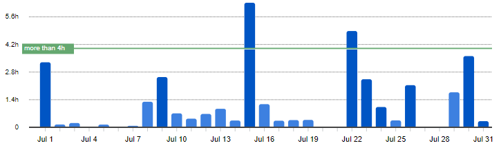
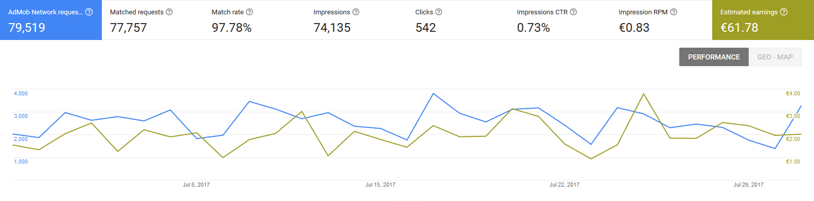
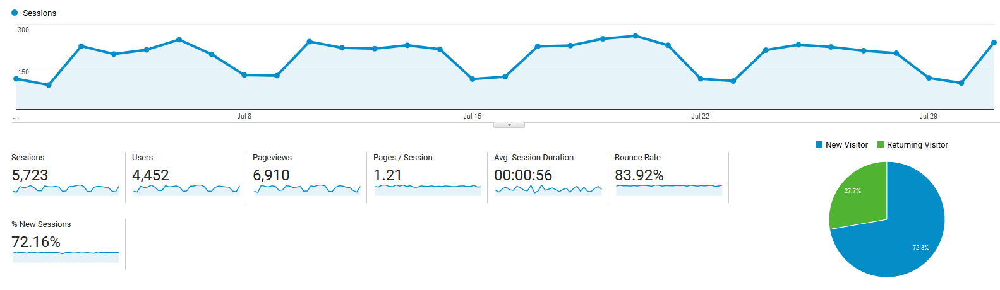

# Progress Report - July 2017
I post a progress report showing what I did and how my products performed each month.
Last month's report can be seen [here](/progress-report-june-2017).

## What did I do

I worked 36 _productive_ hours. (Tracked using [RescueTime](/redirects/rescuetime).)  

## Apps
### Downloads
Downloads went up by 100. In sum, my apps were downloaded **1050** times this month.

### In-App Purchases
In-app Purchases stayed stable at 14 orders this month. (+2)
I made an estimated **47.92€** (-1.15€) this way.

### Ad Revenue
Ad revenue is stable, too. I consistenly make around 60 euros, this month I made **61.78€** (+2.38€) for 74135 Google AdMob banner impressions.

### Total App Income
In total, this month's app income was 109.70€ (+1.23€).

IAPs | Ads | Total
--- | --- | ---
47.92€ | 61.78€ | 109.70€

**After my record month in June, July was another record month where I made over 100€ with my apps!**.
Now I just need to 10x it.

## Platform Growth
### Website
Website traffic was mostly stable again. I released only one new blog post at the end of the month, [the CodePush CheatSheet](/code-push-cheat-sheet/).

### Subscribers
My [twitter](https://twitter.com/cmichelio) followers stayed the same at 162, some people unsubscribed, some subscribed. 🤔  
I have to work on this by being more active on my blog again.

## What's next
I implemented CodePush this month into the new app I'm working on, and it's really awesome. Especially for people like me that like to add new features, but don't want to go through the whole AppStore release process every time and instead end up just not implementing small features. I'll write more about it once I release the app. The frontend is mostly done, my plan is now to move the backend to a _serverless_ architecture.
