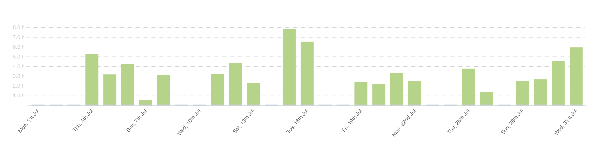
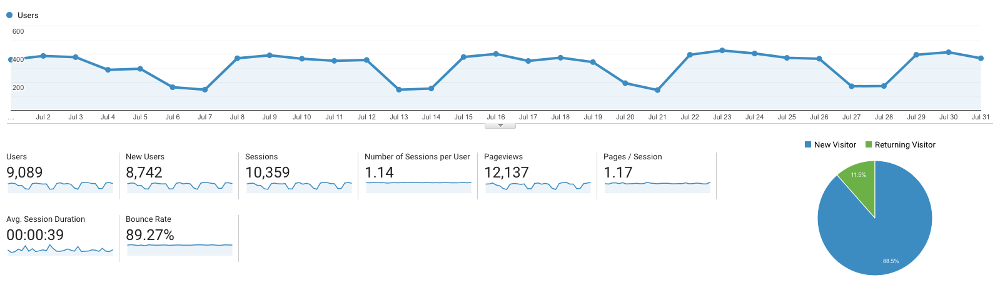

I post a progress report showing what I did and how my products performed each month.
Last month's report can be seen [here](/progress-report-june-2019).

## What did I do

_Hours worked on **side-projects** in July_

I worked **72** _productive_ hours last month.

* **Article of the Month**: [Akrasia](https://en.wikipedia.org/wiki/Akrasia)
* **Song of the Month**: [Kamakaze - Berghain Episode](https://open.spotify.com/track/29WO6pesmwIxFB7QCEKBDX)
    <iframe src="https://open.spotify.com/embed/track/29WO6pesmwIxFB7QCEKBDX" width="300" height="80" frameborder="0" allowtransparency="true" allow="encrypted-media"></iframe>
* **TV series of the Month**: [Money Heist S02](https://trakt.tv/shows/money-heist/seasons/2)

### What was worked on

I worked on several dapps that I cannot talk about.

## Platform Growth

### Website

Sessions went up to **10,359** on my website.

I did **not** stick to my bi-weekly schedule of releasing a blog post.
As always, I managed to only write one... this is becoming a thing now.

1. [How to fetch any secondary EOSIO table index using eosjs](/how-to-fetch-table-indexes-using-eosjs/)

### Subscribers

My [twitter](https://twitter.com/cmichelio) followers increased by _4_ to **484**.

### Learn EOS Development Subscribers

I currently have **483** email subscribers for [my book](https://learneos.dev).
I again sold 8 books in July.

## What's next

I've been occupied with real-life a lot recently - that's why my social media presence and this blog didn't get much attention.
I noticed that I use Twitter less and less myself, it feels like there are the same posts over and over, and I don't get anything useful out of it.
It has mostly turned into a time sink and I don't see that changing soon.
My focus will primarily be my work & side projects that I'm working on, and secondly this blog - disregarding anything else.
