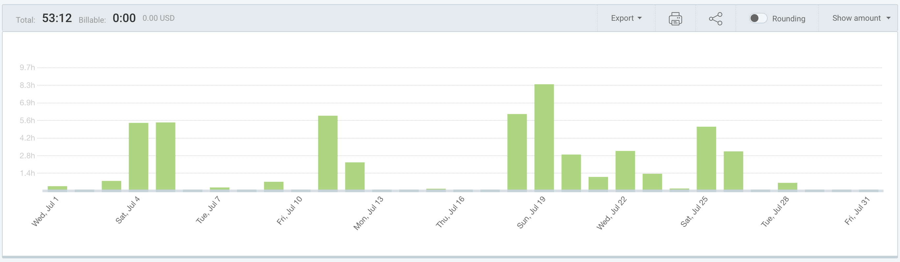
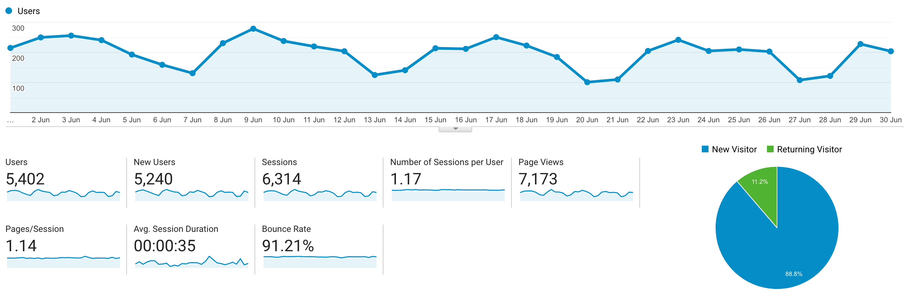

I post a progress report showing what I did and how my products performed each month.
Last month's report can be seen [here](/progress-report-june-2020).

## What did I do

_Hours worked on **side-projects** in July_

I worked **53** _productive_ on side projects hours last month.

To make these progress reports a bit more interesting, from now on I'll post my favourite song, TV show, and article I read last month.

- **Article of the Month**: [Risk/Reward of liquidity provision in AMMs](https://alfablok.substack.com/p/coming-soon)
- **Song of the Month**: [Leavv - Meadow](https://open.spotify.com/track/7wexcgSbynfFSyaa6DDEoI)

    <iframe src="https://open.spotify.com/embed/track/7wexcgSbynfFSyaa6DDEoI" width="300" height="80" frameborder="0" allowtransparency="true" allow="encrypted-media"></iframe>

- **TV series of the Month**: [Norsemen S03](https://trakt.tv/shows/norsemen/seasons/3)

### What was worked on

This month went by so fast.
I didn't even realize it's time to write another progress report again.
I spent most of my time on my day jobs, not much to announce in terms of side projects.
But it should get better in August.

## Platform Growth

### Website

Sessions stayed at **6,333** on my website.

I did **not** stick to my bi-weekly schedule of releasing a blog post.
I managed to only write one which was liked a lot

1. [Obfuscating EOSIO smart contracts](/obfuscating-eosio-smart-contracts/)

### Subscribers

My [twitter](https://twitter.com/cmichelio) followers increased by _10_ to **620**.

## Sales

#### Learn EOS Development

I sold 3 books last month.

#### Trading

I made 36 EOS last month trading crypto.
My trading bot is getting rekt by the other ones.

## What's next

- Update my arbitrage bot and beat the competition. There are so many swap pools launching on EOS recently which makes it a great opportunity.
