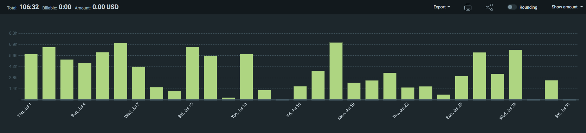
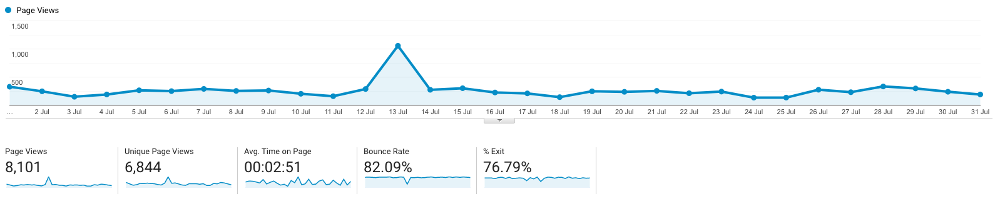

I post a progress report showing what I did and how my products performed each month.
Last month's report can be seen [here](/progress-report-june-2021).

## What did I do

_Hours worked on **side-projects** in July_

I worked **106** _productive_ on side projects hours last month.

To make these progress reports a bit more interesting, from now on I'll post my favourite song, TV show, and article I read last month.

* **Article of the Month**: ["Being On-Call" - Google SREs](https://sre.google/sre-book/being-on-call/). Super interesting to read about all the processes in place
* **Song of the Month**: [Ahzumjot - Lass uns scheinen](https://open.spotify.com/track/6jJgS7nbhfKK9ilv2KhdQc)
    <iframe src="https://open.spotify.com/embed/track/6jJgS7nbhfKK9ilv2KhdQc" width="300" height="80" frameborder="0" allowtransparency="true" allow="encrypted-media"></iframe>

* **TV series of the Month**: [Manifest S01](https://trakt.tv/shows/manifest/seasons/1)

### What was worked on

- I participated in all C4 contests again. New awards came in and I didn't score that well in July, my lead as [#1 on the leaderboard](https://code423n4.com/leaderboard/) is slowly shrinking. It's a combination of me missing issues, more competition, the competition getting better, and the judging / awarding still evolving and lacking clear rules on the verifiability of exploits, assigning proper severity, and deduplicating issues. Overall, it's great as it forces me to stay on top of my game and keep improving.
- Participated in my first NFT drop, got metadata sniped on OpenSea upon reveal. 
  Could be the universe trying to tell me to stick to DeFi.

## Platform Growth

### Website

Pageviews stayed at around **8,000** on my website.

I did **not** stick to my bi-weekly schedule of releasing a blog post.
I did not write a single new blog post last month, I've been busy with other work on the weekends.

I was mentioned on Sam's [shouldiusespotpriceasmyoracle.com](https://shouldiusespotpriceasmyoracle.com/).

### Subscribers

After crossing the 1000 followers threshold on my [twitter account](https://twitter.com/cmichelio) last month, this month saw no stop and my follower count increased to **1248**.

## Sales

#### Learn EOS Development

I sold 4 books last month.

#### Trading

I thought about shutting down my arbitrage bot on EOS but it's 100% hands-off and I didn't update it in half a year, so I see no reason to.
At last, I still made 35 EOS last month.

## What's next

* I have some personal things to take care of, August will be a slower month work-wise.

