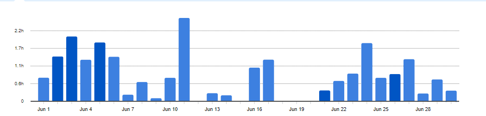
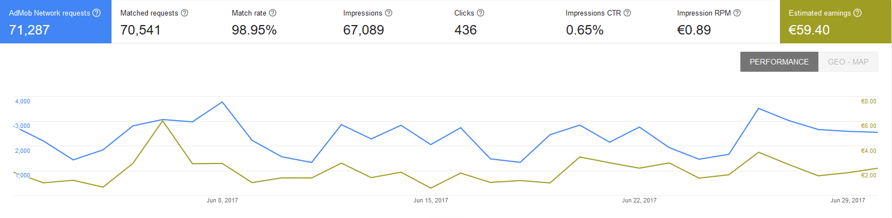
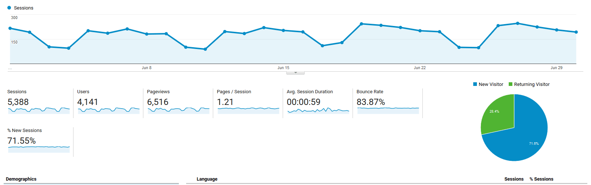

# Progress Report - June 2017
I post a progress report showing what I did and how my products performed each month.
Last month's report can be seen [here](/progress-report-may-2017).

## What did I do

I worked 24 _productive_ hours. (Tracked using [RescueTime](/redirects/rescuetime).)  

## Apps
### Downloads
Downloads have been stable. In sum, my apps were downloaded **956** times this month.

### In-App Purchases
In-app Purchases went up this month to 16 orders. (+7)
It's really interesting, because this value is the one that fluctuates the most between my different months.
My [PPL Workout Log](https://play.google.com/store/apps/details?id=io.cmichel.ppl) alone already had 8 orders this month.
I made an estimated **49.07€** (+23.03€) this way.

### Ad Revenue
Ad revenue was stable, like for the last months. I made **59.40€** (+0.42€) for 67089 Google AdMob banner impressions.

### Total App Income
In total, this month's app income was 108.47€ (+22.82€).

IAPs | Ads | Total
--- | --- | ---
49.07€ | 59.40€ | 108.47€

This means: **June was the first month making over 100€ with my apps!**.

<iframe src="https://giphy.com/embed/ADgfsbHcS62Jy" width="480" height="295" frameBorder="0" class="giphy-embed" allowFullScreen></iframe>

## Platform Growth
### Website
Website traffic was mostly stable. I didn't release any new blog posts this month.

### Subscribers
My [twitter](https://twitter.com/cmichelio) followers went up by only 3 to 162, because I didn't tweet anything this month.

## What's next
Still a struggle to balance life and find time for side projects and to finish my next React Native app.
But once all your apps are released, it's well worth it. This was my best month so far, revenue wise, and I didn't do anything. 👍