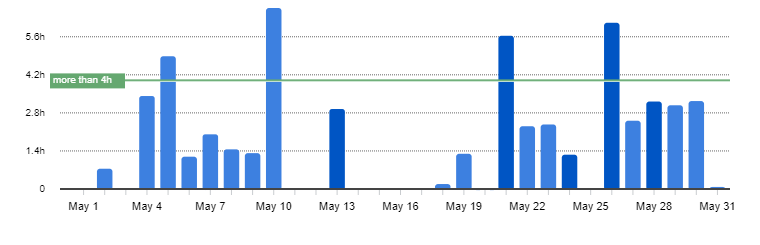
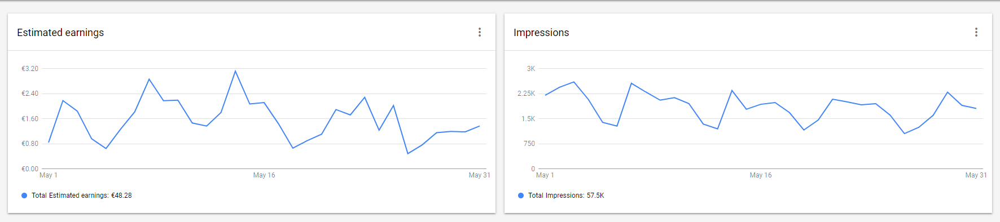
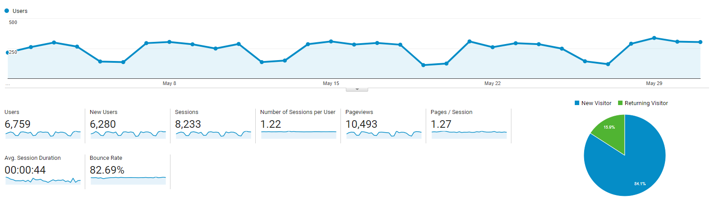

I post a progress report showing what I did and how my products performed each month.
Last month's report can be seen [here](/progress-report-april-2018).

## What did I do

I worked 56 _productive_ hours. 💪 (Tracked using [RescueTime](/redirects/rescuetime).)  
I 'm watching [Silicon Valley S5](https://trakt.tv/shows/silicon-valley/seasons/5), [My Hero Academia S3](https://trakt.tv/shows/my-hero-academia/seasons/3).

I finished my first EOS dapp, I still had to do some significant changes. But it's ready for release today when the main net launches today.

I decided on self-publishing an ebook about EOS smart contract development and started building the landing page.
I wrote down an outline what I want to be in the book.

## Apps
### Downloads
Total downloads of all my apps went down to **638** this month. Lost another 100 downloads compared to last month.
It looks like my apps are slowly dying. Well, I haven't updated them in over a year.

### In-App Purchases
In-app Purchases **went up to 9 orders**. (+4)
This was a really unusual outreach.

I made an estimated **33.74€** (+16.68€) this way.

### Ad Revenue
My ad revenue stayed at **48.28€** (+1.07€) for 66,900 AdMob banner impressions.

### Total App Income
In total, this month's app income was 82.02€ (+17.75€).

IAPs | Ads | Total
--- | --- | ---
33.74€ | 48.28€ | 82.02€

## Platform Growth
### Website
Sessions stayed constant at 8222 on my website.
But I got a lot of views on Medium.

Again, I still stuck to my bi-weekly post schedule:

1. [React - Fun with keys](/react-fun-with-keys/)
1. [Async / Await - Return values](/async-await-return-values/)

"React - Fun with keys" was accepted to [freecodecamp](https://medium.freecodecamp.org/react-fun-with-keys-68f4c8c36f3e) and got 145 claps and some new followers.
That's the most claps I ever got on Medium. 👏

Again, it showed that publications are the way to go to reach an audience on Medium. It's not hard to get accepted to hackernoon or freecodecamp if you write a reasonably good post.

### Subscribers
My [twitter](https://twitter.com/cmichelio) followers increased by _11_ to 261.

Also, [senpai noticed me and gave me incredible wisdom](https://twitter.com/dan_abramov/status/1001245190139543552). 😉

## What's next
Deploy the app.
Finish the landing page for the book. Collect email addresses. Write tutorials for free and link to my book. Collect more email addresses. All while actually writing the book.

I should live-stream my coding more again.
