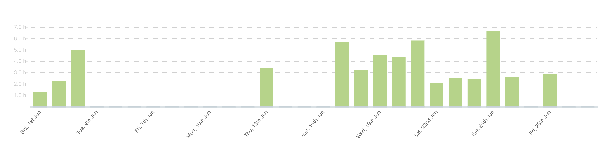
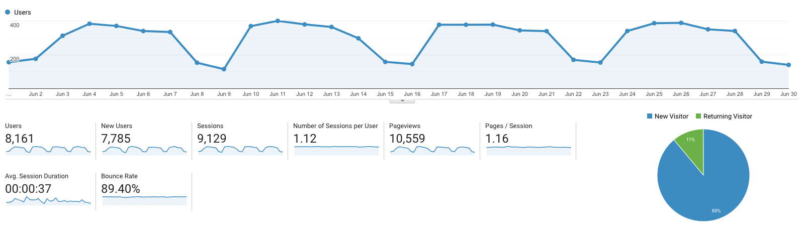

I post a progress report showing what I did and how my products performed each month.
Last month's report can be seen [here](/progress-report-may-2019).

## What did I do

_Hours worked on **side-projects** in June_

I only worked **55** _productive_ hours last month.
Moving out of my apartment and everything that comes with it took a lot of time.

* **Article/Podcast of the Month**: [Naval's podcast](https://open.spotify.com/show/7qZAVw03FuurfYnWIWwkHY?si=bxFIZuI7SwO1x0o8esq4fA)
* **Song of the Month**: [Higher Brothers - Yahh](https://open.spotify.com/track/5c2N1B9HNHIHw8NZZu1DsZ)
    <iframe src="https://open.spotify.com/embed/track/5c2N1B9HNHIHw8NZZu1DsZ" width="300" height="80" frameborder="0" allowtransparency="true" allow="encrypted-media"></iframe>

* **TV series of the Month**: Did not watch any new ones.

### What was worked on

I worked on several dapps that I cannot talk about.

## Platform Growth

### Website

Sessions went down to **9,129** on my website.

I did **not** stick to my bi-weekly schedule of releasing a blog post.
Again, I managed to only write one.

1. [Advanced EOSIO programming concepts](/advanced-eosio-programming-concepts/)

### Subscribers

My [twitter](https://twitter.com/cmichelio) followers increased by _9_ to **480**.

### Learn EOS Development Subscribers

I currently have **478** email subscribers for [my book](https://learneos.dev).

I sold 8 books in June.

## What's next

Keep working on my projects and publish more posts again.

