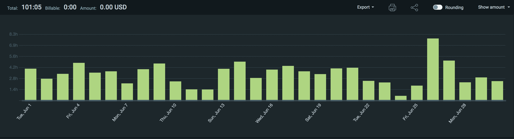
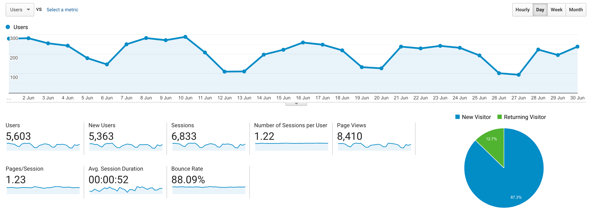

I post a progress report showing what I did and how my products performed each month.
Last month's report can be seen [here](/progress-report-may-2021).

## What did I do

_Hours worked on **side-projects** in June_

I worked **101** _productive_ on side projects hours last month.

To make these progress reports a bit more interesting, from now on I'll post my favourite song, TV show, and article I read last month.

* **Video of the Month**: [FlashBots: How to make $1m per month as a Solidity developer](https://www.youtube.com/watch?v=lXq0eU8viFQ)
* **Song of the Month**: [Bluestaeb - Valle de Rodalquilar](https://open.spotify.com/track/6A4jzwplzPnfirS4xrSZip)
    <iframe src="https://open.spotify.com/embed/track/6A4jzwplzPnfirS4xrSZip" width="300" height="80" frameborder="0" allowtransparency="true" allow="encrypted-media"></iframe>

* **TV series of the Month**: [Dave S02](https://trakt.tv/shows/dave/seasons/2)

### What was worked on

- I participated in _all_ C4 contests again. Results for some of the old ones are in and I'm glad to say that I'm still [#1 on the leaderboard](https://code423n4.com/leaderboard/)
- released a CLI tool that scrapes a website for ETH addresses: [scrape-eth](https://www.npmjs.com/package/scrape-eth)

## Platform Growth

### Website

Sessions went down a lot to only **6,833** on my website.
Not sure why.

Maybe, it's because I did **not** stick to my bi-weekly schedule of releasing a blog post.
I missed all of them ... I was just really busy with other work.

### Subscribers

My [twitter](https://twitter.com/cmichelio) followers increased by _134_ to **1093**! 🎉
It took 4.5 years to cross 1000 followers. It really picked up steam again after I focused more on ETH than on EOS.

Someone asked for resources to learn about ETH hacks in a more practical way and a lot of people liked [my replaying ETH series](https://twitter.com/cmichelio/status/1405841810019209218).
Once you're across the 1000 followers threshold, it grows really fast.

## Sales

#### Learn EOS Development

I sold 7 books last month.

#### Trading

I made 16 EOS last month trading crypto. 😅 I should just shut the bot down.

## What's next

I'm getting more interested in running arbitrage and liquidation bots again with all the MEV talk popping up recently.
I'll probably have to pick up Go and Rust.

On the other side, there were some interesting exploits this month again.
Going bug hunting is probably the better use of my time but development work is much more relaxing than auditing.
