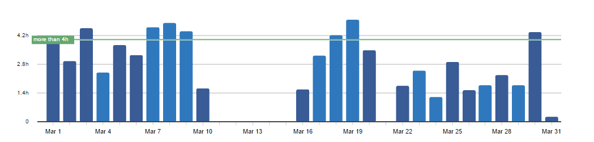
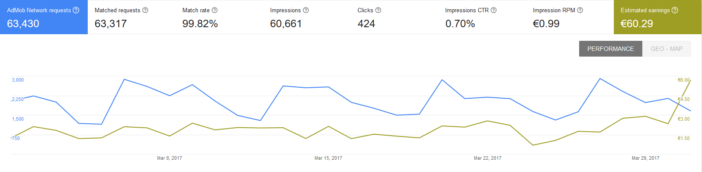
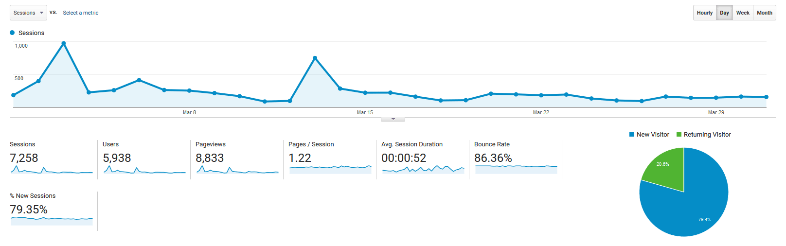

# Progress Report - March 2017
I post a progress report showing what I did and how my products performed each month.
Last month's report can be seen [here](/progress-report-february-2017).

## What did I do

I worked 74 _productive_ hours. (Tracked using [RescueTime](/redirects/rescuetime).)  
I watched [Legion](http://www.imdb.com/title/tt5114356/).  
I read [Clean Code](/book-review-clean-code/).

This was my most unproductive month so far as I moved to a new city for a job and thus didn't have much time to write blog posts or code.
Still, it's nice to see that once you have your apps in the app store and some organic downloads, it's smooth sailing even if you don't do anything.

## Apps
### Downloads
Downloads overall have been relatively stable. Two of my apps downloads slowed down by 20-30%, the download growth of the other two increased by 15-25%.
In sum, my apps were downloaded **910** times this month.

Interestingly, my app that got the most downloads once (PHUL Workout Log), is now the worst performing. Vice versa, the app that got hardly any downloads in the beginning (PHAT Workout Log) is now one of the top performers. So don't be discouraged yet if your freshly published app isn't performing as you expected.

### In-App Purchases
In-app Purchases went down this month to only 7.
I made **15.72€** (-13.16€).

### Ad Revenue
Ad revenue was stable. I made **60.29€** (+7.19€) for 60661 Google AdMob banner impressions.

### Total App Income
In total, this month's app income was 76.01€ (-6.30€).

IAPs | Ads | Total
--- | --- | ---
15.72€ | 60.29€ | 76.01€

## Platform Growth
### Website
A big chunk of traffic this month came by mail (27%) - from the [JavaScript Weekly Newsletter](http://javascriptweekly.com/).

### Subscribers
My twitter followers went up to 142. (+22)

## What's next
I'm only working on my apps and this blog part time from now on and as you all know it's hard to find time and not make excuses. To hold myself accountable and to keep a consistent schedule (which is the most important part) I thought about streaming the whole process of creating my React Native apps + backend. I always wanted to try **live coding**, and streaming for some hours on the weekend seems like a good idea now. I'll keep you updated on twitter.

