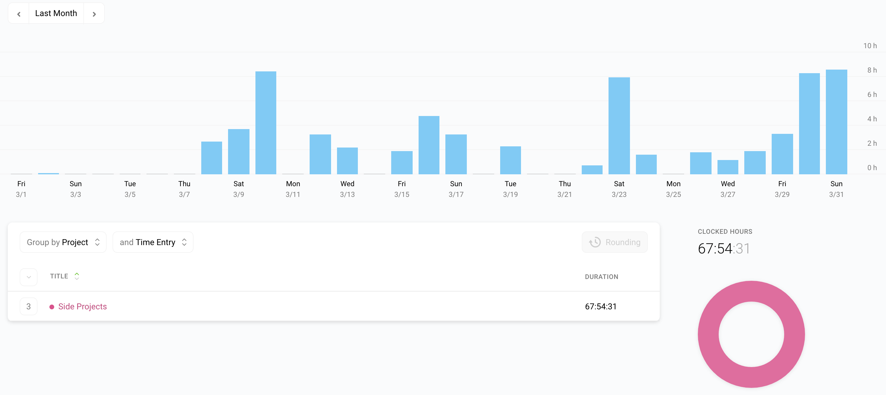

I post a progress report showing what I did and how my products performed each month.
Last month's report can be seen [here](/progress-report-february-2019).

## What did I do

I worked **68** _productive_ hours last month. I really made use of those weekends. 💪

To make these progress reports a bit more interesting, from now on I'll post my favourite song, TV show, and article I read last month.

* **Article of the Month**: [Schelling fences on slippery slopes](https://www.lesswrong.com/posts/Kbm6QnJv9dgWsPHQP/schelling-fences-on-slippery-slopes)
* **Song of the Month**: [Dennis da Menace & Brous One - Gourmet](https://open.spotify.com/track/5hBCrlxAhj6LVKDR2PGZcs?si=G8GZ2v9xSRmTc9goIDfrXw)
    <iframe src="https://open.spotify.com/embed/track/5hBCrlxAhj6LVKDR2PGZcs" width="300" height="80" frameborder="0" allowtransparency="true" allow="encrypted-media"></iframe>

* **TV series of the Month**: [The Order](https://trakt.tv/shows/the-order-2019)

### What did I work on

I finally finished my [Learn EOS Development book](https://learneos.dev). 🎉
The release was on Saturday, March 23th.
The reception for the book is really great, check out this [Twitter thread](https://twitter.com/cmichelio/status/1109370141060616192).
It feels so good to finally complete this project that I've been working on since July 2018, 9 months ago.
I made **30** sales so far in the first week, which is great.
I launched it to a list of over 300 subscribers and most of the sales happened on the first three days of release and then it rapidly slowed down.

I'm curious to see how the sales will be without marketing in April.
If you google for "Learn EOS" or "Learn EOS development" my book is now the first result 🤓

## Platform Growth

### Website

Sessions went up to **11,478** on my website. I think it's been a while since my sessions were above 11k/month. 👍

I again did **not** stick to my bi-weekly schedule of releasing a blog post.
I missed the second post, but I was too busy with the launch and updating the book.
Literally, one day before the book release a new EOSIO.CDT version was released and I updated all code samples from the book.

Still, I managed to write at least one post about how I create the epub version of my book.

1. [How to create beautiful epub programming ebooks](/how-to-create-beautiful-epub-programming-ebooks/)

### Subscribers

My [twitter](https://twitter.com/cmichelio) followers increased by _57_ (!) to **431**.
The successful book launch helped a lot.
Thanks to everyone who liked the post and retweeted it.

### Learn EOS Development Subscribers

I currently have **344** email subscribers for [my book](https://learneos.dev). (+46 in last 30 days)
I made 30 sales since launch.

## What's next

I'm contacting block producers and various projects for a sponsorship for the Learn EOS book right now.
After that, I 'll start with one of my many other ideas for EOS.
Also, I want to give some more love to this blog again. Definitely more blog posts again. Maybe a dark mode or a complete revamp. 🤔
