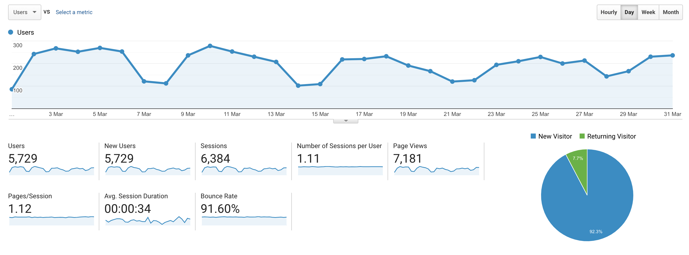

I post a progress report showing what I did and how my products performed each month.
Last month's report can be seen [here](/progress-report-february-2020).

## What did I do

_Hours worked on **side-projects** in March_

I worked **89** _productive_ hours on side projects last month.

To make these progress reports a bit more interesting, from now on I'll post my favourite song, TV show, and article I read last month.

* **Article/Video of the Month**: [George Hotz' livestreams about reverse-engineering COVID-19 like he did with the iPhone and the PlayStation 🤣](https://www.youtube.com/channel/UCwgKmJM4ZJQRJ-U5NjvR2dg/videos)
* **Song of the Month**: [Evidence - Unlearning](https://open.spotify.com/track/3yDIy24qviLm8267NXaAdF)
    <iframe src="https://open.spotify.com/embed/track/3yDIy24qviLm8267NXaAdF" width="300" height="80" frameborder="0" allowtransparency="true" allow="encrypted-media"></iframe>
* **TV series of the Month**: [Better Call Saul S05](https://trakt.tv/shows/better-call-saul/seasons/5)

### What was worked on

Mostly on Vigor and on my arbitrage bot.
No new project was started.

## Platform Growth

### Website

Sessions went down to **6,384** on my website.

I did **not** stick to my bi-weekly schedule of releasing a blog post.
I didn't write any new article this month - I was working a lot on the weekends.
I have two blog posts drafted though, just not finished yet.
Nevertheless, a big fail, this shouldn't happen.

### Subscribers

My [twitter](https://twitter.com/cmichelio) followers decreased by _6_ to **578**. Interesting, that's the first time this happened.

## Sales

#### Learn EOS Development

I sold 3 books last month.

#### Trading

I made 236 EOS last month trading crypto.

## What's next

As always, there are some interesting things in the pipeline that I can't talk about yet.
As a new side project, I thought about building a NewDex / Bancor / YoloSwap dex aggregator smart contract, that splits buy/sell orders to different DEXes to optimize profits.
Then again, you might not save that much using this technique as arbitrage bots already keep the prices really close, and I wouldn't know how to monetize it.
