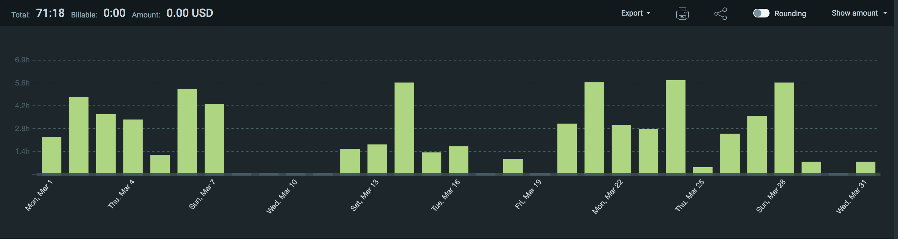
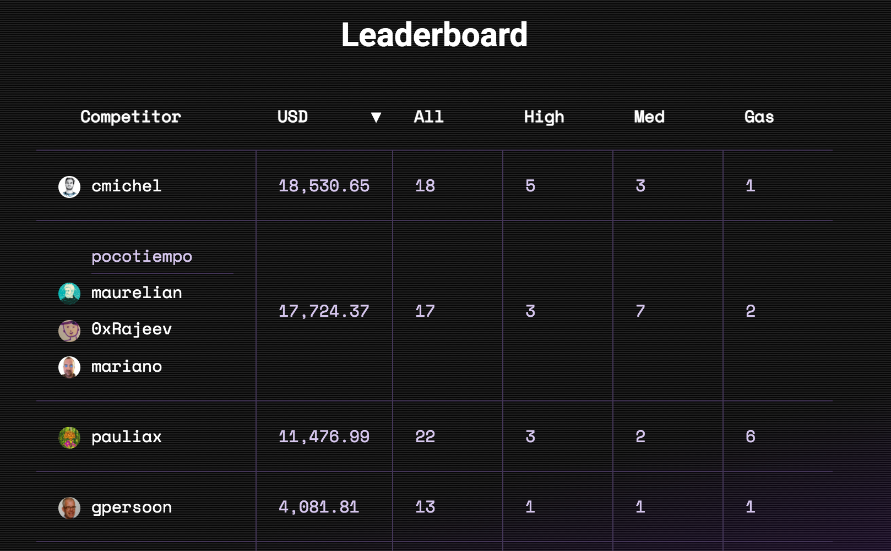
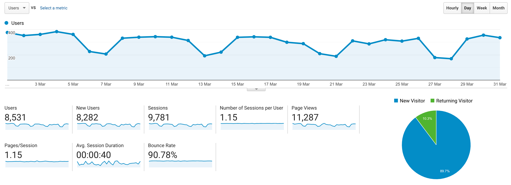

I post a progress report showing what I did and how my products performed each month.
Last month's report can be seen [here](/progress-report-february-2021).

## What did I do

_Hours worked on **side-projects** in March_

I worked **71** _productive_ on side projects hours last month.

To make these progress reports a bit more interesting, from now on I'll post my favourite song, TV show, and article I read last month.

* **Article of the Month**: [Uniswap V3 WP](https://uniswap.org/whitepaper-v3.pdf) and [Noah Zinsmeister's Twitch stream walking through the code](https://www.twitch.tv/videos/962681641)
* **Song of the Month**: [TrueMendous & Kofi Stone - Y](https://open.spotify.com/track/65iFPerfLwgW9Hq2LUK67A)
    <iframe src="https://open.spotify.com/embed/track/65iFPerfLwgW9Hq2LUK67A" width="300" height="80" frameborder="0" allowtransparency="true" allow="encrypted-media"></iframe>
* **TV series of the Month**: Did not stat any new ones.

### What was worked on

Mostly client work, but I also did some bug bounties.

I scored first on [C4's second bug contest (ElasticDAO)](https://code423n4.com/leaderboard) by discovering 5 unique high-severity issues and won 9.19 ETH!
Good news: This puts me as #1 on the leaderboard!  
Bad news: This puts me as #1 on the leaderboard and I'll have to participate in all contests now to defend my position. 😁

But I love C4, it's a very fun and flexible way for bug hunters to earn an income and improve their skills. It also seems to be very useful for the projects - judging by the queue of three contests already lined up.

## Platform Growth

### Website

Sessions increased by 1k to **9,781** on my website.

I did **not** stick to my bi-weekly schedule of releasing a blog post.
I missed the second post this month.

1. [Replaying Ethereum Hacks - Sushiswap BadgerDAO's Digg](/replaying-ethereum-hacks-sushiswap-badger-dao-digg/)

### Subscribers

My [twitter](https://twitter.com/cmichelio) followers increased by _46_ to **788**, most new followers came from the C4 contest tweets.

## Sales

#### Learn EOS Development

I sold 5 books last month.

#### Trading

My arbitrage on EOS mainnet made ~90 EOS last month.

## What's next

* Defend my #1 spot on C4 although I don't know how much time I can commit to it this April. However, this shall not be a cheap excuse to not try to find all bugs.

