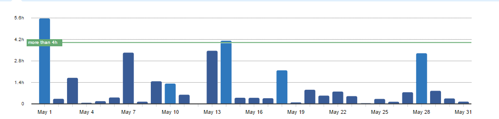
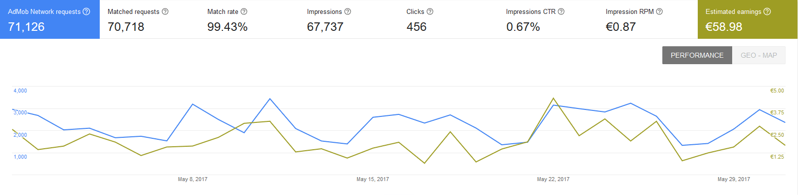
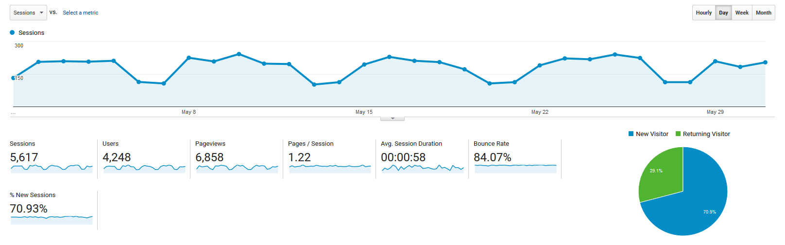

# Progress Report - May 2017
I post a progress report showing what I did and how my products performed each month.
Last month's report can be seen [here](/progress-report-april-2017).

## What did I do

I worked 36 _productive_ hours. (Tracked using [RescueTime](/redirects/rescuetime).)  

I released two new open source [React Native components](http://cmichel.io/react-native-progress-circle/):
1. [React Native Progress Circle](https://github.com/MrToph/react-native-progress-circle)
2. [React Native Countdown Circle](https://github.com/MrToph/react-native-countdown-circle)

## Apps
### Downloads
Downloads have been stable. In sum, my apps were downloaded **955** times this month.

### In-App Purchases
In-app Purchases went up this month to 9 orders.
I made an estimated **26.67€** (+13.47€) this way.

### Ad Revenue
Ad revenue was stable, even though I had quite a few more impressions this month. I made **58.98€** (-0.95€) for 67737 Google AdMob banner impressions.

### Total App Income
In total, this month's app income was 85.65€ (+12.52€).

IAPs | Ads | Total
--- | --- | ---
26.67€ | 58.98€ | 85.65€

## Platform Growth
### Website
Website traffic went up this month by 1000 and I got new comments on older articles.

### Subscribers
My twitter followers went up to 159. (+10)

## What's next
It's been a really good month even though I again could not spend much time on my side projects.
The course continues and I'll keep working on my app on weekends next month.