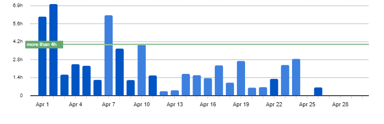
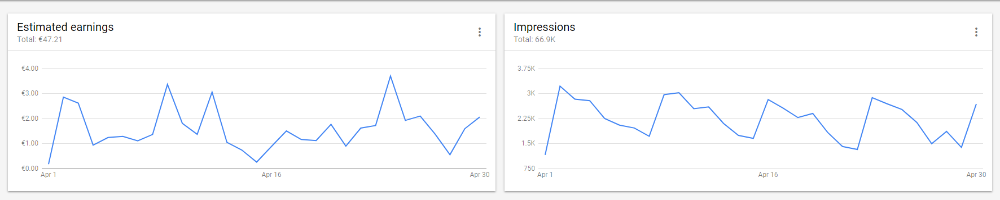
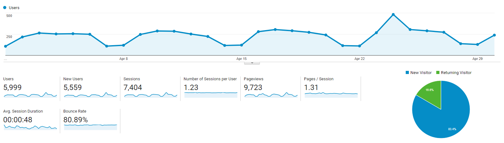

I post a progress report showing what I did and how my products performed each month.
Last month's report can be seen [here](/progress-report-march-2018).

## What did I do

I worked 58 _productive_ hours. 💪 (Tracked using [RescueTime](/redirects/rescuetime).)  
I 'm watching [Atlanta S2](https://trakt.tv/shows/atlanta/seasons/2), [Last Man On Earth S4](https://trakt.tv/shows/the-last-man-on-earth/seasons/4), [My Hero Academia S3](https://trakt.tv/shows/my-hero-academia/seasons/3).

I 'm reading [Make - Bootstrapper's Handbook by Pieter Levels](https://makebook.io/).

I rewrote my EOS smart contract to dawn-3 compatible code and learned quite a lot of modern C++ along the way - lambdas, iterators, multi-index DBs. I feel like I am finally productive in C++.
It's pretty much done, I just need to finish the last 20% that takes 80% of the time. 😄
I hope I can start with my EOS tutorials / video course in May.

Back to my React Native apps and their performance.

## Apps
### Downloads
Total downloads of all my apps went back to **733** this month. Lost roughly 100 downloads compared to last month.

### In-App Purchases
In-app Purchases went up to 5 orders. (+1)

I made an estimated **17.06€** (+3.41€) this way.

### Ad Revenue
My ad revenue stayed at **47.21€** (-9.36€) for 66,900 AdMob banner impressions.

### Total App Income
In total, this month's app income was 64.27€ (-5.95€).

IAPs | Ads | Total
--- | --- | ---
17.06€ | 47.21€ | 64.27€

## Platform Growth
### Website
I lost another 800 sessions on my website. Something seems off here, my experience has always been that if you're actively writing posts you steadily gain more and more visits.
It looks like I'm being penalized by Google for something. I need more time to check

Again, I still stuck to my bi-weekly post schedule:

1. [Importing Blender 3D Model with Texture to Three.js](/importing-blender-model-with-texture-to-threejs/)
1. [You might not need React Context](/you-might-not-need-react-context/)

"You might not need React Context" was accepted to [hackernoon](https://hackernoon.com/you-might-not-need-react-context-e1adb35b2e04).
Publications are pretty much the only way to grow your medium audience nowadays.

### Subscribers
My [twitter](https://twitter.com/cmichelio) followers increased by _9_ to 250.

## What's next
I'll launch my EOS app on a community test net to make it ready for the EOS launch in June.
I think now is a really great time to create an EOS app development course. The "documentation" is basically the example contracts, and a lot of people are thriving for tutorials on how to get started with EOS right now.
I 'll definitely follow Pieter Level's advice from the bootstrapping start-ups / side-projects book I've just read and test it. This means the next steps for May are creating a landing page for the course, creating some free preview material, and sharing it with the EOS community.

