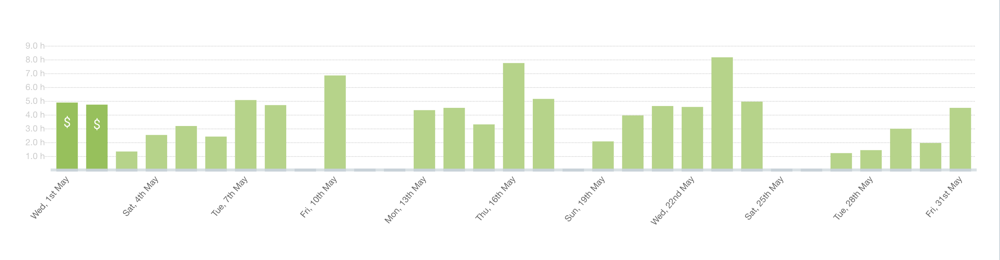
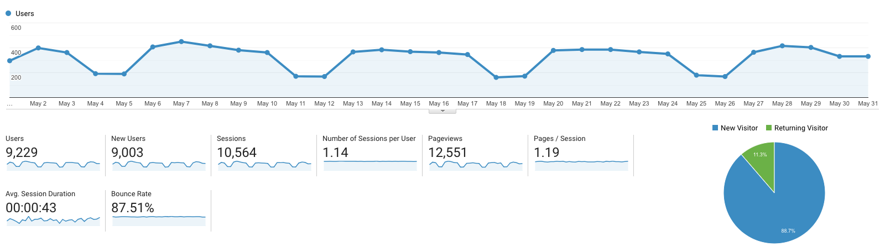

I post a progress report showing what I did and how my products performed each month.
Last month's report can be seen [here](/progress-report-april-2019).

## What did I do

_Hours worked on **side-projects** in May_

I worked **102** _productive_ hours last month.

* **Song of the Month**: [Gus Dapperton - Fill me up Anthem](https://open.spotify.com/track/7460zTXWqoe9ElsRebQU8j?si=nSlLqRRMTK2oF5H5a19mDA)
    <iframe src="https://open.spotify.com/embed/track/7460zTXWqoe9ElsRebQU8j" width="300" height="80" frameborder="0" allowtransparency="true" allow="encrypted-media"></iframe>

* **TV series of the Month**: [Attack on Titan S03](https://trakt.tv/shows/attack-on-titan/seasons/3)

### What was worked on

I finished the first beta release on [eosiac](https://github.com/MrToph/eosiac). It's such a useful tool, it made my life easier by at least 10 times.
I'm working on some new EOS projects I can not talk about yet.

## Platform Growth

### Website

Sessions stayed at **10,564** on my website.

I did **not** stick to my bi-weekly schedule of releasing a blog post.
I managed to write one post and have ideas for many more. The problem is coding is more fun than writing. 😃

1. [How EOS code and ABI hashes are computed](/how-code-hash-and-abi-hash-are-computed-in-eos/)

### Subscribers

My [twitter](https://twitter.com/cmichelio) followers increased by _14_ to **471**.

### Learn EOS Development Subscribers

I currently have **452** email subscribers for [my book](https://learneos.one).

Book sales slowed down drastically. I didn't sell a book in the last week.
Not sure what to do against that.

## What's next

Keep working on my projects and publish more posts again.

