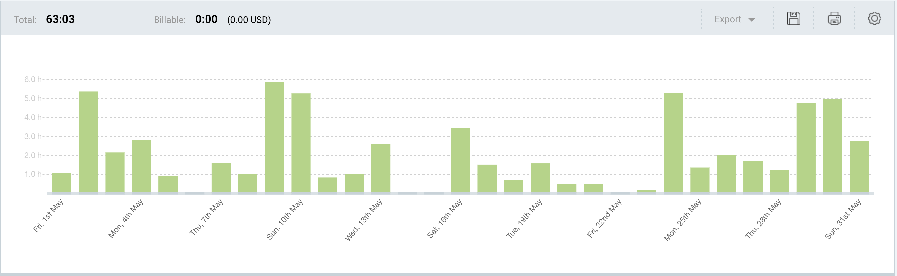
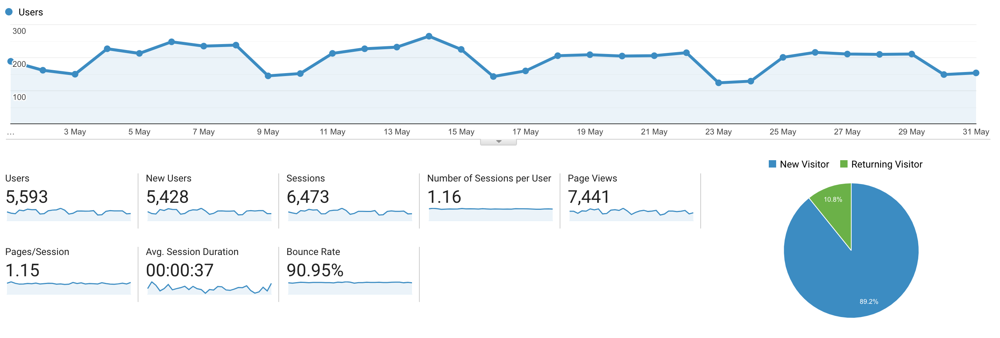

I post a progress report showing what I did and how my products performed each month.
Last month's report can be seen [here](/progress-report-april-2020).

## What did I do

_Hours worked on **side-projects** in May_

I worked **63** _productive_ on side projects hours last month.

To make these progress reports a bit more interesting, from now on I'll post my favourite song, TV show, and article I read last month.

* **Article of the Month**: [This nerd-sniping math problem 😁](https://www.quora.com/How-do-you-find-the-positive-integer-solutions-to-frac-x-y+z-+-frac-y-z+x-+-frac-z-x+y-4)
* **Song of the Month**: [Akira the Don & Naval Ravikant - The Builder and The Seller](https://open.spotify.com/track/1hs8QeqZcZ25saFoADPpz7)
    <iframe src="https://open.spotify.com/embed/track/1hs8QeqZcZ25saFoADPpz7" width="300" height="80" frameborder="0" allowtransparency="true" allow="encrypted-media"></iframe>

* **TV series of the Month**: [Devs](https://trakt.tv/shows/devs)

### What was worked on

- I've been very busy with my main jobs. On the side, I mostly worked on [VIGOR](https://vigor.ai) and on maintaining some of my old code repositories. I rewrote most of my projects that make use of Dfuse because I hit the free tier limit very quickly. I had an interesting chat about what counts as a document and the best way to minimize Dfuse costs for contracts with low volume. Maybe that's worth a blog post on its own.
- I didn’t start a new side project.
- I kept toying around with Rust and built my first small app that scrapes a website and downloads something. The next useful project will be an EOSIO Vanity Key Generator. I already have this functionality as part of [eosiac](https://github.com/MrToph/eosiac) but Rust should be a lot faster than doing all of this in Node.js.

## Platform Growth

### Website

Sessions went down to **6,473** on my website.

I did **not** stick to my bi-weekly schedule of releasing a blog post.
I was too busy with work. I managed to write only one blog post.

1. [Typing transformations in TypeScript](/typing-transformations-in-type-script/)

### Subscribers

My [twitter](https://twitter.com/cmichelio) followers increased by _1_ to **601**.

## Sales

#### Learn EOS Development

I sold 4 books last month.

## What's next

Same old.
