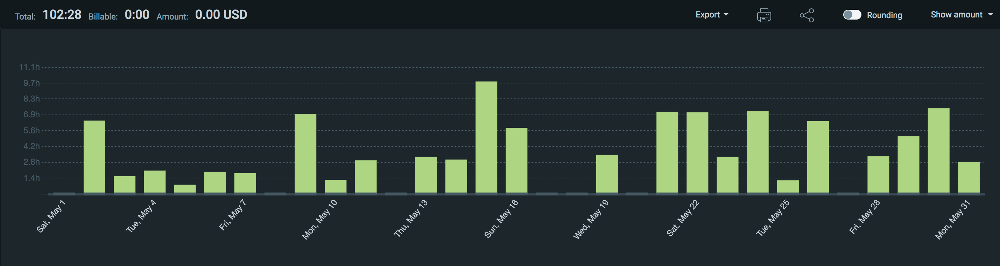
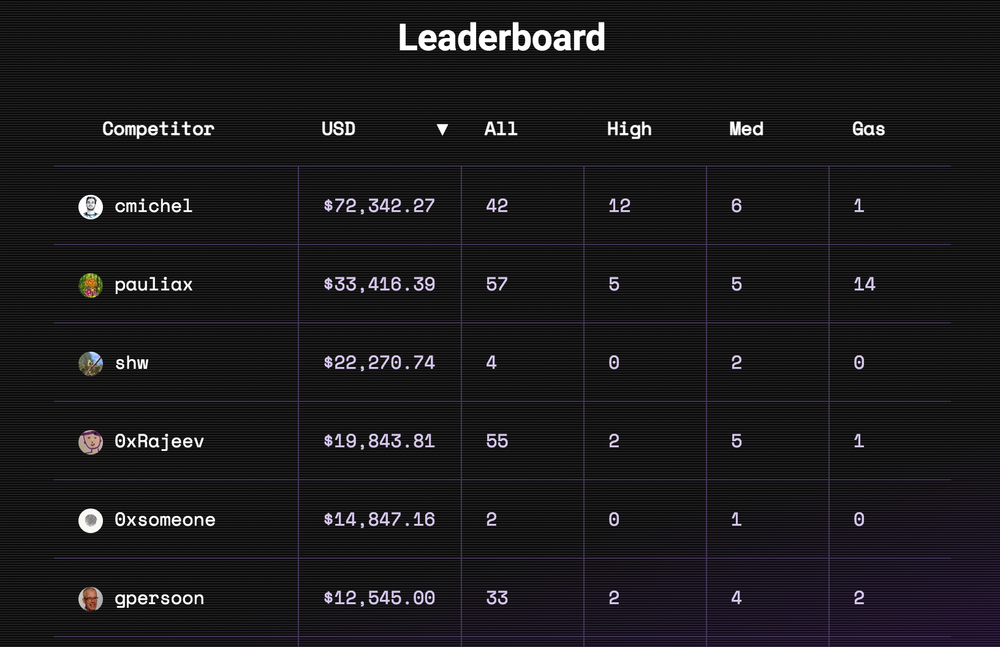
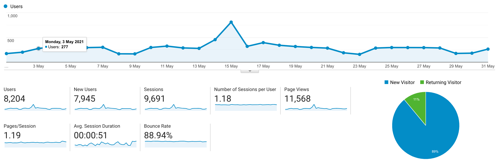

I post a progress report showing what I did and how my products performed each month.
Last month's report can be seen [here](/progress-report-april-2021).

## What did I do

_Hours worked on **side-projects** in May_

I worked **102** _productive_ on side projects hours last month.

To make these progress reports a bit more interesting, from now on I'll post my favourite song, TV show, and article I read last month.

* **Article of the Month**: [Yield Space](https://yield.is/YieldSpace.pdf)
* **Song of the Month**: [Oliver Tree - All in All](https://open.spotify.com/track/2fAfLaxE6fswBIFKdh8L89)
    <iframe src="https://open.spotify.com/embed/track/2fAfLaxE6fswBIFKdh8L89" width="300" height="80" frameborder="0" allowtransparency="true" allow="encrypted-media"></iframe>
* **TV series of the Month**: [Boku no Hero Academia S05](https://trakt.tv/shows/my-hero-academia/seasons/5)

### What was worked on

- I participated in _all_ C4 contests again. Results for some of the old ones are in and I'm glad to say that I'm still [#1 on the leaderboard](https://code423n4.com/leaderboard/)
    
    _CodeArena Leaderboard May 31st_
- Many hacks happened last month, I researched how some of them work and posted my analysis on Twitter or in a dedicated blog post
- worked on a CLI tool that scrapes a website for ETH addresses. I'd often like to have a look at what contracts a frontend interacts with but don't want to click on all the buttons for Metamask to pop up. I think it's useful for all security auditors, bounty hunters, and hackers. I'll release it this month.

## Platform Growth

### Website

Sessions went up at **9,969** on my website.

I stuck to my bi-weekly schedule of releasing a blog post with two posts about major hacks.

1. [EOS vaults.sx hack](/eos-vault-sx-hack/)
2. [BSC PancakeBunny Exploit Post Mortem](/bsc-pancake-bunny-exploit-post-mortem/)

### Subscribers

My [Twitter](https://twitter.com/cmichelio) followers increased by _135_ (!) to **959**. My EOS hack analysis Twitter post gained huge momentum in the EOS ecosystem, as well as tweeting about the other hacks, and Code423n4 praise. I could hit 1000 followers next month!

## Sales

#### Learn EOS Development

I sold 3 books last month.

#### Trading

I made 103 EOS last month trading crypto.

## What's next

- Keep doing the same (C4, hack analysis, bug bounties), it was a great month.

