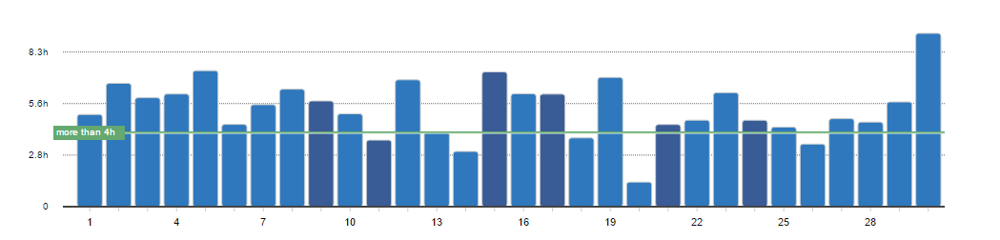
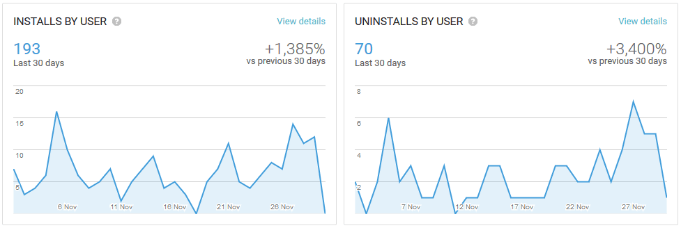
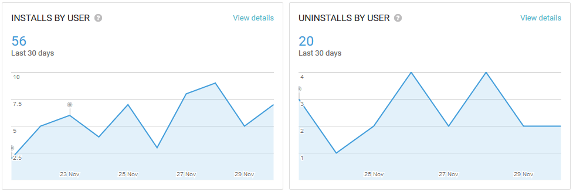
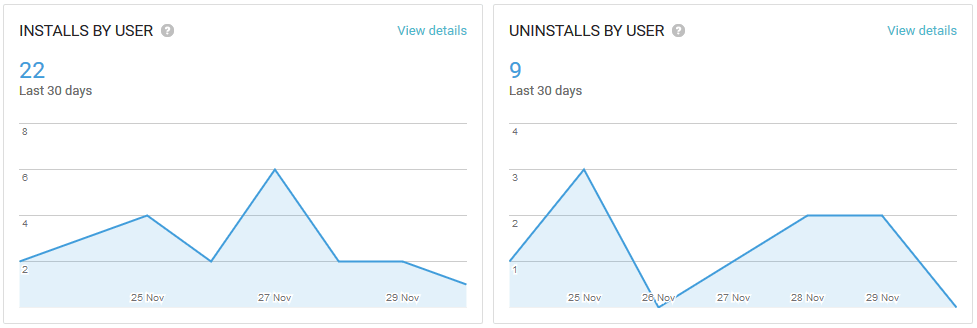
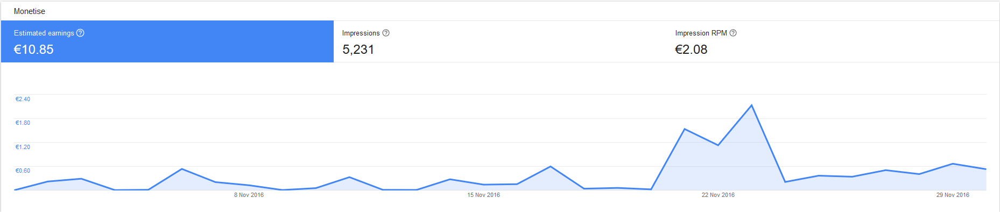
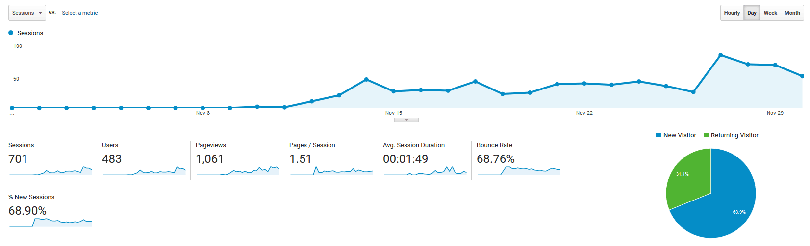

# Progress Report - November 2016
I post a progress report showing what I did and how my products performed each month.
This is where it all begins - the first Progress Report I'm publishing.

## What did I do

I worked 158 _productive_ hours. (Tracked using [RescueTime](/redirects/rescuetime).)  
I watched [Startup](http://www.imdb.com/title/tt5028002/).  
I read [Team Geek](/team-geek-summary/).  

In the first two weeks I moved away from WordPress and rebuilt this blog from scratch using [phenomic](https://phenomic.io), a static site generator.
You can read about [my reasons](/wordpress-to-static-site-generator/) here.
I had to create some custom components in React and now everything runs fine and is easily fully customizable 👌  
At the beginning of the month, I released my [first react-native app](/lessons-from-building-first-react-native-app/), a fitness logger.
I had the idea to create the same app for other fitness programs, similar to the reskinning idea for games.
So after building the website, it took me another week to release two more fitness trackers on October 22nd / 23rd.  
I started a new app in the last week. I 'll post about it when it's ready.

## Apps
### Downloads
Here's a quick look at the _traffic_ of my 3 fitness apps:

I got almost 200 hundred downloads on my [main app](https://play.google.com/store/apps/details?id=io.cmichel.phul),
and steadily around 5 new users per day. The others have only been up for a week.
The [second app](https://play.google.com/store/apps/details?id=io.cmichel.ppl) is also getting traction quite fast,
the [third one](https://play.google.com/store/apps/details?id=io.cmichel.phat) grows slower because the workout is less famous and there's already a competing app for it.
All the traffic is through SEO with not input from me, which is really nice.
An interesting pattern is that my apps' downloads seem to spike on a Wednesday.
I 'm curious if this trend will continue next month and if its representative for sports apps or even the whole app market.

### Income
Now, the big reveal: **How much money did I make in my first month?**
I have an ad banner at the bottom of the apps and made my first **10,85€** this way.

Now, I only need to scale it up 100 times to almost make a living.

By the way, I have no idea where that spike around November 22th comes from.

## Platform Growth
### Website
I started using Google Analytics in the middle of the month when my website was finished, so here's half of November:

The post that got the biggest traction is [this one](/lessons-from-building-first-react-native-app/) where I talked about the lessons I learned creating my first React Native + Redux app.

### Subscribers
Twitter is currently at 40 followers.

## Closing Thoughts
I realized there are two kinds of apps: Apps where the users come naturally to you and the ones where you have to do active marketing.
My apps fall into the first category, because they are made for fitness programs that are already well known. This means they read about a workout and then **actively search** for
the keyword in the app store to see if _there's an app for that_. They basically augment an already existing product.

The second category is the one where you have to do active marketing, because no product already exists for it. Most games fall into this category. 
Nobody will wake up one day and think:
>"_I want to play an endless runner game where I start as a triangle and shape shift into other shapes._
>_It would be cool if it made use of the Stroop effect. I would call it Color Runner. Let me search for it on the app store._"

But that's only one reason why my [first game](https://play.google.com/store/apps/details?id=com.TheoryMode.ColorRunner) got no downloads.

Having said that, I 'm currently creating another app that I should finish in the coming weeks. Sadly, it falls into the second category 😅
