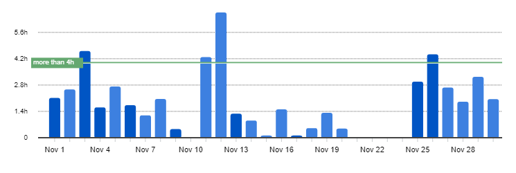
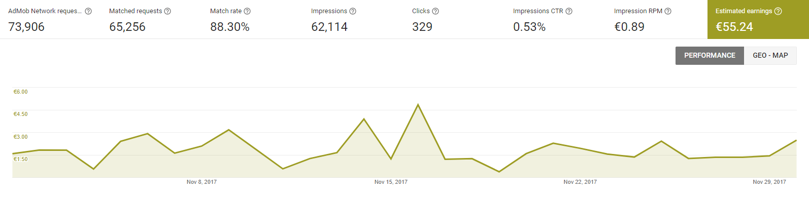
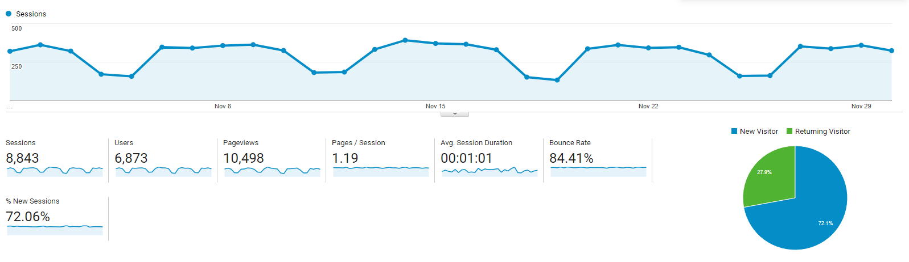

# Progress Report - November 2017
I post a progress report showing what I did and how my products performed each month.
Last month's report can be seen [here](/progress-report-october-2017).  

## What did I do

I worked 54 _productive_ hours. (Tracked using [RescueTime](/redirects/rescuetime).)  
I'm still watching [Mr. Robot Season 3](https://trakt.tv/shows/mr-robot/seasons/3), and [Curb your Enthusiasm Season 9](https://trakt.tv/shows/curb-your-enthusiasm/seasons/9). I didn't start a new series this month.

I read the [Steem Whitepaper](https://steem.io/SteemWhitePaper.pdf) and skimmed over the [Filecoin <del>Yellow</del>Whitepaper](https://filecoin.io/filecoin.pdf).  

I finally finished my fifth React Native app. I wrote a blog post about [its development](/released-my-fifth-react-native-app/). I'm really happy to have released it and to have time for a new side project now.

Let's take a look how my apps performed in November.

## Apps
### Downloads
Total downloads of all my apps stayed at **753** this month.

### In-App Purchases
In-app Purchases went up to 7 orders this month. (+2)

I made an estimated **23.95€** (+6.84€) this way.

### Ad Revenue
After a bump last time, my ad revenue went down again this time. I made **55.24€** (-11.62€) for 62,114 Google AdMob banner impressions.  

### Total App Income
In total, this month's app income was 79.19€ (+4.78€).

IAPs | Ads | Total
--- | --- | ---
23.95€ | 55.24€ | 79.19€

Ad revenue is okay, still I'm a bit worried about the download numbers. They were usually between 900-1000 in the summer months.

### How did my new app perform?
I released the [new app](https://play.google.com/store/apps/details?id=io.cmichel.rapquiz) on November, 26th. So it's only been in the store for a couple of days.

Still, it already looks like this app is not going to do well at all. It only received a disappointing **9** installs so far.
This has a few reasons:
1. It's in German, which means a lower target audience than my other apps.
1. SEO was hard to do. I could not find any niche keywords to market the app for. I found either huge general keywords that are too big to break into, or keywords that only have 10-100 searches a month.
1. I didn't market it.

I'm working on the last point right now. I'm pitching the app to some magazines that might be interested in it. So, if you speak German and like rap music, try out my quiz app. 😃

## Platform Growth
### Website
Website traffic went slightly up. I wrote two new blog posts at the end of the month.

1. [Trying DynamoDB for the first time](/trying-dynamodb/)
1. [Released my fifth React Native app](/released-my-fifth-react-native-app/)

I started cross-posting on two platforms to reach a bigger audience:
1. *Medium*: You already know Medium, not much to say about it. It's the de-facto standard of where to go to find a curated list of tech blog posts from a huge developer community.
1. *Steem*: It's like Medium, but better. 😛 It's based on the blockchain and you earn money when somebody upvotes your posts. I think it has a lot of potential, and the technology behind it is really revolutionary. You can read the [whitepaper](https://steem.io/SteemWhitePaper.pdf) to understand how it is able to seemingly generate money out of thin air - it doesn't cost you anything to upvote a post, but the author of the post will earn money. Unfortunately, the dev community is still small on it. Let's change that. (Also there are a lot of scammy "Make 500$ a day easily on Steem" tutorials which give the platform a bad reputation. So far I only made 0.10$, but that's expected as I don't have an audience on it yet.)

You can follow me here on [Medium](https://medium.com/@cmichel) and [Steem.it](https://steemit.com/@cmichel).

### Subscribers
My [twitter](https://twitter.com/cmichelio) followers increased by 15 to 181. I retweeted some interesting tweets and joined some discussions.

## What's next
I'm currently rewriting my blog in [gatsbyjs](https://www.gatsbyjs.org/) to make use of some nice continuous deployment features.

After developing five React Native apps, it's time for something new. I have some really interesting smart contract ideas on Ethereum that I wanted to code for a while now. My next project will definitely be in Solidity. I'm thinking about live-streaming the coding process.  
Writing a tech book is also on my list. I was approached by a publisher, but I might also [self-publish it](https://zapier.com/blog/how-to-publish-ebook/). If anyone has already gone through one of these processes, I 'd really like to hear your experience.