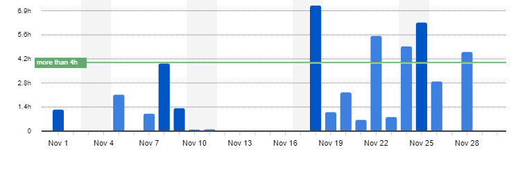
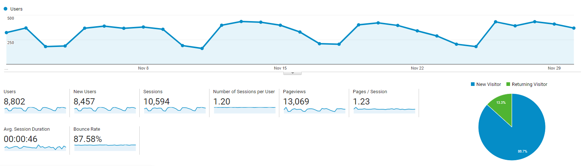

I post a progress report showing what I did and how my products performed each month.
Last month's report can be seen [here](/progress-report-october-2018).

## What did I do

I worked **47** _productive_ hours last month.
I watched [Ozark](https://trakt.tv/shows/ozark), didn't really like it.

I finished the “Smart Contract Development” chapter of my [Learn EOS Development](https://learneos.dev) book, and am creating the example app now.
It is a battleship style decentralized game, of which I finished the [smart contract](https://github.com/MrToph/cryptoship-contract).

My progress can now be tracked in real time on [Makerlog](https://getmakerlog.com/@cmichel).

## Platform Growth

### Blog

Sessions remained stable at **10,594** on my website.

I did not stick to my bi-weekly schedule of releasing a new blog post.
I only got to write one - I need to keep marketing and write newsletters for my book.
Releasing another sample sub-chapter on my blog is probably the easiest and most impactful way.
Either the chapter about _randomness on the blockchain_ or about _deferred transactions_. 

1. [Deploying EOS contracts using EOS.js](/setcode-and-setabi-with-eos-js/)

### Twitter

My [twitter](https://twitter.com/cmichelio) followers increased by _34_ to **352**.

### Learn EOS Development

I currently have **224** email subscribers for [my book](https://learneos.dev). (+32 in a month)
I just sent out a new email newsletter with short updates on EOS + the book.

## What's next

Full focus on the example dapp and writing the last chapter of the book.
My deadline for the first finished draft of the book is still the end of the month - I hope I can reach it. 🙏

* Write tutorials for free and link to my book. Collect email addresses. Keep on coding + writing chapters for the book.
