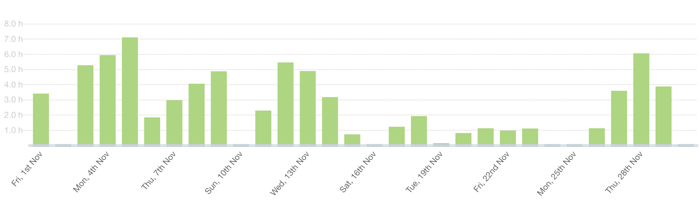
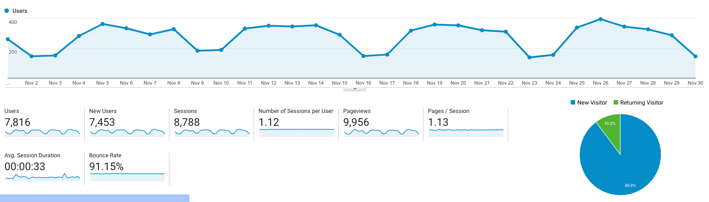

I post a progress report showing what I did and how my products performed each month.
Last month's report can be seen [here](/progress-report-october-2019).

## What did I do

_Hours worked on **side-projects** in November_

I worked **74** _productive_ hours last month.

To make these progress reports a bit more interesting, from now on I'll post my favourite song, TV show, and article I read last month.

* **Article of the Month**: [How Trustless Contracts overcome Artificial Restrictions](https://medium.com/@bytemaster/how-trustless-contracts-overcome-artificial-restrictions-f8cc939faeb6)
* **Song of the Month**: [Hunney Pimp & Tightill - Kreuz](https://open.spotify.com/track/7xHNfT8vmaTREncmDEzENP?si=PvPIpNm0Q0qZI0Tume4-EA)
    <iframe src="https://open.spotify.com/embed/track/7xHNfT8vmaTREncmDEzENP" width="300" height="80" frameborder="0" allowtransparency="true" allow="encrypted-media"></iframe>

* **TV series of the Month**: [Mr. Robot S04](https://trakt.tv/shows/mr-robot/seasons/4)

### What was worked on

I worked on different EOSIO projects I may not talk about.
The one I can talk about is [Vigor Stablecoin](https://www.vigorstablecoin.com/). I'm a DAC custodian and we just designed a new landing page that I'll be the lead developer for.
The design is great and I'm happy we can soon replace the old ugly landing page. 😃

Also, we, Team Malta Block, won the [DAPP Network hackathon's crowd-favourite price](https://dappnetwork.hackerearth.com/).
We extended the LiquidApps DAPP Network with a LiquidCrypto service and implemented blind signatures and the first anonymous voting protocol on EOSIO.
Here's a technical walkthrough of our [anonymous voting protocol](https://streamable.com/wiqgp).

## Platform Growth

### Website

Sessions stayed at **8,800** on my website.

I did **not** stick to my bi-weekly schedule of releasing a blog post.
I managed to only write a single one, but it was well-received.

1. [Earn on your unused CPU and help the EOS network!](/earn-on-your-unused-cpu-and-help-the-eos-network/)

I have quite some blog post topics in the pipeline and some others I'd like to do research on, but time is sparse. 🙁

### Subscribers

My [twitter](https://twitter.com/cmichelio) followers increased by _29_ to **536**.

### Learn EOS Development Subscribers

I currently have **551** email subscribers for [my book](https://learneos.dev). (+17 in last 30 days)

I sold **4 books** in November.

## What's next

No new side projects planned, but I'm working on some cool ones in my day job.
