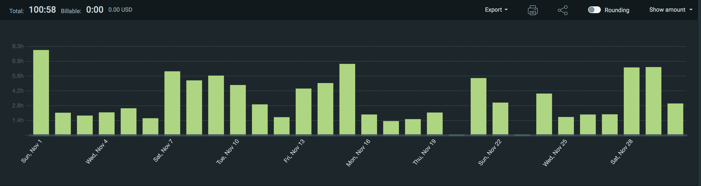
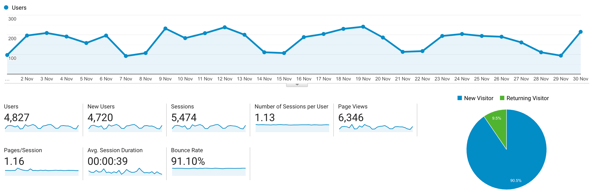

I post a progress report showing what I did and how my products performed each month.
Last month's report can be seen [here](/progress-report-october-2020).

## What did I do

_Hours worked on **side-projects** in November_

I worked **101** _productive_ on side projects hours last month.

To make these progress reports a bit more interesting, from now on I'll post my favourite song, TV show, and article I read last month.

* **Podcast of the Month**: I'm really enjoying [Guy Swann's Bitcoin Audible](https://www.listennotes.com/podcasts/bitcoin-audible-previously-the-cryptoconomy-0wjzfDGPct4/)
* **Song of the Month**: [Bronski Beat - Smalltown Body](https://open.spotify.com/track/5vmRQ3zELMLUQPo2FLQ76x)
    <iframe src="https://open.spotify.com/embed/track/5vmRQ3zELMLUQPo2FLQ76x" width="300" height="80" frameborder="0" allowtransparency="true" allow="encrypted-media"></iframe>
* **TV series of the Month**: [Queen's Gambit S01](https://trakt.tv/shows/the-queen-s-gambit/seasons/1)

### What was worked on

November felt a bit more relaxing than previous months. On the downside, my sleep schedule became very bad. I 'll get back to routinely getting up at the same time in December again.

* arbitrage bot improvements. Even though I made my bot better, the competition isn't sleeping either 😃
* other private projects

## Platform Growth

### Website

Sessions on my website went down by 500 to at **5,474**.

I did **not** stick to my bi-weekly schedule of releasing a blog post.
Usually, I write on the weekends but for some reason my weekends are currently also occupied all the time.

### Subscribers

My [twitter](https://twitter.com/cmichelio) followers increased by _1_ to **658**.

## Sales

#### Learn EOS Development

I sold 13 (!) books last month. This makes November one of the best months this year.
Are more developers interested in EOSIO? Or am I indirectly benefitting from B1's training funnel? Maybe they get hooked by B1's new video course and then come to me to learn more. Fascinating - this is the complete opposite of a zero-sum game which one might expect from the teaching niche.

#### Trading

I made 200 EOS last month.
