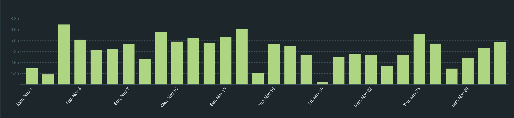
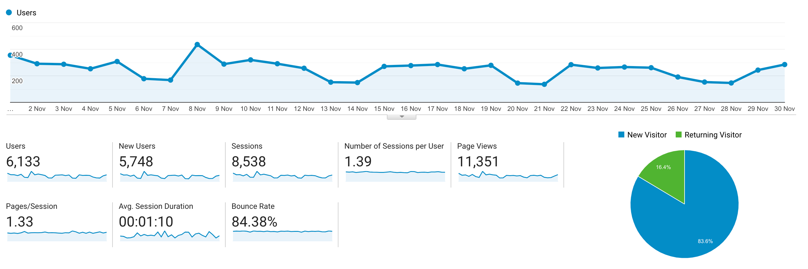

I post a progress report showing what I did and how my products performed each month.
Last month's report can be seen [here](/progress-report-october-2021).

## What did I do

_Hours worked on **side-projects** in November_

I worked **130** _productive_ on side projects hours last month. I noticed this includes C4 but it probably shouldn't be considered a side-project of mine anymore.

To make these progress reports a bit more interesting, from now on I'll post my favourite song, TV show, and article I read last month.

* **Article of the Month**: [Neodyme's Solana Security Workshop](https://workshop.neodyme.io/index.html)
* **Song of the Month**: [Kummer - Der letzte Song](https://open.spotify.com/track/2FQRZLR31e3423Nmrgv0Pv)
    <iframe src="https://open.spotify.com/embed/track/2FQRZLR31e3423Nmrgv0Pv" width="300" height="80" frameborder="0" allowtransparency="true" allow="encrypted-media"></iframe>
* **TV series of the Month**: [Mushoku Tensei: Jobless Reincarnation](https://trakt.tv/shows/mushoku-tensei-jobless-reincarnation/seasons/1)

### What was worked on

**This month is the 5 year anniversary of writing my monthly progress reports**.
The first one can be seen [here](/progress-report-november-2016).
It's incredible how many failed side projects I had over the years.
If I calculate the opportunity costs of my market rate times the hours spent on these side projects, not a single one of them made sense.
Neither have I gone back and read a single one of these progress reports (except the first one now).
Working on these projects was still more fun than client work but I need to rethink all of this on my new year's goal post.

Anyway, what did I do this month?

* [Solved the Solana Security Workshop challenges](https://workshop.neodyme.io/index.html). My solutions can be found [here](https://github.com/MrToph/neodyme-breakpoint-workshop)
* Learned some more Rust and how useful the `From` trait is after looking at a codebase that heavily uses it.
* lots of other smaller things, helping out here and there

## Platform Growth

### Website

Sessions went up to **8,538** on my website.

I did **not** stick to my bi-weekly schedule of releasing a blog post.
Still, at least I managed to write a single post.

1. [Replaying Ethereum Hacks - Rari Fuse VUSD Price Manipulation](/replaying-ethereum-hacks-rari-fuse-vusd-price-manipulation/)

### Subscribers

My [twitter](https://twitter.com/cmichelio) followers increased by _251_ to **2002**.

## Sales

#### Learn EOS Development

I sold 7 books last month. 👀

## What's next

* I'll be doing [Advent of Code 2021](https://adventofcode.com/2021) to learn Rust. I already did the exact same thing last year but stopped after [day 11](https://github.com/MrToph/adventofcode-2020/). Let's see when I stop this time because of too much work. 😢

