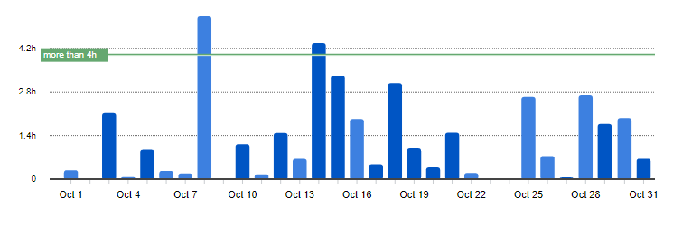
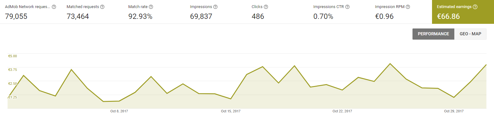
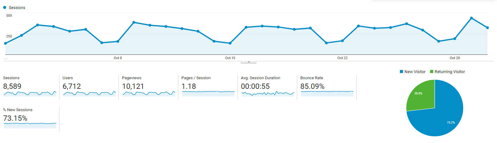

# Progress Report - October 2017
I post a progress report showing what I did and how my products performed each month.
Last month's report can be seen [here](/progress-report-september-2017).  

## What did I do

I worked 40 _productive_ hours. (Tracked using [RescueTime](/redirects/rescuetime).)  
I watched [Mr. Robot Season 3](https://trakt.tv/shows/mr-robot/seasons/3), [Stranger Things Season 2](https://trakt.tv/shows/stranger-things/seasons/2), and [Curb your Enthusiasm Season 9](https://trakt.tv/shows/curb-your-enthusiasm/seasons/9).  
I read [The Complete Software Developer's Career Guide](https://www.amazon.com/Complete-Software-Developers-Career-Guide-ebook/dp/B073X6GNJ1).  
I reviewed some more chapters for a book on React Native that will soon be published.

Workwise, I mostly produced content for my new quiz app.

## Apps
### Downloads
Downloads went down by another 70. In sum, my apps were downloaded **741** times this month. Two of my fitness apps lost about 20% of their monthly downloads.

### In-App Purchases
In-app Purchases stayed at 5 orders this month. (+0)

I made an estimated **17.11€** (+0€) this way.

### Ad Revenue
Ad revenue went up again. 😄 I made **66.86€** (+15.79€) for 69,837 Google AdMob banner impressions.  

### Total App Income
In total, this month's app income was 83.97€ (+15.79€).

IAPs | Ads | Total
--- | --- | ---
17.11€ | 66.86€ | 83.97€

The ad revenue was a lot higher than last month again, still not as high as my peak from two months ago.

## Platform Growth
### Website
Website traffic was the same. I didn't write any new blog posts.

### Subscribers
My [twitter](https://twitter.com/cmichelio) followers increased by 5 to 166. I retweeted some interesting tweets and joined some discussions.

## What's next
I'm still in the content creation phase for my song quiz app. It's taking way too long - I have to go through thousands of prescraped songs by hand and judge if it should be included in the app or not. But I'm 60% done, so I should finally be able to finish it in November. 🎉
