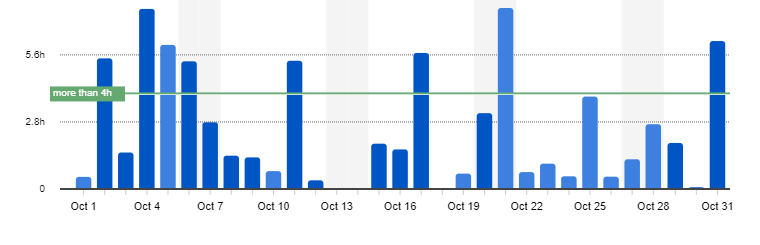
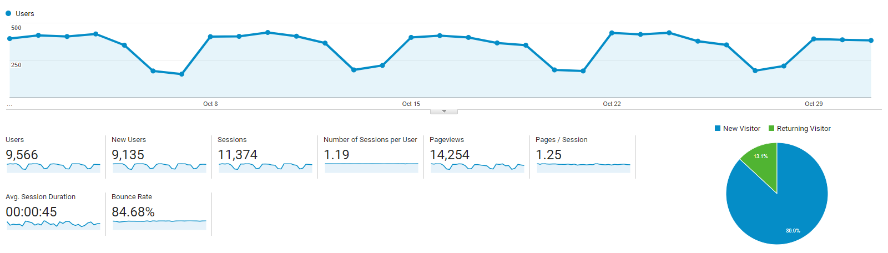

I post a progress report showing what I did and how my products performed each month.
Last month's report can be seen [here](/progress-report-september-2018).

## What did I do

I worked **78** _productive_ hours last month. After my day job I usually work for another hour and of course full-time on the weekends which makes approximately 20h / week. 💪
I watched [Maniac - S1](https://trakt.tv/shows/maniac-2018) and [Norsemen - S2](https://trakt.tv/shows/norsemen/seasons/2).

I 'm really close to finishing the big "Smart Contract Development" chapter of my [Learn EOS Development](https://learneos.dev) book.
I updated a lot of EOS libraries and code to the latest versions.

## Mobile Apps

Big news here. **Google shut down all my fitness apps.** Suddenly, without prior notice after 2 years, I was informed that my apps are missing a privacy policy and I would need to create a website declaring it and link to it from within the store and my app.
The funny story is that the only reason for needing a privacy policy in the first place is because I'm using Google's own advertisement solution - AdMob.
It's not like Google doesn't know everything about the user's app behavior already anyway. 🤷

> After review, [my app], has been removed from Google Play due to a policy violation. This app won’t be available to users until you submit a compliant update.
> Issue: Violation of Usage of Android Advertising ID policy and section 4.8 of the Developer Distribution Agreement.
> Google Play requires developers to provide a valid privacy policy when the app requests or handles sensitive user or device information. We’ve identified that your app collects and transmits the Android advertising identifier, which is subject to a privacy policy requirement. If your app collects the Android advertising ID, you must provide a valid privacy policy in both the designated field in the Play Console, and from within the app.

Updating all three apps would take too much of my time as they're written in an old React Native version (more than a year behind current release).
I don't want to deal with that right now.
The app business is not my focus anymore.
It was mostly a failed attempt only earning about 100$ per month.
In the end, the fitness tracker niche (and the mobile app market in general?) is already quite saturated and my apps were nothing special.  
In a weird way, I'm happy that the apps were suddenly removed from Google's app store - For one, I can now mentally put aside my mobile app endeavors.
For another, it just **strengthens my belief in blockchain and distributed, censorship-resistant solutions** in favor of megacorporations building monopolies in which they have all control.

This means, **no more mobile app updates in the future**.

## Platform Growth

### Website

Sessions went up to **11,374** on my website.

I stuck to my bi-weekly schedule of releasing a blog post.

1. [C++ Guide for EOS Development - Header files](/cpp-guide-for-eos-development-header-files/)
1. [EOS 1.3 Contract Development Toolkit Updates](/eos-1-3-contract-development-toolkit-updates/)

The C++ Guide is now finished and my pipeline is empty, which means I need to write new posts in November.

### Subscribers

My [twitter](https://twitter.com/cmichelio) followers increased by _32_ to **350**.

### Learn EOS Development Subscribers

I currently have **192** email subscribers for [my book](https://learneos.dev). (+48 in a month)  
I need to send newsletters more often.

## What's next

Full focus on the next chapters of the book.

* Write tutorials for free and link to my book. Collect email addresses. All while actually writing the book.
* Send out newsletters more often.
* Try to keep up the pace with newsletter subscribers

**If you have any suggestions on which decentralized example app I should develop in my book, please let me know.**
