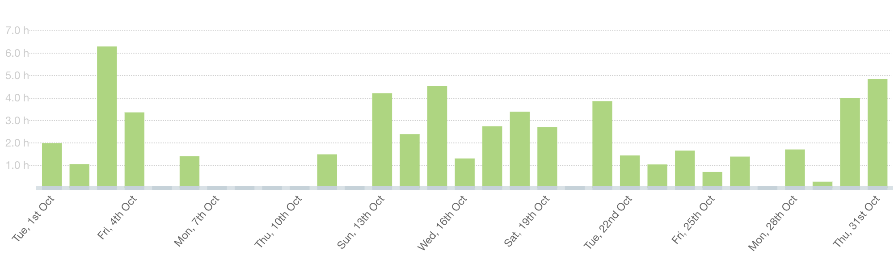
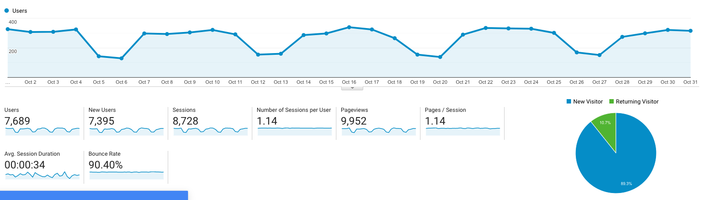

I post a progress report showing what I did and how my products performed each month.
Last month's report can be seen [here](/progress-report-september-2019).

## What did I do

_Hours worked on **side-projects** in October_

I worked **58** _productive_ hours last month.

* **Article of the Month**: [Daniel Larimer's Blockchain Governance Proposal](https://medium.com/@bytemaster/blockchain-governance-proposal-470478e42686)
* **Song of the Month**: [頑童MJ116 - 騙吃騙吃 Pian Jia Pian Jia](https://open.spotify.com/track/0A4xjJBJT41ys5InvWSCJY?si=ieElTNjBS3SmfqWAj80F7Q)
    <iframe src="https://open.spotify.com/embed/track/0A4xjJBJT41ys5InvWSCJY" width="300" height="80" frameborder="0" allowtransparency="true" allow="encrypted-media"></iframe>
* **TV series of the Month**: [Barry Season 2](https://trakt.tv/shows/barry/seasons/2)

### What was worked on

October has been a really busy month. I worked on three different EOS projects.

## Platform Growth

### Website

Sessions went down to **8,729** on my website.
That's really low. I need to keep an eye on this and see if there's any reason to be concerned.

On a plus side, I received a lot of positive feedback for my [What really happened during the EOSPlay hack](/what-really-happened-with-the-eos-play-hack/) post.
I plan on researching and doing a write-up of every EOS hack now.
It's fun to do and you usually learn something new along the way.

I did not release a single blog post last month.
I was just too busy with other things. 💁‍♂️

### Subscribers

My [twitter](https://twitter.com/cmichelio) followers increased by _9_ to **507**. I finally broke 500 followers 🎉 

### Learn EOS Development Subscribers

I currently have **534** email subscribers for [my book](https://learneos.dev). (+15 in last 30 days)
I sold **6 books** in October. That's +200% compared to the previous month. No idea why my book sales are more volatile than bitcoin. 

## What's next

No new side projects planned. Keep building. [Vigor](https://vig.ai) is getting traction. Curious to see what's next.
