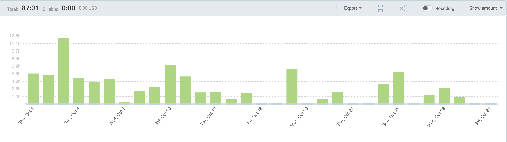
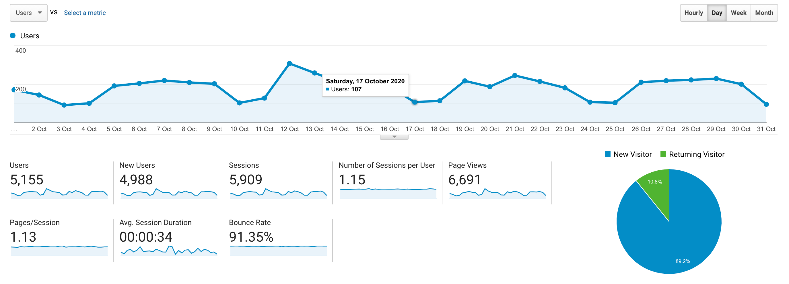

I post a progress report showing what I did and how my products performed each month.
Last month's report can be seen [here](/progress-report-september-2020).

## What did I do

_Hours worked on **side-projects** in October_

I worked **89** _productive_ on side projects hours last month.

To make these progress reports a bit more interesting, from now on I'll post my favourite song, TV show, and article I read last month.

* **Article of the Month**: [All in all, another brick in the Motte](https://slatestarcodex.com/2014/11/03/all-in-all-another-brick-in-the-motte)
* **Song of the Month**: [Elijah Nang - Underwater District](https://open.spotify.com/track/39oRxKk2dUbSaspLaEHFB2)
    <iframe src="https://open.spotify.com/embed/track/39oRxKk2dUbSaspLaEHFB2" width="300" height="80" frameborder="0" allowtransparency="true" allow="encrypted-media"></iframe>

* **TV series of the Month**: Didn't watch any

### What was worked on

* improving my arbitrage bot
* other private projects

## Platform Growth

### Website

Sessions stayed at **5,900** on my website.

I did **not** stick to my bi-weekly schedule of releasing a blog post.
I missed this week and only wrote one post.
But it was a good one 😉

1. [How I gamed EOS Defi projects and still got rekt](/how-i-gamed-eos-defi-projects-and-still-got-rekt/)

### Subscribers

My [twitter](https://twitter.com/cmichelio) followers increased by _11_ to **657**.

## Sales

#### Learn EOS Development

I sold 5 books last month. Bullish 🚀

#### Trading

I made 468 EOS last month.
