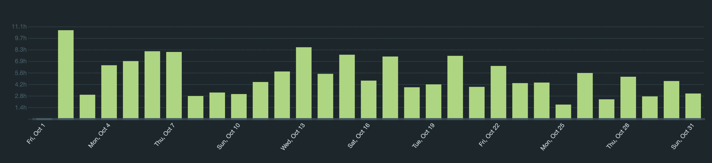
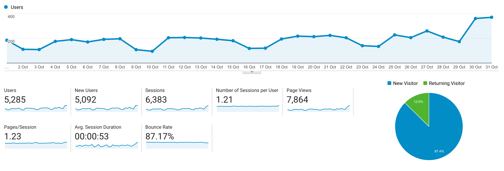

I post a progress report showing what I did and how my products performed each month.
Last month's report can be seen [here](/progress-report-september-2021).

## What did I do

_Hours worked on **side-projects** in October_

I worked **156** _productive_ on side projects hours last month. I noticed this includes C4 but it probably shouldn't be considered a side-project of mine anymore.

To make these progress reports a bit more interesting, from now on I'll post my favourite song, TV show, and article I read last month.

* **Article of the Month**: [UXD's stablecoin mechanism](https://uxdprotocol.medium.com/overview-of-uxd-protocol-7762a38cb477)
* **Song of the Month**: [Steve Erevitt - Twa Brigs](https://www.youtube.com/watch?v=MIsLYZtjppk)

* **TV series of the Month**: I didn't watch any. Anime recommendations welcome.

### What was worked on

* I participated in all [C4](https://code423n4.com) contests again.
* Learned some Rust and started building a Solana NFT analyzer CLI.
* Bought fewer NFTs than last month, I'm starting to have NFT fatigue, especially with the 10k/10k projects without utility. Got rugged by [Piggy Sol Gang](https://twitter.com/PiggySolGang) who suddenly decided to go back on their promise to pay out Alpha Art market royalties.

## Platform Growth

### Website

Sessions increased a bit to **6,383** on my website.

Published one new blog post:
- [How to become a smart contract auditor](/how-to-become-a-smart-contract-auditor/)

### Subscribers

My [twitter](https://twitter.com/cmichelio) followers increased by _324_ to **1751**.
The growth came mostly from my tweet about the "How to become an auditor" blog post.

I set a new record for my most liked tweet as well, it was a [shitpost replying to a cringe @Meta tweet](https://twitter.com/cmichelio/status/1453909864757936134). 

<blockquote class="twitter-tweet">
 <a href="https://t.co/b0WwJpAAmr">pic.twitter.com/b0WwJpAAmr</a>
&mdash; Christoph Michel (@cmichelio) <a href="https://twitter.com/cmichelio/status/1453909864757936134?ref_src=twsrc%5Etfw">October 29, 2021</a></blockquote> 

Shitposting is indeed easier than thoughtful tweets.

## Sales

#### Learn EOS Development

I sold 4 books last month.

## What's next

More of the same same, auditing, maybe some Rust&Solana, maybe some bug bounties, maybe some real life.
