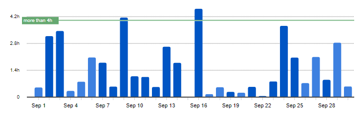
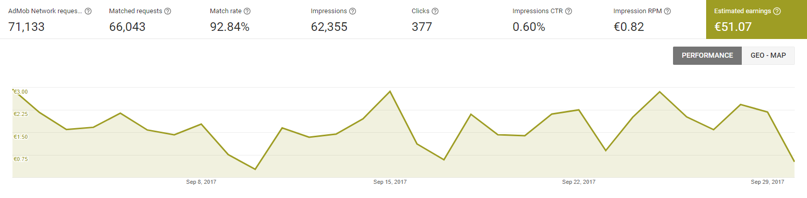
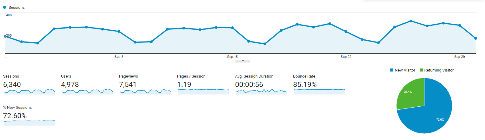

# Progress Report - September 2017
I post a progress report showing what I did and how my products performed each month.
Last month's report can be seen [here](/progress-report-august-2017).  

## What did I do

I worked 44 _productive_ hours. (Tracked using [RescueTime](/redirects/rescuetime).)  
I watched [South Park Season 21](http://www.imdb.com/title/tt4847050/), [Rick and Morty Season 3](http://www.imdb.com/title/tt2861424/episodes?season=3) and [Boku no Hero Academia Season 2](http://www.imdb.com/title/tt5626028).  
I read [Ethereum Whitepaper](https://github.com/ethereum/wiki/wiki/White-Paper) and [The Subtle Art of Not Giving a Fuck](https://www.amazon.de/Subtle-Art-Not-Giving-Counterintuitive/dp/0062457713).  
I was a reviewer for a book on React Native that will soon be published.

I moved the backend of my next app to the `serverless` framework with AWS Lambda + DynamoDB. Turned out it wasn't that easy to replicate my MongoDB setup in DynamoDB with the same functionality. I should write a blog post about it.

## Apps
### Downloads
Downloads went down by another 100. In sum, my apps were downloaded **810** times this month. I hope this trend does not continue. Not sure what happened, the ratings are still mostly the same.

### In-App Purchases
In-app Purchases went down to only 5 orders this month. (-4)

I made an estimated **17.11€** (-13.69€) this way.

### Ad Revenue
Ad revenue also went down a lot. I made **51.07€** (-24.83€) for 62,335 Google AdMob banner impressions.  

### Total App Income
In total, this month's app income was 68.18€ (-38.52€).

IAPs | Ads | Total
--- | --- | ---
17.11€ | 51.07€ | 68.18€

After two great months with over 100€, this month was a bad one again.

## Platform Growth
### Website
Website traffic went slightly up. I released a new blog post explaining how I use [headless chrome in node.js](http://cmichel.io/headless-chrome-in-nodejs/) to automate these progress reports.

### Subscribers
I gained one [twitter](https://twitter.com/cmichelio) follower.

<iframe src="https://giphy.com/embed/5VKbvrjxpVJCM" height="300" frameBorder="0" class="giphy-embed"></iframe>

## What's next
It was a good month, although my earnings went down by about a third. Anyway, I could force myself to work for about an hour after my main job on most days, which is more important.  
I should think bigger for the next projects, the apps I have right now (and the one I'm building) don't have much potential to earn a real income.
I'm also thinking about going into teaching more and writing a book / start with some livecoding. Being a reviewer this month showed me that I'm ready - I feel like I would have done a better job 😇

Still I have to finish glueing my new app together and create its content ...
