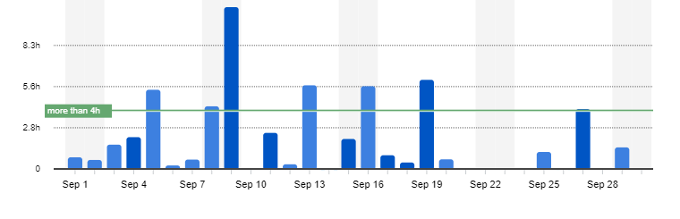
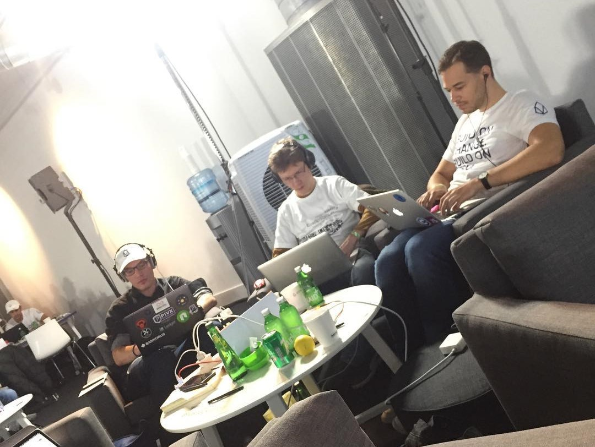
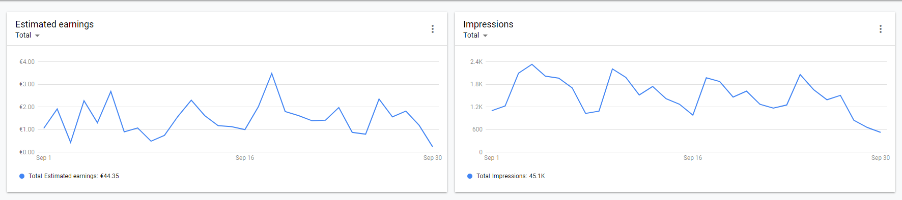

I post a progress report showing what I did and how my products performed each month.
Last month's report can be seen [here](/progress-report-august-2018).

## What did I do

I worked **59** _productive_ hours last month.
I watched [Money Heist](https://trakt.tv/shows/money-heist) and [Attack on Titan Season 3](https://trakt.tv/shows/attack-on-titan/seasons/3).

I finished the second and started with the third chapter of my book [Learn EOS Development](https://learneos.dev).
I didn't write as much as I would have liked as I was at the EOS Hackathon in London.
But it was totally worth it.
The hackathon was the best I've ever been to, from the location (Science Museum), the EOS community, the free food, to the expensive swag (patagonia jacket + backpack).
While we didn't end up in the top 10, it was a lot of fun coming up with the project, coding it, and pitching it to the judges with the team in 24 hours.

## Mobile Apps

### Downloads

Total downloads of all my apps went up to **700** this month.

### In-App Purchases

In-app Purchases reduced to 2. (-3)

I made an estimated **7.58€** (-11.38€) this way.

### Ad Revenue

My ad revenue went down to **44.35€** (-6.04€) for 45,000 AdMob banner impressions.

### Total App Income

In total, this month's app income was **51.93€** (-17.42€).

IAPs | Ads | Total
--- | --- | ---
7.58€ | 44.35€ | 51.93€

## Platform Growth

### Website

Sessions stayed at **10,562** on my website.

I stuck to my bi-weekly schedule of releasing a blog post. The C++ chapter of my book was already finished and I just had to turn the sub-chapters into blog posts.

1. [Classes and Structs](/cpp-guide-for-eos-development-classes-and-structs/)
1. [Templates](/cpp-guide-for-eos-development-templates)
1. [Iterators & Lambda Expressions](/cpp-guide-for-eos-development-iterators-lambda-expressions)

### Subscribers

My [twitter](https://twitter.com/cmichelio) followers increased by _10_ to **328**.

### Learn EOS Development Subscribers

I currently have **144** email subscribers for [my book](https://learneos.dev).
That's +36 in a month.
I'm curious what my conversion rate will be.

## What's next

Full focus on the next chapters of the book.

* Write tutorials for free and link to my book. Collect email addresses. All while actually writing the book.
