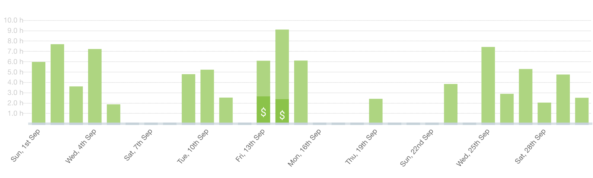
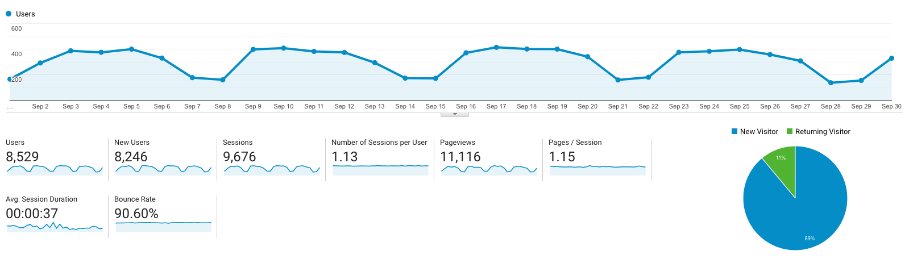

I post a progress report showing what I did and how my products performed each month.
Last month's report can be seen [here](/progress-report-august-2019).

## What did I do

_Hours worked on **side-projects** in September_

I worked **92** _productive_ hours last month.

* **Article of the Month**: [The LAO demystified](https://prestonbyrne.com/2019/09/03/the-lao-demystified/)
* **Song of the Month**: [Brenk Sinatra's Midnite Ride 2 album](https://open.spotify.com/track/42reVqfKcN6jTtjO6uUWrP?si=aK2i8mleR5SYoVvpYY35ow)
    <iframe src="https://open.spotify.com/embed/track/42reVqfKcN6jTtjO6uUWrP" width="300" height="80" frameborder="0" allowtransparency="true" allow="encrypted-media"></iframe>
* **TV series of the Month**: [Preacher Season 04](https://trakt.tv/shows/preacher/seasons/4)

### What was worked on

Besides my job, I worked on a private project, [Vigor]([https://](http://vig.netlify.com)), and on researching the EOS hack.

## Platform Growth

### Website

Sessions went down to **9,676** on my website.

Again, I did **not** stick to my bi-weekly schedule of releasing a blog post.
Still, I managed to write a great blog post investigating an EOS mainnet hack.

1. [What really happened during the EOSPlay hack](/what-really-happened-with-the-eos-play-hack/)

### Subscribers

My [twitter](https://twitter.com/cmichelio) followers increased by _15_ to **498**. Sharing blog posts seems to help.

### Learn EOS Development Subscribers

I currently have **519** email subscribers for [my book](https://learneos.dev). (+10 in last 30 days)
I only sold 2 books in September.
There are finally more and more EOSIO tutorials in the form of video courses popping up, which is a good thing.
Although, it means my monopoly on EOSIO learning resources is gone. 😁

## What's next

No new side projects planned. I 'd like to live-stream my open-source development on [Vigor](https://vigorstablecoin.com) though. Should be fun.
