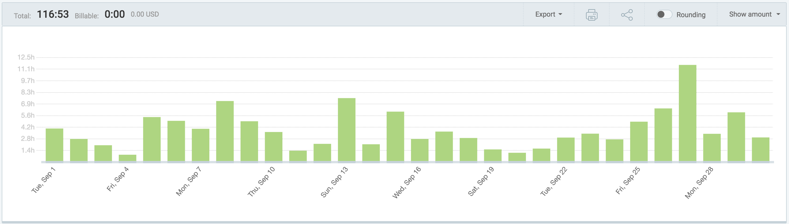
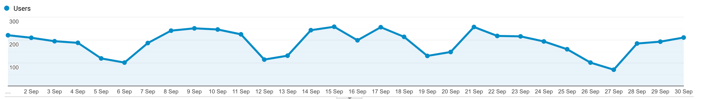

I post a progress report showing what I did and how my products performed each month.
Last month's report can be seen [here](/progress-report-august-2020).

## What did I do

_Hours worked on **side-projects** in September_

I worked **117** _productive_ hours on side projects last month.
That's awesome and almost twice as much as the months before - I had some more free time.

To make these progress reports a bit more interesting, from now on I'll post my favourite song, TV show, and article I read last month.

* **Article of the Month**: [How to correctly type-pun in C++](https://gist.github.com/shafik/848ae25ee209f698763cffee272a58f8#what-is-type-punning)
* **Song of the Month**: [Dennis da Menace & Brous One - Gourmet](https://open.spotify.com/track/6ktuLbWtaATic0aa5xURhg)
    <iframe src="https://open.spotify.com/embed/track/6ktuLbWtaATic0aa5xURhg" width="300" height="80" frameborder="0" allowtransparency="true" allow="encrypted-media"></iframe>
* **TV series of the Month**: [The Boys S02](https://trakt.tv/shows/the-boys-2019/seasons/2)

### What was worked on

* VIGOR launch 🚀
* improving my arbitrage bot
* other private projects

## Platform Growth

### Website

Sessions stayed at **6000** on my website.

Finally, I was able to pump out two short articles and stick to my biweekly schedule.
They were inspired by updating to macOS Catalina and having to fix my dev environments.

1. [Fixing C++ compilation bugs for the MacOS Catalina upgrade](/fixing-cpp-compilation-bugs-for-the-mac-os-catalina-upgrade/)
2. [How to install an old package version with brew](/how-to-install-an-old-package-version-with-brew/)

### Subscribers

My [twitter](https://twitter.com/cmichelio) followers increased by _23_ to **646**.

## Sales

#### Learn EOS Development

I sold 2 books last month.

#### Trading

I made 330 EOS arbitrage trading last month.
IIRC, most of it was from being one of the first to integrate a new DeFi token that launched at the beginning of the month.

## What's next

* I enjoy tinkering around with the various EOS DeFi projects and trying to combine them to get a high APR. Maybe I'll build a product in this direction.
