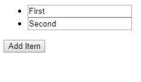
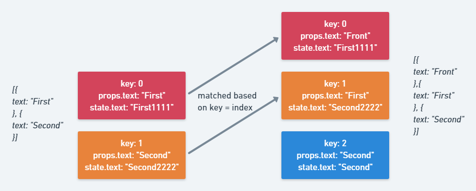

React uses the `key` attribute during [its reconciliation phase](https://reactjs.org/docs/reconciliation.html) to decide which [elements](https://reactjs.org/blog/2015/12/18/react-components-elements-and-instances.html) can be reused for the next render.
They are important for dynamic lists. React will compare the keys of the new element with the previous keys and 1) mount components having a new key 2) unmount components whose keys are not used anymore.
Many React developers heard of the general advice that you [should not use `index` as a key](https://medium.com/@robinpokorny/index-as-a-key-is-an-anti-pattern-e0349aece318), but what exactly can go wrong when using `key`s in a bad way? What else can we do when we play around with keys?

For better understanding, let's consider [the example](https://codesandbox.io/s/7ko97vnv80) of rendering a list of `input`s.
When clicking a button, we will insert a new item with text `Front` _to the front_ of the list.

```jsx
import React from "react";
import { render } from "react-dom";

class Item extends React.PureComponent {
  state = {
    text: this.props.text
  };

  onChange = event => {
    this.setState({
      text: event.target.value
    });
  };

  componentDidMount() {
    console.log("Mounted ", this.props.text);
  }

  componentWillUnmount() {
    console.log("Unmounting ", this.props.text);
  }

  render() {
    console.log("rerendering ", this.props.text);
    const { text } = this.state;
    return (
      <li>
        <input value={text} onChange={this.onChange} />
      </li>
    );
  }
}

class App extends React.Component {
  state = {
    items: [
      {
        text: "First",
        id: 1
      },
      {
        text: "Second",
        id: 2
      }
    ]
  };

  addItem = () => {
    const items = [{ text: "Front", id: Date.now() }, ...this.state.items];
    this.setState({ items });
  };

  render() {
    return (
      <div>
        <ul>
          {this.state.items.map((item, index) => (
            <Item {...item} key={index} />
          ))}
        </ul>
        <button onClick={this.addItem}>Add Item</button>
      </div>
    );
  }
}

render(<App />, document.getElementById("root"));

```

Using `index` as a key the following happens:
[](https://codesandbox.io/s/7ko97vnv80)



Another `Item` with text `Second` instead of `Front` is inserted _at the back_ of the list?
Here's what happens:
1. `Item is an uncontrolled component`: The text the user writes into its `input` field is stored as `state`
1. A new data item `{ text: "Front" }` is inserted to the beginning of the list data.
1. The list is re-rendered with the **index** value as `key`. So the previous components are re-used for the first two **data items** and given the correct props `Front` and `First`, but the state is not updated in `Item`. That's why the first two component instances keep the same text.
1.  A new component instance is created for `key: 2` because no previous matching key is found. It is filled with the `props` of the last **list data item** which is `Second`.



Another interesting point is the `render` calls that happen. Item is a `PureComponent`, so it only updates when the `text` prop (or state) changes:
```
rerendering  Front
rerendering  First
rerendering  Second
Mounted  Second
```

*All* components are re-rendered. This happens because the element with `key: 0` is reused for the first data item and receives its `props`, but the first data item is now the new `Front` object, triggering a `render`. The same happens with the other components because the old data items are now all shifted by one place.

> So what's the fix?
The fix is easy, we give each list data item a unique `id` once _upon creation_ (not on each render!).
All components instances will be matched with their corresponding data item, i.e., they receive the same `props` as before - avoiding another `render`.

Ignoring the performance benefits when using `id`s in dynamic lists for now, the example shows that **bugs introduced by keys only ever happen with regards to _uncontrolled_ components**, components that keep **internal state**.

If we rewrite `Item` as a controlled component, by moving the state out of it, the bug is gone.

Why? Again, because the bug was _reusing a component for a different data item_, and therefore the internal state still _reflected the state of the previous data item_, but the _props of a different one_.
Making the component controlled, by removing its state completely, we, of course, don't have this discrepancy anymore. (But there's still the issue with the unnecessary re-renders.)

## Abusing key to fix broken third-party components
React only needs `key`s when matching several elements, so setting a key on a single child is not needed.
But **it can still be useful to set a key on a single child component**.
If you change the key, React will throw away the whole component (unmount it), and mount a new component instance in its place.
Why could this be useful?

Again, we're coming back to _uncontrolled components_. Sometimes, you're using a third-party component and you cannot modify its code to make it controlled.
If a component has some internal state and it's implemented in a bad way, i.e., the state is derived only _once_ in the constructor, but `getDerivedStateFromProps` / `componentWillReceiveProps` is not implemented to **reflect reoccurring `props` changes in its internal state**, the standard React toolbox cannot help you here. There is no `forceRemount`.
However, we can just set a new `key` on this component to achieve the desired behavior of completely initializing a new component. The old component will be unmounted, and a new one is mounted with the new `props` initializing the `state`.

## TL;DR:
Using `index` as a key can:
1. lead to unnecessary re-renders
2. introduce bugs when the list items are **uncontrolled components** but still use `props`

The `key` property can be used to force a complete remount of a component which can sometimes be useful.
