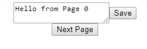

There was a recent update to React, [16.4](https://reactjs.org/blog/2018/05/23/react-v-16-4.html), that changed how `getDerivedStateFromProps` works.
The main difference is that it's now being called even on `state` changes instead of, as the name suggests, just on `prop` changes - which is the way it worked in 16.3.

If you don't know about `getDerivedStateFromProps`, it's a `static` lifecycle method introduced in React 16.3 to prepare for async rendering.

In 16.3 it was proposed as an alternative for `componentWillReceiveProps`, which is deprecated and will be removed in `React 17`.

> getDerivedStateFromProps is being added as a safer alternative to the legacy componentWillReceiveProps. - [React 16.3](https://reactjs.org/blog/2018/03/29/react-v-16-3.html)

In my opinion, the removal of `componentWillReceiveProps` made it significantly more verbose to write components that have *both* local `state`, and also derive part of their state from `props`.

A _fully_ controlled or fully _uncontrolled_ component won't have the problems that we'll see now. So you should stick to these whenever possible, but in contrast to popular belief, we're often faced with components that are neither _fully_ controlled nor uncontrolled.

Let's consider the following example. You have a `Page` component that renders the text of the current page and lets you edit it.
So far, `Page` can be uncontrolled - we keep the `text` in `state` and only update it when a button is pressed on the page, triggering an update to the parent component.

Now, let's add pagination: The parent component has a button that allows you to go to the next page, which will re-render your `Page` component with a new `text prop`.
This should now discard the local state in the `Page` component and render the text of the new page instead.

Here's a [codesandbox](https://codesandbox.io/s/j3xvwy6845) of the app:



[](https://codesandbox.io/s/j3xvwy6845)

The `App`:

```jsx
class App extends React.Component {
  state = {
    pages: ["Hello from Page 0", "Hello from Page 1", "Hello from Page 2"],
    currentPage: 0
  };

  onNextPage = () => {
    this.setState({
      currentPage: (this.state.currentPage + 1) % this.state.pages.length
    });
  };

  onUpdate = value => {
    const { pages, currentPage } = this.state;
    this.setState(
      {
        pages: [
          ...pages.slice(0, currentPage),
          value,
          ...pages.slice(currentPage + 1)
        ]
      }
    );
  };

  render() {
    const currentPageText = this.state.pages[this.state.currentPage];
    return (
      <div style={styles}>
        <Page value={currentPageText} onUpdate={this.onUpdate} />
        <button onClick={this.onNextPage}>Next Page</button>
      </div>
    );
  }
}
```

And here's the first try to implement the `Page` component:

```jsx
import React from "react";

export default class Page extends React.Component {
  constructor(props) {
    super(props);
    this.state = {
      value: props.value,
    };
  }

  componentWillReceiveProps(nextProps) {
    // if new value props was received, overwrite state
    // happens f.i. when changing pages
      this.setState({
        value: nextProps.value
      });
  }

  // ALTERNATIVE: using getDerivedStateFromProps
  static getDerivedStateFromProps(props, state) {
      return {
        value: props.value
      };
  }

  onChange = event => {
    this.setState({
      value: event.target.value
    });
  };

  onSave = () => {
    this.props.onUpdate(this.state.value);
  };

  render() {
    return (
      <div
        style={{
          display: "flex",
          alignItems: "center",
          justifyContent: "center"
        }}
      >
        <textarea value={this.state.value} onChange={this.onChange} />
        <button onClick={this.onSave}>Save</button>
      </div>
    );
  }
}
```

## The bug

The important thing to point out here is the use of `componentWillReceiveProps` _or_ `getDerivedStateFromProps` to update the local `text` state when the page changed.

But right now, **the Page component has a bug** (even though it's not noticeable in the way it is used right now). We reset the state on **every re-render**. This is because of how `componentWillReceiveProps` / `getStateDerivedFromProps` worked:
> `componentWillReceiveProps`: Note that if a parent component causes your component to re-render, this method will be called even if props have not changed. Make sure to compare the current and next values if you only want to handle changes. [React Documentation](https://reactjs.org/docs/react-component.html#unsafe_componentwillreceiveprops)

Now here's the fun part: Having this (buggy?) code that worked perfectly fine in our example app, **doesn't work anymore in React 16.4** when you're using `getDerivedStateFromProps`:
 The `onChange` on the `textarea` triggers a `setState` which itself triggers a `getDerivedStateFromProps` which sets the state again to the _old_ `text` from `props`. Which means **you cannot write in the `textarea` anymore**.


The main problem with this code is that it was **not resilient to re-renders**. Because of this seemingly breaking change, there's a [huge GitHub issue](https://github.com/facebook/react/issues/12898#issuecomment-392117539) if this behavior in React 16.4 shouldn't be considered a breaking change which would require a major version bump.

## The solution
The point I'm trying to make is a different one, however. It gets clear when we look at the **suggested solution** which fixes this bug:
As stated above, we need to compare the current and next values of props before setting the state.

This was easy for `componentWillReceiveProps`:

```jsx
componentWillReceiveProps(nextProps) {
    // if new value props was received, overwrite state
    // happens f.i. when changing pages
    if (nextProps.value !== this.props.value) {
      this.setState({
        value: nextProps.value
      });
    }
  }
```

But not so easy with `static getDerivedStateFromProps`: It's static and we only receive `(props, state)` as arguments. To compare `props` with `prevProps` we have to save `prevProps` in `state` to be able to access it.

```jsx
  constructor(props) {
    super(props);
    this.state = {
      prevProps: props,
      value: props.value,
    };
  }

  static getDerivedStateFromProps(props, state) {
    // comment this "if" and see the component break
    if (props.value !== state.prevProps.value) {
      return {
        prevProps: props,
        value: props.value
      };
    }
  }
```

## That's ugly
Now take a step back. Think about the simplicity of the app and what we're trying to achieve: A text field. And then look at the solution code again.  
There's clearly something wrong with React when this is the recommended way to handle such a fundamental use-case in React 16.4. To me, it feels hacky having to save the previous `props` in the `state`. There should be an easier way to do that. (You could also (ab)use the `key` attribute and do a full remount of the `Page` component avoiding `getDerivedStateFromProps`. This is described [in another article](/react-fun-with-keys), or [this one](https://engineering.hexacta.com/three-approaches-to-distribute-the-state-across-components-in-react-da4db5a389e0). But that doesn't feel polished either.)


I sincerely hope that the React team's initiative to push **async rendering** doesn't further come at the cost of React's usability in everyday scenarios like the one above.
React 16.4 feels like a step backward after so many great and useful features in React 16.3.
With the removal of `componentWillReceiveProps` there is no **simple** way to just listen to `props` changes anymore or access previous `props`.
