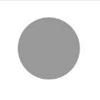
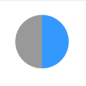
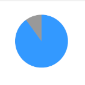
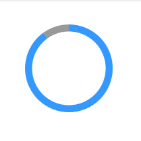
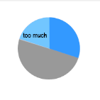
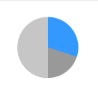

I decided to create my own React Native component to display **progress circles**. It's called [react-native-progress-circle](https://www.npmjs.com/package/react-native-progress-circle) and you can easily use it in your React Native app. I didn't use an existing component, because I wanted it to be _small_ and _lightweight_. It does _not_ depend on `react-native-svg` or ART, it's done **purely in CSS**.

### How it works
It uses two circles and two half-circles and positions them in a smart way such that they look like the progress circles you see above.
(Inspired by [react-native-percentage-circle](https://www.npmjs.com/package/react-native-percentage-circle).)
It's done in four steps:

#### 1. Render an _outer_ background circle with the shadow border color.



It's just a styled `View`:
```javascript
<View
  style={[styles.outerCircle, {
    width: radius * 2,
    height: radius * 2,
    borderRadius: radius,
    backgroundColor: shadowColor,
  }]}
/>
```

#### 2. Render a half-circle and position it according to the percentage
Now we style a `View` to the size of a rectangle and set the `borderRadius` property of only two of the four corners. This creates a _half-circle_.



```javascript
<View
  style={[styles.outerCircle, {
    width: radius,
    height: radius * 2,
    backgroundColor: color,
    borderRadius: radius,
    borderTopRightRadius: 0,
    borderBottomRightRadius: 0,
    transform: [ { rotate: /* rotate it according to percentage */ } ],
  }]}
/>
```

#### 3. Render another half-circle and position it according to the percentage
If the percentage is greater than 50%, we need another half-circle and then rotate it. It will overlay the first half-circle to some degree.



#### 4. Render a smaller _inner_ circle with the original background color
Now just put a smaller white circle in the center:



```javascript
const radiusMinusBorder = this.props.radius - this.props.borderWidth
// ...
<View
  style={[styles.innerCircle, {
    width: radiusMinusBorder * 2,
    height: radiusMinusBorder * 2,
    borderRadius: radiusMinusBorder,
    backgroundColor: this.props.bgColor,
  }]}
>
  {
      this.props.children
  }
</View>
```

### Rotation Issues
Two half-circles are enough to cover all percentages from 0 to 100, however you need to be a bit smart about it:

#### 1. More than 50%:
This is the easy case. The first half-circle will always have a rotation value of `180deg`, spanning the right side of the circle.
The second one is computed easily by converting the percent to degrees:

```javascript
function percentToDegrees(percent) {
  return percent * 3.6
}
```

#### 2. Less than 50%:
We do the same rotation conversion here, but the problem is that we display the _full_ half-circle instead of only the part on the right circle side.



The solution is use the second half-circle as an overlay for the left side. We render it there (`0deg`) **in the color of the outer circle**.



### Further Usage with Animated Library
An advantage of only using the built-in CSS features is that we can use the [Animated](https://facebook.github.io/react-native/docs/animated.html) library
that provides smooth animations with hardware acceleration.
We can then create a simple [Countdown Circle](https://www.npmjs.com/package/react-native-countdown-circle) with the same concepts.

