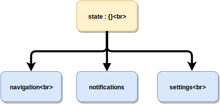
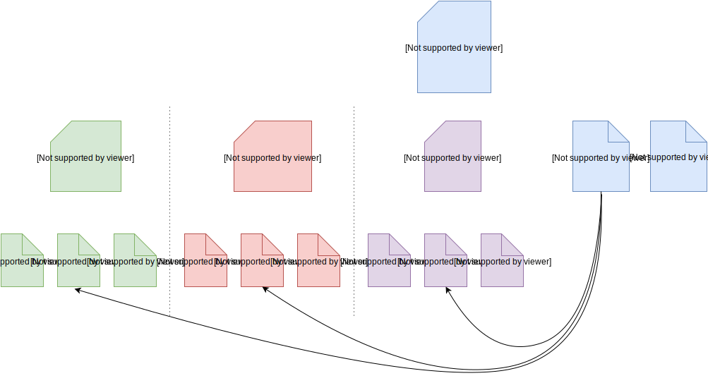
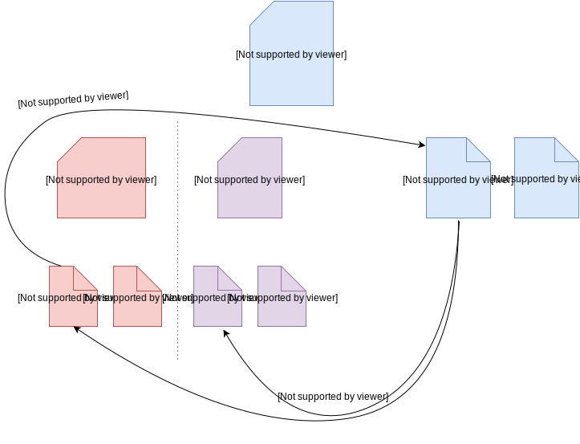

There have recently been [some](http://randycoulman.com/blog/2016/11/29/globalizing-redux-selectors/) 
[posts](http://www.datchley.name/scoped-selectors-for-redux-modules/) about how to structure the **redux** parts, especially how to handle selectors.
My way of doing it is pretty similar, but I do even more automation when globalizing the selectors.
I'm really satisfied with it and haven't encountered any issues yet.

## What do we want from selectors?
First of all, let's recap some common issues / patterns that need to be addressed:
1. Components access the state only via **selectors** and every selector should take the **root** state as an argument.
    This also holds true for _sub_-reducers composed with `combineReducers`.
    This way components are completely decoupled from the _internal_ state representation.
2. The first point leads to writing _global_ selectors taking the **root** state as an argument, but for ease of development we would rather write _local_ selectors taking a
    **child of the root state** as an argument. This way we don't have to _unpack_ the state, and can make sure the _sub_-reducers are
    correctly decoupled by preventing access to other parts of the root state.
3. There should be a mechanism that maps _local_ selectors to _global_ ones, so we only have to **implement selectors once and touch a single file**. This way we don't have code redundancy,
    are more time efficient, and I get to keep my sanity.

## Redux File Structure
Take a look at the following state:



The state has three _sub_-states: `navigation`, `notifications`, `settings`. These should (mostly) be independent of each other and we can create three reducers and combine them with
`combineReducers`.
I organize my redux files the same way by splitting the `store` into three sub-folders, one for each reducer.



Each sub-folder contains its `reducer`, its _local_ `selectors` and its `actions`. The `store` folder contains a `selectors.js` file that gathers all the local selectors and
**globalizes** them. The `store`'s `index.js` contains `middleWares`, `combineReducers` and creates the store with `createStore`.

### Reducer and selectors in same file?
Some people like to put the selectors into the reducer file, but I prefer keeping them separate.
At first, I did this to avoid _circular import dependencies_, but if you encounter them here it's probably bad design.
For instance, assume you need to access the settings to consume notifications in the `notification reducer`. 
If you import some (global) settings selector from within the reducer, you 'll get a cyclic dependency graph which cannot be resolved.<sup>[1](#footnote1)</sup>



You can avoid this by defining [**thunks**](https://github.com/gaearon/redux-thunk) in `actions.js` that retrieve the important part of the settings themselves
via the global selectors, and then pass it as part of the _payload_ along with the action.
So whether to put selectors and reducers into the same file, is more of a personal preference in my opinion.

## Globalizing Selectors
The only thing left is how to create the **global** version of the selectors without duplicating code and while only touching the local selector files.
This can be done by exporting a new set of functions with the same name, whose only purpose is to do the state selection and then invoke the local selector.

```js
// store/navigation/selectors.js
export function getActiveScene(state) {
  return state.activeScene
}
```

```js
// store/selectors.js

/**
 * Accumulates all the different selectors
 */
import * as navigationSelectors from './navigation/selectors'
import * as notificationSelectors from './notifications/selectors'
import * as settingsSelectors from './settings/selectors'

const selectors = {}
Object.keys(navigationSelectors).forEach(
    funcName => selectors[funcName] = state => navigationSelectors[funcName](state.navigation),
)

Object.keys(notificationSelectors).forEach(
    funcName => selectors[funcName] = state => notificationSelectors[funcName](state.notifications),
)

Object.keys(settingsSelectors).forEach(
    funcName => selectors[funcName] = state => settingsSelectors[funcName](state.settings),
)

// We want to be able to import like this: "import { name1, name2 } from 'selectors'"
// Below code behaves like "export {...selectors}" because of this relationship:
// var module = {}
// var exports = module.exports = {}
module.exports = selectors
```

```js
// someComponent.js
import { getActiveScene } from '../store/selectors'
const mapStateToProps = state => ({
    activeScene: getActiveScene(state),
})
```

<a name="footnote1">1</a>: Webpack doesn't recognize that the settings selector is used in a different JS execution block than the one defining the notification selectors.
If you want to cheat, you could use `require(./selectors).someSelector` here _inside your reducer function_.