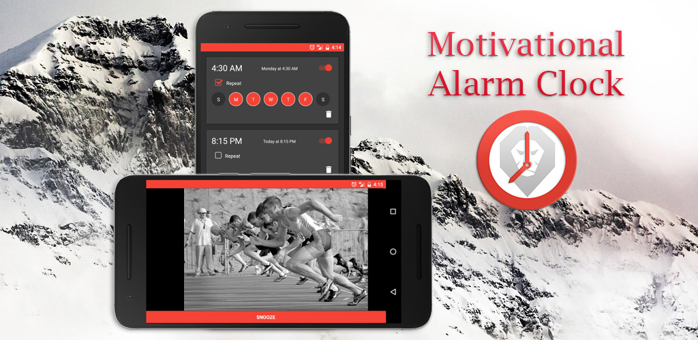

After releasing my first three [React Native fitness apps](../lessons-from-building-first-react-native-app/), I published my fourth one for Android today:
**Motivational Alarm Clock**

[](https://play.google.com/store/apps/details?id=io.cmichel.motivation)

There are a lot of great motivational videos on YouTube and I thought it would be a good idea to start my day with one of these, instead of a beeping sound.
And this is exactly what it does: You set your alarms for specific days of the week and whenever an alarm goes off, it starts playing a daily new inspiring video.
You can read more about the [Motivational Alarm Clock app](https://play.google.com/store/apps/details?id=io.cmichel.motivation) on the Google Play store - this post is about
the development part.

## How was development?
Smooth. It took me **three weeks** from the idea to publishing it on the app store, mostly because I was already familiar with React Native, and my current way to [structure the app state](../redux-selectors-structure/) works well for me. Note that the three weeks also include a lot of non-development work like creating the images, creating a playlist for the motivational videos, doing some keyword research, writing an app store description, testing on an actual device, ... 
But, let's have a look at some development choices I made:
* **Handling state:** I used `Redux` and [`seamless-immutable`](https://github.com/rtfeldman/seamless-immutable). You can read more about app state handling on my blog, for instance [here](../lessons-from-building-first-react-native-app/) or [here](../redux-selectors-structure/).
* **Material Design:** For my first three apps I used [`react-native-material-design`](https://github.com/react-native-material-design/react-native-material-design), but it's not maintained anymore and lacks some components I wanted to use, like a `TabBar`. I switched to [`react-native-elements`](https://github.com/react-native-community/react-native-elements) which is a great collection of good-looking components, but they don't ship with a _Material Design_ integration. What I ended up doing was to only use the font and color _styles_ of `react-native-material-design` and combine these with the `react-native-elements` components. This worked better than expected, especially when I found out it's nicely modularized and you can access just the styling part by installing [react-native-material-design-styles](https://github.com/binggg/react-native-material-design-styles):
    ```js
    import { color, typography } from 'react-native-material-design-styles'
    ```
* **Portrait/Landscape Mode:** You can watch the video in either Portrait or Landscape mode, but all other scenes should be in Portrait mode. [`React-native-orientation`](https://github.com/yamill/react-native-orientation) has a `lockToPortrait/lockToLandscape` function that you can use to achieve that by coupling it with its `orientation-change` listener.

I noticed the more experience I get, the more likely I am to build my own React Native modules. I always have this vision of how the _User Experience_ should be, and if I cannot achieve it with existing modules, I end up building something on my own now, instead of settling for a sub-optimal solution with existing tools. The hardest part for me, someone with little prior native Android experience, was actually getting the _gradle_ build system to work in Android Studio - the programming part and figuring out `Intents` was easy.
* I created a [`react-native-app-launcher`](https://github.com/MrToph/react-native-app-launcher) library using Android's `AlarmManager` to schedule the alarms in a way that an alarm icon is shown in the Status Bar. The alarms still work when the device is _idle_ or the application is closed.
* When there is no Internet access, the alarm simply falls back to a **ringtone** alarm, so I wrote a small `SoundManager` module in Java that can play / pause the default ringtone and adjusts its volume.

### It's on GitHub
I decided to **release the source code** for the whole app in the hope that it will be helpful to someone just starting out with React Native.
You often only see small code snippets or the infamous **To-Do app**, but having many components interact with each other poses different challenges again.
It's available on GitHub as [`react-native-motivation-app`](https://github.com/MrToph/react-native-motivation-app).

I'm aware that someone could just disregard my copyright and publish the app under his own name, but I feel like it's worth the risk and in the end people are lazy and developers usually have better things to do. And it probably won't [earn you any money](../progress-report-november-2016/). So, I'm not really concerned.

<iframe width="560" height="315" src="https://www.youtube.com/embed/cEFO83Ad-nk" frameborder="0" allowfullscreen></iframe>

### It's on Google Play
<a class='clearA' href='https://play.google.com/store/apps/details?id=io.cmichel.motivation&pcampaignid=MKT-Other-global-all-co-prtnr-py-PartBadge-Mar2515-1'></a>