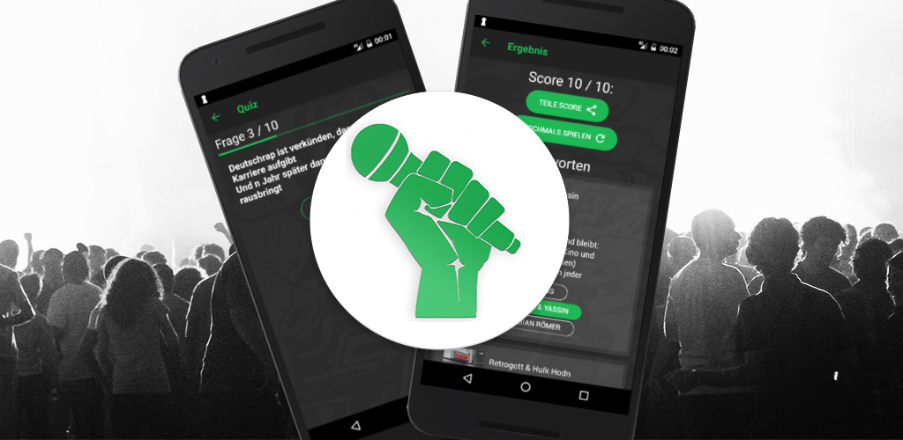

After releasing my first four [React Native apps](/released-fourth-react-native-app/), I finally published my fifth one for Android today:

It's a song quiz game showing you parts of the lyrics of a song, and you have to guess the artist based on that.

It's built with React Native for the frontend, and AWS Lambda with DynamoDB on the backend.

## Development
In contrast to my first apps, this one took quite a long time to develop. The reason is not the app's complexity, it's just that I worked on it only in my free time besides being distracted by other side projects. In addition to the React Native app, I wrote an admin web dashboard to scrape and filter the songs and a backend in Express + MongoDB. I decided to then rewrite my backend because I wanted to try out the [serverless framework](https://serverless.com/framework/) and AWS DynamoDB.

Here's the full stack and an explanation of the decisions:

### Mobile App / React Native
* *State handling*: For handling the app state I used **redux** with **redux-persist** to easily store state on the device. I used **seamless-immutable** instead of the more popular **immutable-js** library, because I didn't want to learn a new API and my app isn't heavy on state updates, so the worse performance is not an issue. I moved back from **redux-saga** to **redux-thunk** for handling *async* actions, because it's simpler and all I needed.
* *Navigation*: I used [**react-navigation**](https://reactnavigation.org/) as it seemed to finally become *the* solution for navigation in React Native. It works well once you correctly set it up and it fulfills all my needs. I just feel like their [redux integration](https://reactnavigation.org/docs/guides/redux) documentation could be better. Everything is abstracted away into functions of `StackRouter`, making it not really clear to me how the actual navigation state looks like and how to extend it. It doesn't really feel *"reduxy"*.
* *UI*: I used [Native base](https://docs.nativebase.io/Components.html#Components) for some additional components that don't exist in stand-alone React Native yet: Cards, Icons, different buttons. Also theming is really easy with it. For styling and general layout I used **plain inline-styling** - no CSS-in-JS like [glamor(ous)](https://github.com/paypal/glamorous) or [styled-components](https://github.com/styled-components/styled-components). I know these frameworks are really popular, but styling in React Native has never been a pain point for me (yet).
* *Custom Components*: I built an open source component for the countdown timer shown on each question. It's [react-native-countdown-circle](https://github.com/MrToph/react-native-countdown-circle) on GitHub.  
  
* *Internationalization*: I used **react-native-i18n** to translate all my texts into English and German. I highly recommend it for that use case, works like a charm.

> [App's source code available](https://github.com/MrToph/quiz-app)

### Tooling:
* *CodePush*: It's a shame that this was my first time trying [**CodePush**](https://github.com/Microsoft/react-native-code-push), even though it's already my fifth React Native app. It's an incredible piece of technology and I'll probably use it every time from now on. If I implement features using JavaScript only, I can immediately release them to all customers by running two [commands from the console](/code-push-cheat-sheet/). If I add CI integration on top, all I need to do is push to my release branch.
Compare this to building the `.apk`, navigating to the Google Dev Console, preparing a new release, uploading the APK, (optionally realizing you forgot to change the `versionCode` in `build.gradle`, and doing all the steps again,) filling out a bunch of update notes, and then waiting for an hour until it's live.
* *ESLint & Prettier*: Not much to say, makes your code more readable for yourself and especially others by forcing you to comply with sensible rules.

### Backend
* *serverless*: I used the serverless framework with the *aws-sdk* to deploy AWS Lambda functions. Authentication and everything else I learned can be read in [this great tutorial](https://serverless-stack.com). The functions are mostly to update the data base from my dashboard. The react native app only uses a single public lambda functions that returns new random questions. This gives me the option to dynamically add new content.
* *DynamoDB*: It's the data base system I used because its integration is really easy with AWS Lambda. However, I had a hard time with DynamoDB - You can read about it in [trying DynamoDB](/trying-dynamodb/).

## Learnings
* React Native can be frustrating when it comes to using native third-party projects. React Native breaks things in every update, and most open source authors simply don't have the time to maintain their libraries for years and keep up with the necessary changes on each release. Even big repos with thousands of stars, like [react-native-device-info](https://github.com/rebeccahughes/react-native-device-info), can be [broken](https://github.com/rebeccahughes/react-native-device-info/issues/236) for months at the time of writing. I eventually had to remove part of a feature because of that.
* CodePush is really nice. I could go one step further and add CI integration to deploy on each code push. Especially with Visual Studio App Center / [Fastlane](https://fastlane.tools/), you can drastically [reduce the amount of work](https://medium.com/react-native-training/setup-continuous-integration-with-react-native-50ad2f6145f4) required for your releases, even if you need to upload a whole new apk. For real projects, setting this up is a no-brainer to me. Microsoft is doing some really interesting things in this regard.
* Updating React Native is still a pain in the ass. At some point I lost all `.gitignore`d files while running `react-native-git-upgrade`. I will do it manually in the future by taking a look at [rn-diff](https://github.com/ncuillery/rn-diff). Or, do it my favorite way: Create a new React Native project and copy over all `.js` source files, run `react-native link`, set up environment and signing variables again. Unfortunately, this seems to be the fastest way to update React Native.
* I did quite some over-engineering, because I wanted to try out new stuff. For example, internationalization without having English speaking content, or, rewriting an already existing backend. It would probably have been better to finish this project and play with new toys in the next side project.
* The serverless framework is really nice. No need to manage any servers. It doesn't even cost a thing for unsuccessful apps. 🤷‍
* I have the opposite problem most people have: I need to learn when to quit side projects and not finish them. This app took me way too long to finish calculated against its potential.
