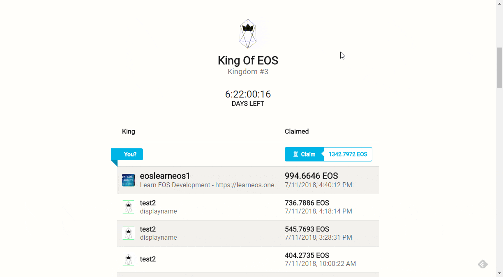

Recently I released [my first decentralized app](/introducing-king-of-eos) on the EOS blockchain, [King of EOS](https://kingofeos.com).

It's a game where players fight for the throne by paying more money than the previous contender and earn EOS this way. 👑

This post will talk about the development side of things, go [here](/introducing-king-of-eos) for more information about the game.

It consists of a simple smart contract with about 200 lines of code and a frontend written in React (with next).

## The Frontend
I won't talk too much about the frontend, because it's a standard static site written in React using [next](https://github.com/zeit/next.js/).
Thinking about it, it's not that standard - it uses WebGL with **Three.js** to really visualize the kingdom by rendering castles with custom flags and a randomly generated 3D terrain.


### Communication with the blockchain
To communicate with the blockchain I'm using [eosjs](https://github.com/EOSIO/eosjs).
I save the state in the smart contract's database on the blockchain, and my frontend uses `eosjs` to read the table of kings and the _Hall Of Fame_.

```js
import Eos from 'eosjs'

const host = process.env.EOS_NETWORK_HOST
const port = process.env.EOS_NETWORK_PORT
const chainId = process.env.EOS_NETWORK_CHAINID

const network = {
    blockchain: `eos`,
    protocol: `https`,
    host,
    port,
    chainId,
}

const eos = Eos({ httpEndpoint: `${network.protocol}://${network.host}:${network.port}` })

const ROWS_LIMIT = 99999

const getKings = () => eos
        .getTableRows({
            json: true,
            code: `kingofeos`,
            scope: `kingofeos`,
            table: `claims`,
            table_key: `kingdomKingIndex`,
            lower_bound: 0,
            upper_bound: -1,
            limit: ROWS_LIMIT,
        })
        .catch(console.err)

export { network, getKings }
```

### User Interaction with the blockchain
More interesting is how to let the user interact with my smart contract using the frontend as an interface to the blockchain.
The best way to do this right now is by using [Scatter](https://get-scatter.com/).
It's a secure Chrome extension that acts as a wallet.
Users import their private keys and the extension injects an API that allows requesting transaction signatures from within my frontend code.
Of course, Chrome extensions run in their own sandbox and the private keys never leak to the site.
The only way of communication with Scatter is through its injected API.

Say, a user wants to become King of EOS and claim the throne: He will click on `Claim`, fill out his information in a modal, and then my frontend code uses `eosjs` to build the transaction, and then requests Scatter to sign the transaction. A popup will be shown to the user where he can review the transaction and accept it.



Here's the `redux` action that does that:

```js
export const scatterClaim = ({
    displayName,
    imageId,
    claimPrice,
}) => (dispatch, getState) => {
    const { scatter, network, scateos } = getState().scatter
    let accountName
    const memo = `${displayName};${imageId};`

    // if there is no identity but forgetIdentity is called
    // scatter will throw "There is no identity with an account set on your Scatter instance."
    const clearIdentityPromise = scatter.identity
        ? () => scatter.forgetIdentity()
        : () => Promise.resolve()
    return clearIdentityPromise()
        .then(() => scatter.getIdentity({ accounts: [network] }))
        .then(identity => {
            if (!Array.isArray(identity.accounts) || identity.accounts.length < 1)
                throw new Error(`No identity`)
            accountName = identity.accounts[0].name
        })
        // get the eosio.token contract and call its `transfer` action
        .then(() => scateos.contract(`eosio.token`))
        .then(contract =>
            contract.transfer(
                accountName, `eoskingofeos`, `${claimPrice} EOS`, memo,
            )
        )
        .then(resolve => {
            console.log(`success`)
            dispatch({ type: `CLOSE_MODAL` })
            // wait 2 seconds to make block irreversible
            setTimeout(resolve, 2000)
        })
        .then(() => {
            // and then fetch new kings
            fetchCurrentKingdom()(dispatch)
        })
        .catch(err =>
            // logout on error and re-throw the error to the UI
            scatter.forgetIdentity().then(() => {
                throw err
            }),
        )
}
```

## The Backend
### Workflow
The backend is a smart contract written in `C++` compiled to WebAssembly and then deployed to the EOS blockchain.
The usual way to interact with any EOS code is to run your own local **node with nodeos** that produces the blocks containing the blockchain transactions and run all commands against your node with the `cleos` CLI. This includes creating accounts on the blockchain, unlocking your wallet, compiling the contracts, deploying the contracts, calling actions on the deployed contract, etc.

I'm running the node (`nodeos`) on Windows through the Linux subsystem for Windows when developing and sometimes it becomes unresponsive, I have to kill it and do the whole process again.

Therefore I built a lot of tooling for my workflow.
I set up an NPM project and use Node with [eosjs](https://github.com/EOSIO/eosjs) instead of the `cleos` CLI for everything. In the end, I'm just running NPM scripts again, which I and most web developers find really convenient.

I can just run `npm run deploy` to deploy my smart contract to my local node, and then `npm run @transfer` to run the transfer action on my deployed smart contract.
If there's interest, I could create a scaffolding tool `create-eos-app` that already sets up an EOS project like this, similar to `create-react-app`.

### The Smart Contract
The smart contract is only about 200 lines of C++ code.
There are not many tutorials on EOS development, but once you figure out how it works and read the code of other contracts, it's pretty easy to write.
I'm writing [a book on EOS full stack development](https://learneos.dev) to make it easier for people to get started.

The smart contract's code [is available on GitHub](https://github.com/MrToph/KingOfEos/blob/master/contract/contract/KingOfEOS.cpp) if you want to have a look.

### Optimizing the RAM usage
Each smart contract is tied to a corresponding EOS account that the smart contract is deployed to. This EOS account needs a specific amount of RAM to hold the smart contract's (webassembly) code and to store the database entries.
There's only a limited amount of RAM available (64GB) and it's a free market. Meaning, the price is driven by supply and demand and has lately become interesting for speculators that drove the price up a lot.

Back then, buying 1 KB of RAM costs 0.32 EOS. The latest price can be [checked on eos.feexplorer.io](https://eos.feexplorer.io/).
This means **the size of the contract and its database** will directly determine how much developers need to pay for smart contracts.

**How much RAM does an EOS smart contract need?**

Estimating the amount of **RAM needed for the database** is pretty straightforward. It's proportional to the amount of bytes of your serialized data entries which can be easily computed.
In my cases, this is the C++ struct I store for each new throne claim:

```cpp
struct claim_record
{
    // upper 56 bits contain kingdom order, lower 8 bits contain kingOrder
    uint64_t kingdomKingIndex; // this also acts as key of the table
    time claimTime; // is 64 bit
    account_name name; // typedef for uint64_t
    std::string displayName; // restricted in my code to max 100 chars
    std::string image; // restricted in my code to 32 chars

    uint64_t primary_key() const { return kingdomKingIndex; }
    EOSLIB_SERIALIZE(claim_record, ...)
};
```

We can just sum up the bytes needed for each field: 

```
8bytes + 8bytes + 8bytes + 100bytes + 32bytes (+114 bytes unknown overhead) = 270bytes
```

Optimizing `struct`s is hard, but one thing I did was to encode both the current round of the game and the king index in the upper and lower bits of a single `uint64_t`.

Estimating the amount of **RAM an EOS smart contract requires** is a lot harder and I could only ever check it after I deployed it to the blockchain.

Here are some things I noticed and that will help you reduce the number of RAM your EOS contract needs:
* The web assembly compiler is smart enough to exclude header files and function definitions that you do not use in your contract. So it comes with [Dead Code Elimination](https://en.wikipedia.org/wiki/Dead_code_elimination). There's no need to comment out unused header files.
* **Not using `std::to_string` saves you 188.3 KiB** (back then 71 EOS / 500 $). Initially, I used it to print a number in an `assert` message. Removing it saved me a lot of RAM.
* Marking functions as `inline` will usually also shave off some of your contract's size.
* I checked som other third-party functions that I could optimize and ended up replacing `boost::split`'s string splitting function with my own implementation. It reduced the RAM requirements by another 20 KiB.

Resulting in a **smart contract that needs 200 KiB** to be deployed (excluding the dynamic amount of RAM required for storing the entries).
Using the [EOS resource planner](https://www.eosrp.io/#calc) I calculated I need to pay 70 EOS for 220 KiB of RAM.
This was about 500$ for a _really simple, optimized_ smart contract. If I didn't do the optimizations I would have paid double that.

> Update: The RAM price halfed in the last month. So it would be around 250$ now - but the high volatility of RAM price makes it hard to plan.

Comparing this to Ethereum, it's a lot what developers have to pay and this might hold new developers back from developing on EOS.
For indie developers making small fun projects to get started, it's just too much.


## Conclusion
I hope this post gave you some insight in how I developed my first EOS dapp and some easy tricks to reduce the amount of RAM your EOS smart contract needs.

From a developer point of view, it's nice to see that RAM has gone down to 0.17 EOS / KB even though it's still too much for non-profit projects.
Some more tooling is definitely needed, running `cleos` gets annoying. But EOS is only 2 months old, so I expect a lot still to come.

[](https://eepurl.com/dyJXNr)
