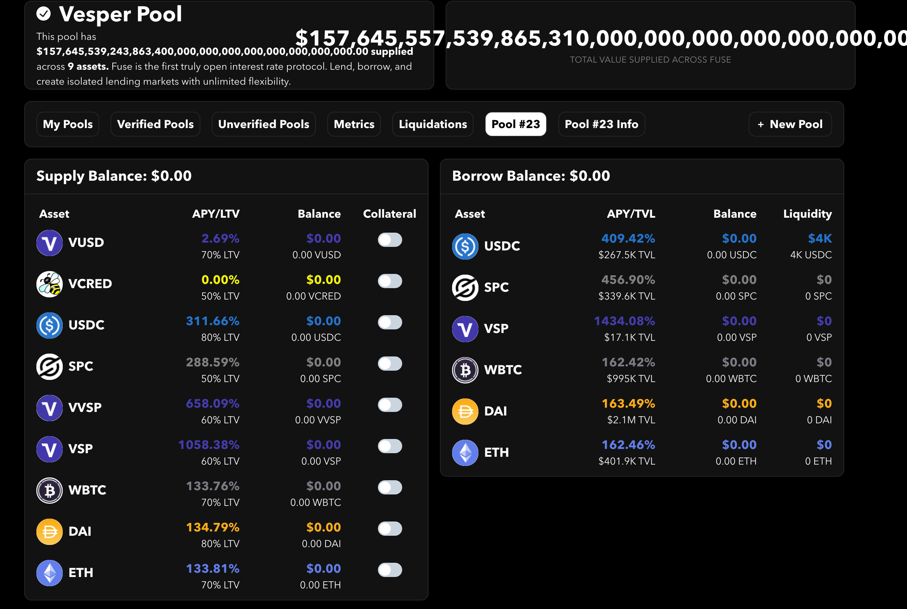
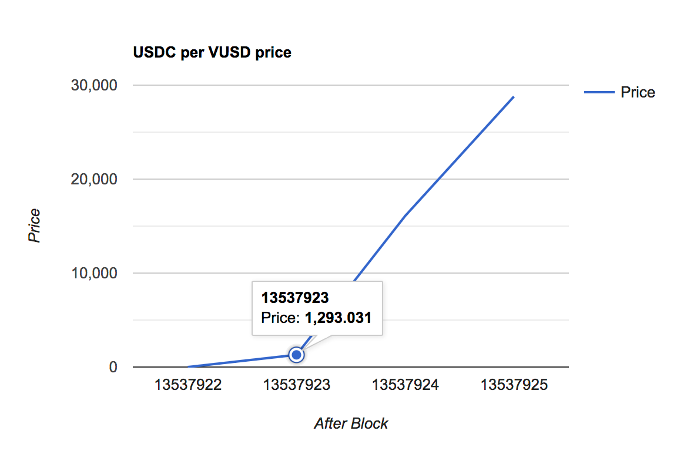
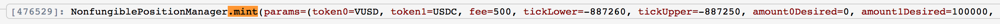
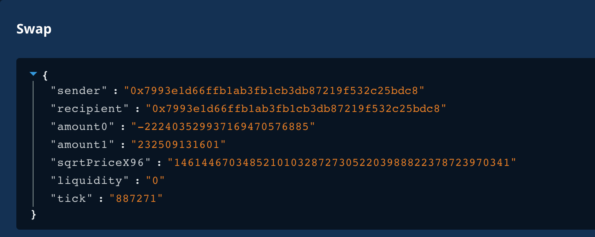

A few days ago, pool 23 of Rari's Fuse platform [was exploited](https://twitter.com/RariCapital/status/1455569653820973057).
In this episode of the _Replaying Ethereum Hacks_ series, we will look at what happened and replay the exploit by implementing it from scratch.

- [Attacker Address](https://etherscan.io/address/0xa3f447feb0b2bddc50a44ccd6f412a5f98619264)
- [Price Manipulation TX](https://etherscan.io/tx/0x89d0ae4dc1743598a540c4e33917efdce24338723b0fabf34813b79cb0ecf4c5)
- [Fuse inflated deposit & borrow TX](https://etherscan.io/tx/0x8527fea51233974a431c92c4d3c58dee118b05a3140a04e0f95147df9faf8092)

## Background
Rari's Fuse protocol is an isolated lending market creator.
Anyone can create their own lending platform by specifying _arbitrary tokens_ that can then be used as collateral or borrowed.
When creating a pool, it deploys a fresh instance of [Compound.finance](https://compound.finance)'s contracts (`Comptroller`, `CTokens`).
The idea of creating isolated pools is that the **risk stays within the pool** and does not spill over to lenders or borrowers of other pools.
General issues of a _permissionless_ token listing lending protocol include:
- A listed malicious token's price can be pumped liquidating its borrowers, seizing collateral tokens that might be more valuable
- A listed malicious token's price can be pumped and used as collateral to borrow more valuable tokens

The second issue is exactly what happened with **Fuse pool 23**, except that the token wasn't even malicious, given enough capital, manipulating prices works with any token.

> Note that this is not an issue of Rari's Fuse protocol per se, it's the nature of a permissionless lending protocol that requires participants to do their own due diligence on the pools they enter.

Pool 23 was operated by [Vesper](https://twitter.com/VesperFi/status/1455567032536248324) and included the following assets: `VUSD`, `USDC`, `WBTC`, `DAI`, `ETH` and others.
The attacker was able to **manipulate the price of VUSD** (denominated in USDC) which was so high that the attacker's collateral value even overflowed the UI.



As anyone can create a pool for any tokens, Rari Fuse uses **UniswapV3's TWAP oracle** by default to price its assets.

> Using Chainlink here wouldn't have helped because Chainlink doesn't list any long-tail assets like VUSD.

#### Exploit
The heart of the exploit is about manipulating UniswapV3's TWAP oracle of the `VUSD <> USDC` pair which is used to price VUSD within Rari's Fuse pool 23.
By inflating the price, VUSD can be provided as collateral and then any other asset _of that pool_ can be borrowed.

The `VUSD <> USDC` pool had about 500k$ of liquidity and the initial USDC per VUSD price was `0.988964`.
The attacker used 232k USDC to buy all available VUSD in the pool, bringing the VUSD price practically to infinity.

> Due to UniswapV3's _max tick limit_ of `887271`, the max price for this pair is `3.4 * 10^50`. A tick corresponds to the exponent of the price equation; price at tick i: `1.0001^i`. (For efficiency reasons, UniswapV3 often deals with the _square root_ of the price instead of the price itself.)

Note that this is a _time-weighted_ oracle which means the TWAP after executing the trade will **not** change, time (blocks) must first pass before this higher price is incorporated.
Therefore, this attack does not work with _flashloans_, the attackers must **provide their own capital** and keep it for several blocks for the TWAP to change.
This puts some of the attacker's capital at risk.
Unfortunately, the TWAP changes very quickly when the current price is at the maximum.
Here's a plot of the TWAP prices (Pool 23 used a time window of 600 seconds) at the end of each block, starting with block `13537922` where the price manipulation transaction was included:



One block after the manipulation (block-time delta of 37 seconds), the TWAP already changed from `0.98` to `1293.031076` and it increases exponentially.
Even if the next block was minted at the average block speed of 13 seconds instead, the TWAP would have increased to `18.0`, still enough to exploit the pool.
This makes it very difficult to protect against this attack as the manipulation transaction can be sent through flashbots and the arbitrage opportunity cannot be picked up (and undo the price change) by others, except by sheer luck.
When the next block is minted, the TWAP is already manipulated and the attacker is likely to make a profit from the exploit.
Here, the attacker waited even longer with their second transaction, included at block `13537932` (`+10`), increasing the price to `1,960,630,954,978.808896 USDC / VUSD`.

```bash
# USDC/VUSD TWAP (600s time window) after each block
Block 13537922 Price: 0.988964
Block 13537923 Price: 1293.031076
Block 13537924 Price: 16091.047672
Block 13537925 Price: 28793.048286
Block 13537926 Price: 34953.698466
Block 13537927 Price: 243088.923366
Block 13537928 Price: 7977279.941027
Block 13537929 Price: 215644807.583917
Block 13537930 Price: 690402294.848451
Block 13537931 Price: 1017552049.183367
Block 13537932 Price: 1960630954978.808896
```

Finally, they deposited the received VUSD as collateral into the Fuse pool at this highly-inflated price and borrowed all other pool assets against it.

#### Why is it easy to manipulate UniswapV3's TWAP?

There has been a lot of discussion regarding using the geometric mean as a TWAP (which UniswapV3 uses) vs arithmetic mean (which UniswapV2 uses), but this is not the issue here.
The UniswapV3 prices are generally easier to manipulate than UniswapV2 because of the **concentrated liquidity** feature that makes sure that most liquidity is provided at a small range around the "real price" (external market price).
Because of this, an attacker can burn through this range order with an _average execution price close to the real price_.
The attacker does not lose much value on the trade due to the low slippage, they benefit from the capital efficiency like any other trader.

We haven't seen this with UniswapV2's TWAP before because, there, liquidity is provided across the entire price spectrum. This leads to an extremely high slippage loss & initial capital requirement when trying to drastically change the price.


## Implementation

Now that we know how the attack works, let's implement it.
Let's first have a look at what the attacker did (wrong) in this [price manipulation transaction](https://dashboard.tenderly.co/tx/mainnet/0x89d0ae4dc1743598a540c4e33917efdce24338723b0fabf34813b79cb0ecf4c5/logs).

1. They were funded by a 100 ETH tornado cash withdrawal. They used part of this ETH to buy USDC on the `WETH <> USDC` pair.
2. They used a [VUSD Minter](https://etherscan.io/address/0xb652fc42e12828f3f1b3e96283b199e62ec570db#code) contract which mints VUSD if you provide any of DAI, USDC or USDT.
3. They then created a UniswapV3 LP position close to the minimum tick range `(-88760, -88760 + TICK_SPACING = -88750)`
    
4. They traded 232k USDC (`token1`) to 222k VUSD (`token0`) buying up the entire VUSD liquidity and driving the price to the max tick `887271`.
    

Instead of using a Minter contract in step 2, we can make it easier for ourselves and just buy VUSD in the pool that we're going to manipulate anyway.
I spent a long time thinking about why step 3, providing a tiny LP position, is required.
Initially, I thought the max price (or tick) can only be reached if there's actual liquidity at that price that we can trade into, and therefore we create a small position there.
But if you look closely, you can see that the current tick _after_ the trade is at `+MAX_TICK` but the LP position is at `-MAX_TICK`.

After more testing, it turns out that step 2) and step 3) **are not even needed** and the attacker simply didn't know what they were doing and provided liquidity at the wrong end.
(It's also not even necessary to provide it at the correct end.)

Our price manipulation attack is therefore **much more efficient**: we also first buy USDC, but then simply buy up all VUSD.
Another interesting technical detail is that the attacker perfectly calculated the trade amount required to buy up all liquidity and I first couldn't figure out how to do this.
When trying to buy the entire VUSD pool balance (`VUSD.balanceOf(pool)`) the swap reverts.
This is probably because not all tokens in the pool are tradeable, there might still be some unclaimed fees in it.

After more testing, I figured out a way to buy all pool liquidity without having to specify neither an exact input nor an exact output amount.
This is done by calling the `swap` function directly on the `pool` with an amount set to infinity and a _price limit_ at the max tick.
We essentially instruct the contract to do a limit buy order, buying all liquidity up to this price.

```solidity
function buyAllVUSD() internal {
    // we won't actually be able to buy up the entire VUSD.balanceOf(pool) balance, it'll be slightly less. I assume this is due to fees still in the contract or something
    // instead we use the sqrtPriceLimit at a max tick to search and buy up all liquidity up to this tick, s.t., in the end the new price will be at max tick
    // the sqrtPriceLimitX96 used here will end up being the sqrtPrice & currentTick of pool.slot0(), so pump it up to the maximum
    pool.swap(
        address(this), // receiver
        false, // zeroToOne (swap token0 to token1?)
        type(int256).max, // amount
        UniswapMath.getSqrtRatioAtTick(UniswapMath.MAX_TICK - 1), // sqrtPriceLimit
        "" // callback data
    );
}
```

The pool then performs a callback into our contract where we need to settle the trade:

```solidity
function uniswapV3SwapCallback(
    int256 amount0Delta,
    int256 amount1Delta,
    bytes calldata
) external {
    // Uniswap always does callback to its msg.sender, so we only receive the callbacks we started
    // still need to check that it originated from the v3 pool
    require(msg.sender == address(pool));
    // negative means we received, positive means we need to pay
    require(
        amount0Delta <= 0 && amount1Delta > 0,
        "should have swapped USDC to VUSD"
    );
    USDC.transfer(address(pool), uint256(amount1Delta));
}
```

And that's it. ✨
Now we wait for one block for the VUSD TWAP to increase, deposit VUSD as collateral and borrow WBTC for a profit.
The full attack contract code [can be seen here](https://github.com/MrToph/replaying-ethereum-hacks/blob/74ce67155fec5dac563e04faf9548de67f9f00f3/contracts/rari-fuse/Attacker.sol#L63).

