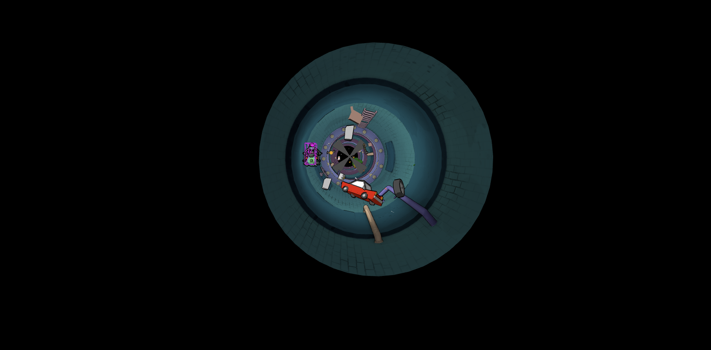
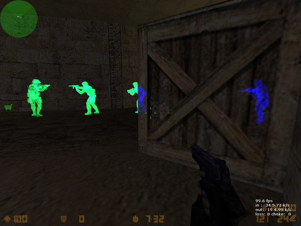

[Dookey Dash](https://dookeydash.com/) was YugaLabs' latest game.
It was a skill-based game using the final rankings to mint a new NFT collection (speculated to evolve into [mechs](https://mdvmm.xyz/) at some point). The top scorer received [a key to mint a 1/1 NFT](https://opensea.io/assets/ethereum/0x764aeebcf425d56800ef2c84f2578689415a2daa/21915) that is expected to be worth at least mid-6 figures.
This made Dookey Dash an attractive target for cheating and bot development.
We'll look at the code and see if we can trick its anti-cheat system.

## Background

It's an endless runner game: You move through the sewer dodging obstacles and picking up _collectibles_ for more points. There's one special skill, a **dash**, that increases the speed for a short duration and allows crushing through wooden obstacles. It's on cooldown but the cooldown resets when you collide with a destructible object.

<iframe width="916" height="515" src="https://www.youtube.com/embed/rp5iNApIPr8" title="YouTube video player" frameborder="0" allow="accelerometer; autoplay; clipboard-write; encrypted-media; gyroscope; picture-in-picture; web-share" allowfullscreen></iframe>

BAYC & MAYC holders could mint a **sewer pass** which allowed them to play the game in the first place. There are four different **tiers**, one for each (BAYC/MAYC, BAKC / no BAKC) combo. Higher tiers come with a bigger percentage bonus to the final score as well as an increased drop chance for rarer collectibles.

It was played in the browser and used plain JavaScript, so one could just look at the source files.
Even though the code was **minified** (variable names were rewritten, expressions replaced with shorter ones, spaces removed), it was still easy to read as the code was very clean.
The latest update to the code introduced some obfuscation by putting class method names into an array and doing something like a virtual method table lookup on each method call. It would have taken some more time to reverse engineer but nothing that parsing and rewriting the AST couldn't solve. As we had already seen the previous unobfuscated code, it didn't really matter much anymore.

At its core, it used **Next.js, React, and ThreeJS** - I'm not sure if a specific game engine framework was used, I didn't notice any. The code was structured into several **systems** handling different tasks: input manager, collision detection system, randomness system, game loop, clock, and so on.
Most of them worked as you expected them to. Let's talk about the **game loop and the input system** more as it'll later become important when thinking about potential cheats:

The game always ran at **60 fixed updates per second**, no matter how slow or fast your computer was.
Within [`requestAnimationFrame`](https://developer.mozilla.org/en-US/docs/Web/API/window/requestAnimationFrame), which is called when your system is ready for a repaint, the elapsed clock time from the last call is computed and the game loop's `fixedUpdate` function is called as many times as needed.

```js
// cleaned up for readability
this.handleRAF = () => {
  if (!this.paused) {
    this.time.update();
    this.onUpdate.emit();
    let diff = this.time.elapsed - this.lastFixedUpdateTime;
    let fixedUpdatesToProcess = Math.floor(diff / this.time.fixedDelta); // fixedDelta = 1 / 60
    for (let i = 0; i < fixedUpdatesToProcess; i += 1) {
      this.onFixedUpdate.emit();
      this.lastFixedUpdateTime += this.time.fixedDelta;
    }
    window.requestAnimationFrame(this.handleRAF);
  }
}
```

The main `App` class listens to the `FixedUpdate` event and iterates through all of its **systems**, calling `system.fixedUpdate()` on each of them. The different systems then check for user input, move the player, update speed, check for collisions, spawn new entities, etc.
The point of executing physics at a **fixed** update interval is such that the gameplay feels the same no matter how fast or slow the user's system is.
This already mitigates any kind of cheating by slowing down your system's repaints.

### Movement
In each frame, the _input recorder system_ fetches new mouse inputs and stores them.
Then, at each frame, you move through the world at a certain speed as well as move towards your mouse's XY coordinates.

#### Speed (movement in Z-direction)

Interestingly, you're not actually moving through the world, the world is moving through you. The player's `z` coordinate is always 0. The other entities move at the player's speed towards you (in +z direction).
The speed increases as the game progresses such that the game ends at some point when the speed becomes too high to dodge anything in time.
The speed for the current frame is computed as:

```js
speed = baseSpeed + dashSpeed
baseSpeed = 40.0 + fixedUpdateElapsedTime * 0.15; // fixedUpdateElapsedTime is seconds since game start
dashSpeed = dashFactor * 40.0;
// dashFactor tweens from 0 to 1.0 and back to 0.0, one can precompute the tweened values per frame
dashFactor = dashing ? _DASH_SPEED_FACTORS[framesSinceDashing] : 0.0;
_DASH_SPEED_FACTORS = [
  0, 0.777, 1, 1, 1, 1, 1, 1, 1, 1, 1, 1, 1, 1, 1, 1, 1, 1, 1, 0.944, 0.888,
  0.833, 0.777, 0.722, 0.666, 0.611, 0.555, 0.5, 0.444, 0.388, 0.333, 0.277,
  0.222, 0.166, 0.111, 0.055, 0,
];
```

The initial base speed is 40 and your base speed increases by an additional 40 every 266.67 seconds.

#### Strafing (movement in XY-direction)

Analysing the [strafing](https://en.wikipedia.org/wiki/Strafing_(video_games)) movements is more interesting because, unlike the speed, you have more control over it as you move towards your mouse input (XY coordinates). The possible XY coordinates you can end up in, are all points within a circle of radius 4.25 - the sewer basically being a cylinder.

Each frame, your player moves a certain percentage of the path towards your mouse input:

```js
// lerp = linear interpolation between these two vector
// playerPosition = playerPosition + strafeFactor * (inputPosition - playerPosition)
playerPosition = lerp(playerPosition, inputPosition, lerpFactor);
lerpFactor = 1/60 * 3 * dashFactor;
dashFactor = dashing ? _DASH_STRAFE_FACTORS[framesSinceDashing] : 1.0;
// dashFactor tweens from 1.0 to 0.25 and back to 1.0, one can precompute the tweened values per frame
_DASH_STRAFE_FACTORS = [
  1.0, 0.416, 0.25, 0.25, 0.25, 0.25, 0.25, 0.25, 0.25, 0.25, 0.25, 0.25,
  0.25, 0.25, 0.25, 0.25, 0.25, 0.25, 0.25, 0.291, 0.333, 0.375, 0.416, 0.458,
  0.5, 0.541, 0.583, 0.624, 0.666, 0.708, 0.749, 0.791, 0.833, 0.874, 0.916,
  0.958, 0.999,
];
```

First, dashing reduces your strafing ability to 25%, making it even harder to dodge besides the already increased speed.
Second, at each frame, a _lerp_ towards your target input is performed which makes strafing look like an ease-out animation.
Keeping the input the same, you move a larger distance in the beginning than at the end:


_Strafing moves the player 5% towards the input each frame._

**What's the quickest way to move towards your desired XY coordinates?**  
You might think it's by pointing _at_ the XY coordinates but that's not true, you move faster when you point _past_ them and adjust your mouse input in the following frames so you don't overshoot. Here's the difference between moving left/right by pointing _at_ your direction vs. optimizing your mouse inputs if you had frame-perfect control.


_Moving left and right by pointing to the final position. Then by pointing past it._

This requires frame-perfect control over your inputs, making it a great strategy for a bot to use.
In theory, one could teleport to any XY coordinate in a single frame by setting an input far away, however, the mouse inputs are restricted to coordinates in the game area - the mentioned circle of radius 4.25.
So far, everything we analysed was on the client side, maybe the server wouldn't validate the inputs allowing us to teleport?
With a basic understanding of how the game works and some cheat ideas, let's look at its anti-cheat system.


_Teleporting on the client side. Does not pass the server-side anti-cheat system._

## Anti-Cheat System

When starting a game, an authorized request to `/start?pass={$sewerPassTokenId}` was made which returned the game `seed`. This **game seed** was used to derive all randomness - from the type of obstacles to spawn to the rarity of the collectibles. The game seed makes the game deterministic.

No further server requests were made up until the point when the game ended. At that point, a request to `/end?pass={$sewerPassTokenId}` was made with the following payload:

```json
{
  "seed": "xxxxxxxx-xxxx-xxxx-xxxx-xxxxxxxxxxxx", // same seed as from start
  "score": 123456, // client-computed score
  "inputs": "base64(inputs)", // array of inputs for every frame
  "clientHash": "62cc1c5b56411c16da998ce8094dcc0faaacb91c" // game version hash
}
```

The response structure was:

```json
{
  "sessions": 123,
  "valid": true,
  "booster": false,
  "score": 123456,
  "rank": 12345,
  "collectibles": [...],
  "time": 100.00,
  "basePoints": 50000,
  "collectiblePoints": 50000,
  "destructionPoints": 2345,
  "scoreMultiplier": 1,
  "stats": {
    "itemsByRarity": {
      "common": { "collectedCount": 1, "pointsPerItem": 300 },
      "uncommon": { "collectedCount": 1, "pointsPerItem": 500 },
      "rare": { "collectedCount": 1, "pointsPerItem": 1000 },
      "epic": { "collectedCount": 1, "pointsPerItem": 1500 },
      "legendary": { "collectedCount": 1, "pointsPerItem": 2000 }
    }
  },
  "bestRank": 123,
  "bestScore": 800000
}
```

If the server detected some irregularity, it returned `"valid": false` and the game showed a "cheater" screen.
The input recorder system records the input **for every single frame of your game**. A single _input_ consists of `{x: number, y: number, clicked: bool}` - the mouse coordinates and whether the left mouse button was clicked (with the intention to activate dash).

> The update from February 5th performed a new request to a `/save?pass={$sewerPassTokenId}` endpoint that was apparently supposed to save the game. Initially, the server always errored until another update but it's unclear why saving a game needs to happen from a client request, instead of doing it server-side at the `/end` API endpoint already.

The interesting parts of the request are the `seed`, `score` and the `inputs` fields:

- changing the `score` makes your game invalid.
- changing the `inputs` will almost certainly make your game invalid: There are remnants of a **replay validator class** in the source code and I'm sure the server is replaying your inputs with the randomness from your seed to see if the replayed score matches the score you specified.
- what about input validation? changing an input to be out of the game area is also invalid, so we cannot teleport.
- if we could force the server to always start our game **with the same seed**, it would be easy to improve upon previous inputs and hardcode an optimized run, essentially making Dookey Dash a [tool-assisted speed run](https://www.youtube.com/watch?v=HOa5B3COET4) challenge. Changing the `seed` to an old one and trying to replay an old game with new inputs didn't work for me. Unfortunately, I also didn't find a way to trick the server to return the same seed for a new run.

I didn't find any obvious way to cheat at the game as the server fully simulates your replay given the inputs. So we are left with two options:

- make it easier for us to play the game
- write a bot that returns good inputs for a given game seed

### Client-side cheats

Certain modifications that make the game easier to play for a human can be done to the game code on the client side.
The upside of these cheats is that they are mostly undetectable as they just enhance human behavior (compared to inhuman movements from a bot, for example).

#### Speed hack

The game uses an internal **clock** class that measures real-world clock time. This clock time is used to determine how many milliseconds elapsed since the last `requestAnimationFrame` call which in turn determines how often the game loop runs.
If we just hook into the clock class and have it return _the time divided by two_, we just slowed down the game by 50%, making it a lot easier to dodge.
Note that the update loop still runs frame by frame, the frames just happen slower, so our inputs are still recorded in the input recorder system and should be valid for the game. Unfortunately, this only works on the client side. My suspicion is that there's a third check that measures the time between the `start` and `end` API calls and it must match the actual (fixed elapsed) game time that the replay returned (up to some small threshold). The same issue happens when your (unmodified) code hits a breakpoint and you continue after a second.

#### Camera hacks

You can zoom in/out, helping you to see obstacles earlier.
You can also remove the green fog in the distance and remove the green VFX particles.


_Zoom hack with fog & VFX removal._

#### Pausing

The game already comes with pausing functionality, it's easy to hook into it and add a key press event listener to pause the game loop. However, your run will be invalidated for the same reason the speed hack is invalid.

#### Chams

You can reskin the game by replacing the textures that are applied to the objects. Chams (chameleon skins) are often used in FPS games as they make it easier to recognize enemies, sometimes including through the walls.


_Not Dookey Dash._

The same idea can be applied to Dookey Dash. Color-code the different types of entities: collectibles, lethal objects, wood.
[orephelious](https://twitter.com/orephelious/status/1621617391376408577) implemented this as well.
Note that this also makes it easier to train a pixel bot on it.

## Botting

We've covered the exact code how the player moves through the world which is a good start when developing a bot.

The best way to _solve_ this game is by implementing a _solver_. Write an algorithm that, given a game seed, returns inputs with the highest score. (I'm sure you could circumvent their timing check by just waiting the expected amount of time until sending the `/end` request.)
This is also the most technically involved way to cheat at the game because it requires a lot of engineering effort: you need to perfectly reimplement (or reuse) almost everything: the randomness, the entities, the movements, the collision detection.

I was curious if I could implement a bot in my limited time and how well it would do.
The gist of the algorithm I use is that I pick a random mouse input on the outer game area circle, then I simulate the player strafing, the obstacles moving (and the propellers rotating) for several frames in advance, do some basic collision detection and see if I'm still alive. If not pick a different mouse input target.

Its best run was just short of 250,000 points (7 minutes) on a Tier 1 (without powershart boosters).

> To already address any outragers: This was purely out of curiosity and I didn't submit any of these scores. (I was running a modified version that doesn't talk to their servers while training this bot to not get flagged.) Researching the game, seeing if I can break it, and coming up with an algorithm to play it instead of playing it myself is my definition of a good time. Even though my bot plays better than me, it wouldn't even have made it into the [top 5% of all tier1 / no powershart players](https://dookeydata.com/d/WUtOl_oVk/dookeydash?orgId=1&refresh=5m&var-Tier=tier-1&var-Powershart=true). In my opinion, anything outside of the top 1000 will still have a price similar to the floor price, so there never even was any incentive.

After 2.5 weeks of gameplay, a 1-week review period followed with YugaLabs reviewing scores and looking for anything suspicious. Any cheaters were invalidated from the mint.
There are **1,232 "N/A" ranks** out of 26,485 sewer passes, however, this also includes users that minted but never played the game at all.

I can only speculate how the scores were reviewed but here's what I would do:
- manually review all top 500 runs with the replay function.
- manually review all runs from accounts that were flagged with a single invalid game once.
- programmatically analyze the inputs of all runs: bot runs should display very different input movement than human runs. For example, the inputs would likely change much more frequently, one could count the number of frames the inputs changed. One can do all kinds of more advanced analysis here. Any irregularities get flagged and manually reviewed.


## Boosting

Over time, many boosting services emerged: Players could use [delegatecash](https://delegate.cash/) to delegate their sewer pass to better players and get a higher score this way. The top 500 was full of boosters. Out of the top 100 ranks, 19 were played by Mongraal, another 19 by blocksofmilk, see [dookeystats.com](https://dookeystats.com/).
The prices for top-tier boosting services were:

- 300k+ for .5 ETH + $10 $APE (add .1 for T1 or T2)
- 350k+ for 1 ETH + 20 $APE (add .15 for T1 or T2)
- 400k+ for 1.5 ETH + 20 $APE (T3 or T4)
- 450k+ for 2.25 ETH + 50 $APE (T4 only)
- 500k+ for 3 ETH + 50 $APE (T4 only)

## Conclusion

I was sceptical at first that a skill-based mint would be a good idea but YugaLabs did a good job securing this game.
I couldn't find any obvious exploits and the other ideas described here are technically impossible to completely protect against because the code is running on my machine so I can make it return anything I want in the API requests.
If you complain on Twitter that they didn't "fix" more cheats, then you don't know much about game hacking. A suggestion was to [create the obstacles on the server side](https://twitter.com/xClearHat/status/1623308298081402883) instead of locally using the seed but it wouldn't have changed much, bots can just directly iterate over the created entities in memory and there's no need to know about entities 1 minute into your future. You can never fully prevent botting in games.

This was fun, I hope we will see more high-stakes web3 games this year, stuff like this makes me want to start a web3 games botting company.

