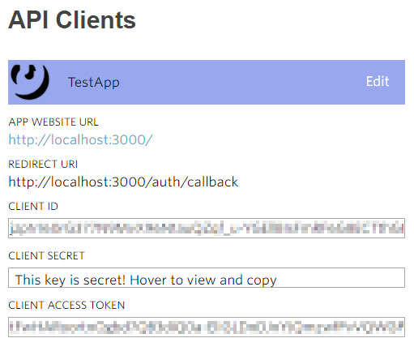

If you're developing a music app, you probably want access to song lyrics at some point. In this post I'll show you how to get song lyrics using **Node.js**.

## Using the Genius API
[Genius](https://genius.com/) is a site that grew from providing annotated rap lyrics to annotating the whole web. They provide an easy-to-use [API](https://docs.genius.com/) that unfortunately lacks some often needed functionality.

What we can do with it:
1. Search their database for song "meta data"
2. Get the songs for a given artist ID
3. Get annotations (_referents_) for a song (or any web page).

What we _cannot_ do is:
1. Get an artist ID directly through some API entry point
2. Get the lyrics for a song.

The second point has probably to do with [licensing issues](https://www.nytimes.com/2014/05/07/business/media/rap-genius-website-agrees-to-license-with-music-publishers.html) on their part.
You can get parts of the lyrics through their _referents/annotations_ endpoint. If you want the full lyrics however, you need to:

1. Search for the artist, iterate through songs and get the artist id
2. Get songs meta data for the artist id and extract the genius url
3. Parse the genius url for the full lyrics.

Note: This post is for informational and learning purposes only. Do _not_ violate genius' [terms of service](https://genius.com/static/terms).

### Using the Genius API in Node.js
We will use the great NPM package [genius-api](https://www.npmjs.com/package/genius-api) that provides a simple interface for using the Genius API. As we don't do query for any user-specific data, the authentication part works by registering your [client](https://genius.com/api-clients) and getting the **client access token** directly from their dashboard.



To initialize `genius-api` you call it with the _client access token_:

```javascript
import Genius from 'genius-api'

const accessToken = 'ABCDEFGHIJKLMNOPQRSTUVWXYZ1234567890'
const genius = new Genius(accessToken)
```

### Getting the artist id
We will search for the artist, iterate through the results (songs), and grab the artist id from there once there is a match:

```javascript
// genius API does not have an artist entrypoint.
// Instead, search for the artist => get a song by that artist => get API info on that song => get artist id
Genius.prototype.getArtistIdByName = function getArtistIdByName(artistName) {
  const normalizeName = name => name.replace(/\./g, '').toLowerCase()   // regex removes dots
  const artistNameNormalized = normalizeName(artistName)

  return this.search(artistName)
    .then((response) => {
      for (let i = 0; i < response.hits.length; i += 1) {
        const hit = response.hits[i]
        if (hit.type === 'song' && normalizeName(hit.result.primary_artist.name) === artistNameNormalized) {
          return hit.result
        }
      }
      throw new Error(`Did not find any songs whose artist is "${artistNameNormalized}".`)
    })
    .then(songInfo => songInfo.primary_artist.id)
}

const genius = new Genius(accessToken)
genius.getArtistIdByName('Drake')
.then(artistId => { /* ... */ })
.catch(err => console.error(err))
```

### Getting the songs from artist id
Given the artist id, a request to [`/artists/:id/songs`](https://docs.genius.com/#artists-h2) is enough to get the songs:

```javascript
genius.songsByArtist(artistId, {
    per_page: 50,
    sort: 'popularity',
})
.then(songs => songs.map(song => song.url)) // has more song info like 'id', 'title', ...
```

### Parse the song url for the full lyrics
We will download the song URLs using [node-fetch](https://www.npmjs.com/package/node-fetch) and parse the HTML with the awesome [cheerio](https://github.com/cheeriojs/cheerio).

```javascript
Genius.prototype.getSongLyrics = function getSongLyrics(geniusUrl) {
  return fetch(geniusUrl, {
    method: 'GET',
  })
  .then(response => {
    if (response.ok) return response.text()
    throw new Error('Could not get song url ...')
  })
  .then(parseSongHTML)
}

// parse.js
import cheerio from 'cheerio'

function parseSongHTML(htmlText) {
  const $ = cheerio.load(htmlText)
  const lyrics = $('.lyrics').text()
  const releaseDate = $('release-date .song_info-info').text()
  return {
    lyrics,
    releaseDate,
  }
}
```

The lyrics live in an HTML tag called `lyrics` and are really convenient to parse, same for the release data.

Now you got a way to get the lyrics for artists and can [build something interesting](https://pudding.cool/2017/02/vocabulary/) on top of it.
