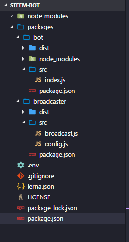

I came up with an interesting way to split my code base that I think can apply to a wide range of projects.

I was currently developing a new app (a bot for steem) and I repeatedly came across the following issues:
1. Nodes are sometimes down or overloaded and time out. So the API access is not stable.
1. External libraries are randomly crashing in parts of the code that I cannot `try / catch` easily. (I'm looking at you [steem-js](https://github.com/steemit/steem-js).)

In short, there are **many things** that can go wrong and **crash my whole application**. I then came up with the following idea:
Similar to micro-services, I'll just create several, what I call **micro-processes**, that have only one strictly defined task.
A micro-process is simply a tiny **node** app itself.

_Why is it helpful?_
The idea here is **better fault isolation** - if one micro-process fails, the others continue to work.
It also comes with the added benefit of a better **separation of concerns**. Each micro-process is responsible for only one job, which itself leads to code that is **easier to understand and maintain**. It allows other open-source members to be productive right away without needing to know the whole application stack.

_However, this code split comes with several challenges:_
1. If done incorrectly, the code structure can become more complicated, because everything is now spread out possibly over several repos / NPM modules. In the worst case, fixing a simple bug might then lead to having to touch and release several packages. We will avoid this by using [**lerna**](https://github.com/lerna/lerna), a _a tool that optimizes the workflow around managing multi-package repositories with git and npm_.
1. It should still be easy to manage all the micro-services. In the worst case, we have to update and maintain all build tools on an **individual micro-process** level. Again _lerna_ helps us here for managing the dependencies and building the micro-processes, as we'll see later. We'll also make use of [PM2](http://pm2.keymetrics.io/docs/usage/quick-start/), a **process manager** for Node apps that can start several processes at once, and automatically restart them when one crashes.
1. How do we pass and receive data between the micro-processes? In a monolithic app, we can just call functions, callbacks, and promises to pass and receive data.
For our micro-process architecture, we will use **Interprocess Communication (IPC)**. We'll use the great [node-ipc](https://www.npmjs.com/package/node-ipc) library for local communication between our micro-processes.

Let's get started.

## Project setup with Lerna
The solution to many of these challenges is (ab-)using lerna. [Lerna](https://github.com/lerna/lerna) is a tool for managing multiple packages in a single git repository. The task it tries to solve is to make publishing interdependent packages easy. It's often used in UI libraries having a lot of custom components that might depend on each other.

While we don't intend to publish our individual micro-processes to npm, abusing lerna and making each micro-process an individual package still gives us the benefit of **bootstrapping all packages**: It installs all their dependencies, sym-links the packages that depend on each other, and runs custom scripts for each package.

Start by installing lerna globally:
`npm install -g lerna`

Then start your app by creating a new folder and initializing it:
```
mkdir steem-bot
cd steem-bot
git init
lerna init
```

This will create a `lerna.json` file, which you can ignore for now, and create a `packages` folder where our micro-processes will live.
The repo has a global `package.json` file and each individual package in `packages` is just another NPM app with its own `package.json` file.

You can install all build tools and testing scripts in the root `package.json`. For example, it looks like this if you're using `babel`, `eslint`, `prettier` and `jest`:

```json
{
  "name": "@cmichel/steem-bot",
  "version": "1.0.0",
  "description": "",
  "main": "",
  "scripts": {
    "test": "jest"
  },
  "license": "MIT",
  "devDependencies": {
    "babel-eslint": "^8.0.2",
    "babel-plugin-transform-class-properties": "^6.24.1",
    "babel-plugin-transform-object-rest-spread": "^6.26.0",
    "babel-preset-env": "^1.6.1",
    "eslint": "^4.11.0",
    "eslint-plugin-react": "^7.5.1",
    "jest": "^22.1.4",
    "lerna": "^2.8.0",
    "prettier": "^1.8.2"
  },
  "dependencies": {}
}
```

For demonstration purposes, let's create a steem bot, with two packages:
1. `broadcaster`: This package will listen to the steem blockchain and internally broadcast all transactions, comments, votes to the other micro-processes.
1. `bot`: The bot itself, which listens to the data from the `broadcaster`, checks if the data is relevant to it and then does its bot logic.

### Creating the broadcaster micro-process
Creating the broadcaster micro-process is straight-forward. Create a new NPM package named `broadcaster` under `packages` and put a `package.json` with the following contents there:

```json
{
  "name": "@cmichel/broadcaster",
  "version": "1.0.0",
  "main": "dist/config.js",
  "scripts": {
    "prepublish": "npm run build",
    "build": "npx babel src --out-dir dist",
    "start": "node dist/broadcast.js",
    "start:dev": "babel-node src/broadcast.js"
  },
  "dependencies": {
    "dotenv": "^4.0.0",
    "node-ipc": "^9.1.1",
    "steem": "^0.6.7"
  }
}
```

We define some scripts here:
1. I'm using ES6/ES7 features, so I need to transpile it with babel, that what the **build** script is for. I also do the build step in a **prepublish** script, because **lerna executes all prepublish scripts** while bootstrapping.
1. `start` scripts that run the micro-process.

> Note that we're using private NPM repositories here (indicated by the @name/ before the app name). I never intend to publish these packages to NPM, I just misuse it as a namespace, to keep all my lerna packages for a specific app under the same name.

### Creating the bot micro-process
We create the bot micro-process the same way, with the same scripts.

```json
{
  "name": "@cmichel/bot",
  "version": "1.0.0",
  "main": "dist/index.js",
  "scripts": {
    "prepublish": "npm run build",
    "build": "npx babel src --out-dir dist",
    "start": "node dist/index.js",
    "start:dev": "babel-node src/index.js"
  },
  "dependencies": {
    "dotenv": "^4.0.0",
    "node-ipc": "^9.1.1",
    "steem": "^0.6.7",
    "@cmichel/broadcaster": "*"
  }
}
```

Note how we added the `broadcaster` as a dependency to the `bot`. We can use this to share the broadcaster's config to all micro-processes using it.

Now, here's the great things:
**When we run `lerna bootstrap --hoist`, lerna will install all dependencies for the packages, run our `prepublish` scripts which builds the sources, and sym-link the broadcaster**, such that it is just another external dependency for `bot`.
The `--hoist` flag installs **common** dependencies of all packages (like `dotenv`, `node-ipc`, `steem`) only once in the lerna root folder's `node_modules`. So the dependency is only installed once for the whole app, instead of once for _each_ package.

Here's the setup that we have so far:



You can check out the code structure on [GitHub](https://github.com/MrToph/lerna-micro-processes/tree/21c329a716459be2315d606feefd6ff5c3c42c6e).

## How the processes communicate
We already added `node-ipc` as a dependency to our packages. It uses local UNIX / Windows sockets for inter-process communication (IPC). There's one or several servers, and clients that connect to them. Messages can then be broadcasted from a server to _all_ connected clients, or to clients on an individual basis.

In our case, the `broadcaster` acts as the server to which the `bot` is connected.

So let's start with setting up the server in `broadcaster/src/broadcast.js` to connect to the Steem blockchain and broadcast its transactions to all connected local clients:

```javascript
import config from './config'
import ipc from 'node-ipc'
import steem from 'steem'

ipc.config.id = config.id
ipc.config.retry = config.retry

ipc.serve(function() {
  ipc.server.on(`socket.disconnected`, function(socket, destroyedSocketID) {
    ipc.log(`client ` + destroyedSocketID + ` has disconnected!`)
  })
})

ipc.server.start()

steem.api.streamOperations((err, res) => {
  if (err) {
    return
  }

  const type = res[0]
  const data = res[1]
  ipc.server.broadcast(type, data)
})
```

We use `ipc.server.broadcast(type, data)` to broadcast the Steem data by their **type**, i.e., connected clients can choose to listen only to certain _types_ like `comment` or `vote`.

We can then process the messages in `bot/src/index.js`:

```javascript
import ipc from 'node-ipc'
import ipcServerConfig from '@cmichel/broadcaster'

ipc.config.id = `steem.bot`
ipc.config.retry = 1500
ipc.config.silent = true

ipc.connectTo(ipcServerConfig.id, function() {
  ipc.of[ipcServerConfig.id].on(`connect`, function() {
    ipc.log(
      `## connected to ${ipcServerConfig.id} ##`.rainbow,
      ipc.config.delay
    )
  })
  ipc.of[ipcServerConfig.id].on(`disconnect`, function() {
    ipc.log(`disconnected from ${ipcServerConfig.id}`.notice)
  })
})

// listen to all comments (= posts + replies)
ipc.of[ipcServerConfig.id].on(`comment`, (data) => {
    ipc.log(`got a message from ${ipcServerConfig.id} : `.debug, data)

    // check for new posts only, no replies
    if (data.parent_author === ``) {
        console.log(`https://steemit.com/@${data.author}/${data.permlink}`)
    }
})
```

## Managing the micro-processes
Starting all the micro-processes by hand is tedious, so we use a **node process manager**. I like [PM2](http://pm2.keymetrics.io/docs/usage/quick-start/) because of its simplicity and nice features: You can define which `npm scripts` to run on which packages in a config file, and it **automatically restarts crashed processes**.

To get it, run:

```
npm install pm2@latest -g
```

We create a config file `pm2.json` in the lerna root directory that starts our two micro-processes with their `start` command:

```json
{
  "apps": [
    {
      "name": "bot",
      "cwd": "./packages/bot",
      "kill_timeout": 3000,
      "restart_delay": 3000,
      "script": "npm",
      "args": "run start"
    },
    {
      "name": "steem-broadcaster",
      "cwd": "./packages/broadcaster",
      "kill_timeout": 3000,
      "restart_delay": 3000,
      "script": "npm",
      "args": "run start"
    }
  ]
}
```

Our workflow now looks like this:
Build all the packages by running:

```
lerna bootstrap --hoist
```

Start the micro-processes by running:

```
pm2 start pm2.json
```

And you're done. You have a robust self-healing swarm of communicating node processes. 🤖🤖🤖  
I created a [GitHub repo](https://github.com/MrToph/lerna-micro-processes) with this boilerplate.
