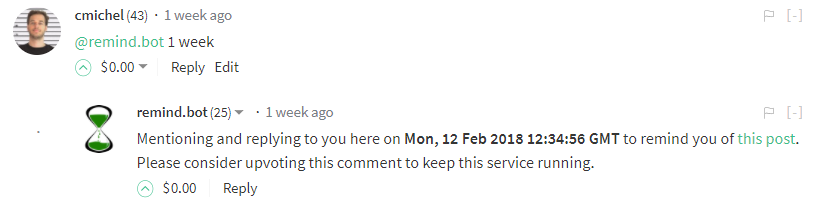
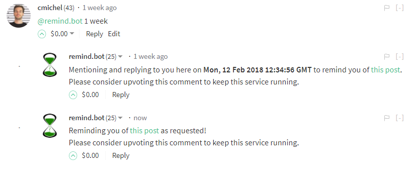
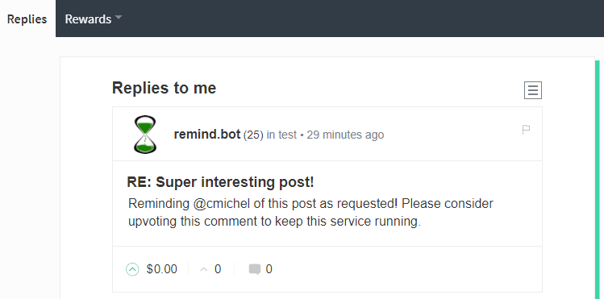

I'm happy to announce that Steem has its own [@remind.bot](https://steemit.com/@remind.bot) now!

## What is a Remind-Me bot?
A reminder bot allows you to save a comment or post for later and be reminded of it.

If this bot is `@`-mentioned with a _time span_ in a **reply** to a post, this bot is activated and will remind you as soon as the time has passed.

For example, you're on the bus and notice an interesting post about a new cryptocurrency but it's too long to read now, and you would like to read it when you get home in 8 hours instead. But you're sure, you'll already have forgotten about it when you get home, so you comment on that post mentioning @remind.bot:

> This looks really interesting, I'll get back to you when I get home.
> @remind.bot 8 hours 

Think of @remind.bot as an improved and automatic bookmark that notifies you so you don't forget it.

The idea stems from reddit's [RemindMe bot](https://www.reddit.com/r/RemindMeBot/comments/24duzp/remindmebot_info/).
**Now it's also on the Steem platform**!

## Use-cases
[@remind.bot](https://steemit.com/@remind.bot) can help in the following scenarios:

- You want to read / answer a post later and not forget about it.
- Can remind you of anything with a deadline, for example, the start of an ICO.
- It 's really interesting in the crypto space because everyone thinks he is a good trader and makes market predictions. Now you can finally evaluate these predictions by being notified in the future and then see how it turned out in reality.

## How can I call remind.bot?
Simply mention @remind.bot in a comment to the post (or other comments) you want to be reminded of.
Follow the mention by a _number_ and a _time unit_ like so:
```
@remind.bot 1 week
```

You can also leave an additional message in the post, in case you need to remember why you wanted to be reminded.


The bot will then answer your comment, usually after a few minutes, to indicate that it processed your request. It will show the exact time when it will notify you. **The time is displayed in UTC (GMT).**



Once the time has come, it will remind you of the post by creating another comment with the original post and `@`-mention you in it.



You will see your `@`-mentions for example in steemit by checking the replies to your comments there.



Steemit does currently not have the option to send **Desktop / Push Notifications** to you, but I know of some projects working on notifications whenever you are `@`-mentioned.

> The bot only comments when requested by a human, so it's non-intrusive and creates no more spam than other humans. If this still becomes a problem at some time, I'll implement a remind-me feature through private memos to the bot.

## Supported Options
```
@remind.bot 30 minutes
@remind.bot 1.5 hours
@remind.bot 3 days
@remind.bot 1 week
@remind.bot 6 months Check if this guy's prediction is correct
@remind.bot 1.5 years shop for Lambos
```

## FAQ
#### I called remind.bot, but it didn't answer
There can be several reasons for it:
1. The request format is not correct. The name of the bot is `@remind.bot`, make sure you spell it correctly. The bot's name must be followed by a **number** and then a **valid time unit** (minutes, hours, days, weeks, months, years). See the `Supported Options` section for more help.
The bot does **not** support specific dates (August 25th, 2019) as of now.
1. The bot has reached its [network bandwith](https://www.steem.center/index.php?title=Bandwidth) on the steem blockchain and cannot create any more comments at this moment in time. It will answer later at a time when there's less traffic on the blockchain.
1. The bot is currently down. I try to keep this bot running 24/7 however there might be smaller down-times. In this case, updating your comment, by clicking on edit and then saving again, is enough to trigger the bot again _if it is online_. You do not need to create a new comment. 

---

The bot is still early in its development life-cycle.
If you encounter any difficulties please comment here or message me on [twitter](https://twitter.com/@cmichelio)
