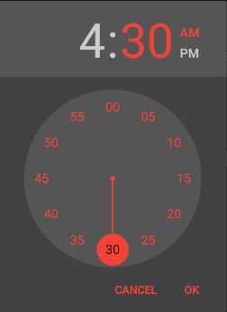

The standard style of the [**TimePickerAndroid** Component](https://facebook.github.io/react-native/docs/timepickerandroid.html) is a teal background which might not blend with the color scheme you're using in your React Native app. However, similar to [`DatePickerAndroid`](http://cmichel.io/styling-timepickerandroid-in-react-native/), I'll show you how to style it to match your theme.



[`TimePickerAndroid`](https://facebook.github.io/react-native/docs/timepickerandroid.html) is an API for Android's native `TimePicker` module and thus cannot be directly styled through JavaScript `props` like pure React Native JS components. However, you can style the native Android modules by changing the **styles.xml** file in your `android` folder. It is located at **`android/app/src/main/res/values/styles.xml`** relative to your react-native project. To color the clock hands and the numbers, you edit the contents of **styles.xml** as follows:

```XML
<resources>
    <!-- Base application theme. -->
    <style name="AppTheme" parent="Theme.AppCompat">
        <item name="android:timePickerDialogTheme">@style/Dialog.Theme</item>
    </style>
    <style name="Dialog.Theme" parent="Theme.AppCompat.Dialog">
        <item name="colorAccent">#f44336</item>
        <item name="android:textColorPrimary">#f44336</item>
    </style>
</resources>
```

I 'm using the _dark_ theme here, if you want to use a white background, change to the _light_ theme by replacing
`Theme.AppCompat` with `Theme.AppCompat.Light.NoActionBar`.
The app has to recompile for the styles to be applied, so run `react-native run-android` again.
