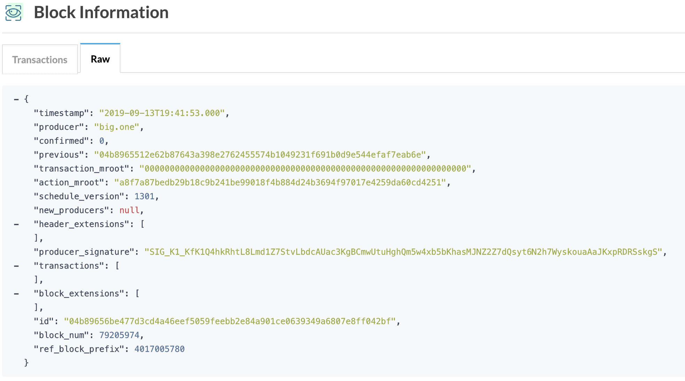

It's been almost two weeks already since EOSPlay (and other EOSIO casinos) were hacked, and there are already many [attempts at explanations](https://medium.com/@dexaran820/eos-congestion-9-13-2019-and-eosplay-hack-cbafcba2d1dc) circulating around.
However, I'd still like to give my thoughts on the hack as I found the existing explanations to all be inaccurate, and then [that's what you do on the internet](https://xkcd.com/386/).

Let's have a look at the existing explanations:

<blockquote class="twitter-tweet" data-conversation="none" data-dnt="true" data-theme="dark"><p lang="en" dir="ltr">Some DAPPs were using future blocks to generate random numbers. The hacker rented 1.2m CPU from REX to create thousands of deferred trxs, blocking the network.<br><br>The hacker then cherry pick the trxs they wanted to go through(winning ones), and the others(losing ones) stay blocked</p>&mdash; Michael Fletcher (@Mikefletcher42) <a href="https://twitter.com/Mikefletcher42/status/1172789474000023552?ref_src=twsrc%5Etfw">September 14, 2019</a></blockquote>

<blockquote class="twitter-tweet" data-conversation="none" data-dnt="true" data-theme="dark"><p lang="en" dir="ltr">5/ Update:<br><br>The attacker did not use the previous blocks as I thought initially. He fills future blocks with the transaction he needs instead. <a href="https://t.co/YBWpNbGVbW">pic.twitter.com/YBWpNbGVbW</a></p>&mdash; Dexaran (@Dexaran) <a href="https://twitter.com/Dexaran/status/1172799629257302017?ref_src=twsrc%5Etfw">September 14, 2019</a></blockquote>

What's right is that the hacker rented lots of bandwidth from REX to congest the network and created many deferred transactions, but if one understands how EOSPlay works (or worked at the time of the hack) it quickly becomes clear that there's no way to cherry-pick winning transactions or calculate if you're winning from within the block where the outcome is being decided.

## How EOSPlay works

The attacker played [EOSPlay's DICE game](https://eosplay.com/dice) which works as follows:

> How is the outcome produced?
> Unlike other dice games, EOS Dice does not generate the numbers internally, by allowing players to bet on the last 2 digits of the 10th Block ID after the bet is confirmed, players can be assured that the results are always fair.
> For example, if your bet of 5 EOS has its transaction recorded in block 19125344, then the outcome will be retrieved from the 10th block ID after this (19125344 + 10) = 19125354. For the purposes of this game, block 19125344 is considered the betting block, whereas block 19125354 is considered the outcome block.
> When the last two digits are not numbers, we will find the nearest digits in turn. The ID of the EOS block is a 32-byte number, which is randomly generated according to a series of complicated encryption algorithms. The usual display mode is hexadecimal, and our lottery number is using such a truly random number. The result is used as the outcome number.

So if you send 600 EOS to EOS Dice at **betting block** `79205964`, EOS Dice will look at the block hash of **result block** `79205974` (= betting block + 10) and take the first two characters from the right in range 0-9 as the dice roll:

```bash
04b89656be477d3cd4a46eef5059feebb2e84a901ce0639349a6807e8ff042bf
=> will roll `42` as `b` and `f` is not a valid base 10 number.
```

This block hash is fetched by an off-chain script of EOSPlay and pushed to the blockchain in a [dicereveal action](https://bloks.io/transaction/092700d4f21c7880562d27188f48885a4145a57df9d7f44f5b31f588f43d9aea).

**Delaying or blocking this action** by congesting the network does **not help in any way** when you try to win the game as the script will still always fetch the block hash of the result block. In fact, delaying/blocking this action only hurts you - the EOS bet amount was already transferred to EOSPlay's contract 10 blocks ago and **this `dicereveal` action is the one that resolves the bet and schedules the winning payouts**.

You can also not get the current block hash (or previous ones) from within a smart contract, because the current block is not final yet and it depends on what transactions are part of it.

## How the EOSIO block ID is computed

To understand the attack one first needs to understand how the EOSIO **Block ID** or **Block hash** is computed.
Looking [at its EOSIO source code](https://github.com/EOSIO/eos/blob/45adb5e4cc6d550619fd27216b7c17f27c335272/libraries/chain/block_header.cpp#L22-L29) we see it's the _SHA256 hash of the block header_ with the block number encoded:

```cpp
digest_type block_header::digest()const
{
  return digest_type::hash(*this);
}

block_id_type block_header::id()const
{
  // Do not include signed_block_header attributes in id, specifically exclude producer_signature.
  block_id_type result = digest(); //fc::sha256::hash(*static_cast<const block_header*>(this));
  result._hash[0] &= 0xffffffff00000000;
  result._hash[0] += fc::endian_reverse_u32(block_num()); // store the block num in the ID, 160 bits is plenty for the hash
  return result;
}
```

The [block header](https://github.com/EOSIO/eos/blob/eb88d033c0abbc481b8a481485ef4218cdaa033a/libraries/chain/include/eosio/chain/block_header.hpp#L24-L52), that the hash is computed over, consists of the following values:

```cpp
struct block_header
{
  block_timestamp_type             timestamp;
  account_name                     producer;

  uint16_t                         confirmed = 1;

  block_id_type                    previous;

  checksum256_type                 transaction_mroot; /// mroot of cycles_summary
  checksum256_type                 action_mroot; /// mroot of all delivered action receipts

  uint32_t                          schedule_version = 0;
  optional<producer_schedule_type>  new_producers;
  extensions_type                   header_extensions;
}
```

> Note how the signature of the producer (in signed block headers structure) is not used in the block ID computation in EOSIO.

These values can also be seen on block explorers, for example in the [Raw view of bloks.io](https://bloks.io/block/79205974):



The big revelation is that **most of the block header values are easy to know** in advance, especially if there are no transactions, which sets the merkle root hash `transaction_mroot` to `0`.

An interesting value is the `action_mroot` which has a new non-zero value even if there are no transactions.
Unfortunately, I could not find the code for its computation anywhere. ([Here's some old code](https://github.com/EOSIO/eos/blob/eb39371ae22fcba34f093a0b1cf0ead4b9120937/libraries/chain/block_trace.cpp#L63) which should result in `0` for empty transactions as well.)
All I found is a [post by Dan](https://eosio.stackexchange.com/questions/164/block-data-structure):

> The action_mroot creates a mroot over all dispatched actions that were evaluated while applying transactions in the block.

My current speculation is that it [includes the `eosio::onblock` action](https://github.com/EOSIO/eos/blob/master/libraries/chain/controller.cpp#L2186-L2209).
This can then also be precomputed as its input is the already known/predicted previous block header (current head block at the time of creating a new block).

(This `onblock` action can be seen on [eosq](https://eosq.app/block/04b89656be477d3cd4a46eef5059feebb2e84a901ce0639349a6807e8ff042bf).)

> If you know how exactly `action_mroot` is computed or what action traces it considers for the computations, please let me know and I will update this section.

## The Attack

It's clear now how the attack on EOSPlay's dice game works:
One predicts the block hash of the result block.
The only unknowns in the prediction are the transactions included in the blocks.
But what if one could just spam and congest the network so nobody else can send transactions. 🤔
That's the **real reason for renting so much CPU from REX** - having control over the network which makes it easy to predict the block hashes.

After analyzing the hack, the attacker seems to do the following:

1. Rent CPU from REX. Stake to your account and EOSPlay's account (to be able to get paid out)
2. SPAM the network
3. Play one (actually multiple) dice games betting on a 50/50 outcome. (roll < 50)
4. Stop the SPAM some blocks before the result block. (I assume the attacker did this to make the prediction easier again. Otherwise, you never know how much SPAM transactions will be included in what block.)
5. Calculate the block hash of the result block assuming no further transactions will be included in the upcoming blocks.
   1. If it would be a win, do nothing. (happens with 50%)
   2. If not, send a random transaction. This is like having another coin flip for the game outcome in the losing case. (happens with 50%)

In total, you would have a win percentage of 75% (0.5 + 0.5 \* 0.5) instead of 50% which is already enough to beat the house edge over a short period.

### Having a closer look at the attack

We could stop here, but let's have a closer look at the attack and the smart contract that was used.

The attacker was in control of several accounts, the main one was [mumachayinmm](https://bloks.io/account/mumachayinmm).
This one was used to attack EOSPlay's dice game contract [eosplaybrand](https://bloks.io/account/eosplaybrand).
Other accounts like [mumachayinm1](https://bloks.io/account/mumachayinm1), [mumachayinm2](https://bloks.io/account/mumachayinm2), etc., were used to attack [Dapp Spinach's games](https://dappspinach.io/dapp/pc/dist/#/main/playgame).

The `mumachayinmm` account is the only one with a smart contract and responsible for the SPAM.

#### REX

There were [8 relevant `rentcpu` actions](https://mainnet.eos.dfuse.io/graphiql/?query=IyBXcml0ZSB5b3VyIHF1ZXJ5IG9yIG11dGF0aW9uIGhlcmUKCnsKICBzZWFyY2hUcmFuc2FjdGlvbnNCYWNrd2FyZCgKICAgIHF1ZXJ5OiAiYWN0aW9uOnJlbnRjcHUgYXV0aDptdW1hY2hheWlubW0iCiAgICBsaW1pdDogMjAwCiAgICBoaWdoQmxvY2tOdW06NzkyMDU5OTEKICAgIGxvd0Jsb2NrTnVtOgk3NDE0MTc3MQogICkgewogICAgcmVzdWx0cyB7CiAgICAgIGN1cnNvcgogICAgICB0cmFjZSB7CiAgICAgICAgaWQKICAgICAgICBibG9jayB7CiAgICAgICAgICBudW0KICAgICAgICAgIHRpbWVzdGFtcAogICAgICAgIH0KICAgICAgICBzY2hlZHVsZWQKICAgICAgICBtYXRjaGluZ0FjdGlvbnMgewogICAgICAgICAgcmVjZWl2ZXIKICAgICAgICAgIGFjY291bnQKICAgICAgICAgIG5hbWUKICAgICAgICAgIGpzb24KICAgICAgICB9CiAgICAgIH0KICAgIH0KICB9Cn0=):

- 7 actions renting a total of 300 EOS in CPU for `mumachayinmm`. (5 times 20 EOS + 2 times 100 EOS)
- 1 action renting a total of 10 EOS in CPU for `eosplayadmin`. This is the account that authorizes the `dicereveal` action (among others) determining the wins.

#### Attack trace

To better understand the attacker's smart contract, we can have a look at an attack trace first.
This one includes all actions the attacker did from a single EOSPlay attack.
The indented actions are SPAM actions (`run`/`start`).

<details>
 <summary>Uncollapse to see the whole attack transaction trace</summary>

```js
// payout
79205991 (..0180): transfer {"from":"eosplaybrand","to":"mumachayinmm","quantity":"1176.0000 EOS","memo":"dice:win|79205964,42,under,50"} [] (61233bc72c965c9982273cbcaf88b52b29821d60ad74af4327cb2fda1d4a7703)
79205991 (..0180): transfer {"from":"eosplaybrand","to":"mumachayinmm","quantity":"1176.0000 EOS","memo":"dice:win|79205964,42,under,50"} [] (fdb0505cb88df045e6b5a9d58220bd1e1a35d7b5c7a90694a9615b666f0bfb66)
79205991 (..0180): transfer {"from":"eosplaybrand","to":"mumachayinmm","quantity":"1176.0000 EOS","memo":"dice:win|79205964,42,under,50"} [] (0af49c62a19db4d05c0cbf1364303b8fef9cc13bdeca2941dcf6d8ed408e5342)
79205991 (..0180): transfer {"from":"eosplaybrand","to":"mumachayinmm","quantity":"1176.0000 EOS","memo":"dice:win|79205964,42,under,50"} [] (2dd114069a1cdfe5ff0587f74d456a5ac06cfb0efa1402cf90099fbdaad8c600)
        79205991 (..0180): run {"num":100000,"id":14009} []
        79205991 (..0180): run {"num":100000,"id":14008} []
        79205991 (..0180): run {"num":100000,"id":14007} []
        79205991 (..0180): run {"num":100000,"id":14006} []
        79205991 (..0180): run {"num":100000,"id":14005} []
        79205991 (..0180): run {"num":100000,"id":14004} []
        79205991 (..0180): run {"num":100000,"id":14003} []
        79205991 (..0180): run {"num":100000,"id":14002} []
        79205991 (..0180): run {"num":100000,"id":14001} []
        79205991 (..0180): run {"num":100000,"id":14000} []
        79205991 (..0180): start {"num":100000,"id":14} [ current:1568403721500]
        79205991 (..0180): run {"num":100000,"id":13009} []
        79205991 (..0180): run {"num":100000,"id":13008} []
        79205991 (..0180): run {"num":100000,"id":13007} []
        79205991 (..0180): run {"num":100000,"id":13006} []
        79205991 (..0180): run {"num":100000,"id":13005} []
        79205991 (..0180): run {"num":100000,"id":13004} []
// this `setc` turns the deferred transaction spam off, `run` terminates immediately instead of spending time
// see the changed console output of `run` from `a: inf` to empty string
79205990 (..6e35): setc {"currentvc":0,"usedc":0,"taskc":0,"currentb":0} [] (35e4820ea0b26bf56ded208f524579991c7919166dbef611d1443cd8eeb15ff1)
79205990 (..6e35): setc {"currentvc":0,"usedc":0,"taskc":0,"currentb":0} [] (94c626852989311300603a41b19093e33673fab18c9093d9122e0abe84d4de62)
        79205990 (..6e35): run {"num":100000,"id":13003} [ a: inf]
        79205990 (..6e35): run {"num":100000,"id":13002} [ a: inf]
        79205990 (..6e35): run {"num":100000,"id":13001} [ a: inf]
        79205990 (..6e35): run {"num":100000,"id":13000} [ a: inf]
        79205990 (..6e35): start {"num":100000,"id":13} [ current:1568403721000]
        79205990 (..6e35): run {"num":100000,"id":12009} [ a: inf]
        79205990 (..6e35): run {"num":100000,"id":12008} [ a: inf]
        79205990 (..6e35): run {"num":100000,"id":12007} [ a: inf]
        79205990 (..6e35): run {"num":100000,"id":12006} [ a: inf]
        79205990 (..6e35): run {"num":100000,"id":12005} [ a: inf]
        79205989 (..2250): run {"num":100000,"id":12004} [ a: inf]
        79205989 (..2250): run {"num":100000,"id":12003} [ a: inf]
        79205989 (..2250): run {"num":100000,"id":12002} [ a: inf]
        79205989 (..2250): run {"num":100000,"id":12001} [ a: inf]
        79205989 (..2250): run {"num":100000,"id":12000} [ a: inf]
        79205989 (..2250): start {"num":100000,"id":12} [ current:1568403720500]
79205989 (..2250): dicereceipt {"player":"mumachayinmm","timestamp":"1568403708000","blocknum":79205964,"amount":"600.0000 EOS","profit":"1176.0000 EOS","roll_type":"under","roll_border":50,"roll_value":42} [] (628f6be9dfbea79371690dea28dab55b6902a5dd46992f21fbe899104583c2b6)
        79205989 (..2250): run {"num":100000,"id":11009} [ a: inf]
        79205989 (..2250): run {"num":100000,"id":11008} [ a: inf]
        79205989 (..2250): run {"num":100000,"id":11007} [ a: inf]
        79205988 (..c8c1): run {"num":100000,"id":11006} [ a: inf]
        79205988 (..c8c1): run {"num":100000,"id":11005} [ a: inf]
        79205988 (..c8c1): run {"num":100000,"id":11004} [ a: inf]
        79205988 (..c8c1): run {"num":100000,"id":11003} [ a: inf]
        79205988 (..c8c1): run {"num":100000,"id":11002} [ a: inf]
        79205988 (..c8c1): run {"num":100000,"id":11001} [ a: inf]
        79205988 (..c8c1): run {"num":100000,"id":11000} [ a: inf]
        79205988 (..c8c1): start {"num":100000,"id":11} [ current:1568403720000]
        79205988 (..c8c1): run {"num":100000,"id":10009} [ a: inf]
        79205988 (..c8c1): run {"num":100000,"id":10008} [ a: inf]
// dicereveal comes in at result-block + 13, but has correct block id from block ..974 (result-block)
79205987 (..aedd): dicereveal {"timestamp":"1568403708000","result":42,"blocknum":79205964} [] (092700d4f21c7880562d27188f48885a4145a57df9d7f44f5b31f588f43d9aea)
        79205987 (..aedd): run {"num":100000,"id":10007} [ a: inf]
        79205987 (..aedd): run {"num":100000,"id":10006} [ a: inf]
        79205987 (..aedd): run {"num":100000,"id":10005} [ a: inf]
        79205987 (..aedd): run {"num":100000,"id":10004} [ a: inf]
        79205987 (..aedd): run {"num":100000,"id":10003} [ a: inf]
        79205987 (..aedd): run {"num":100000,"id":10002} [ a: inf]
        79205987 (..aedd): run {"num":100000,"id":10001} [ a: inf]
        79205987 (..aedd): run {"num":100000,"id":10000} [ a: inf]
        79205986 (..16ab): start {"num":100000,"id":10} [ current:1568403719000]
        79205986 (..16ab): run {"num":100000,"id":9009} [ a: inf]
        79205986 (..16ab): run {"num":100000,"id":9008} [ a: inf]
        79205986 (..16ab): run {"num":100000,"id":9007} [ a: inf]
        79205986 (..16ab): run {"num":100000,"id":9006} [ a: inf]
        79205986 (..16ab): run {"num":100000,"id":9005} [ a: inf]
        79205986 (..16ab): run {"num":100000,"id":9004} [ a: inf]
        79205986 (..16ab): run {"num":100000,"id":9003} [ a: inf]
        79205986 (..16ab): run {"num":100000,"id":9002} [ a: inf]
        79205985 (..6e4e): run {"num":100000,"id":9001} [ a: inf]
        79205985 (..6e4e): run {"num":100000,"id":9000} [ a: inf]
        79205985 (..6e4e): start {"num":100000,"id":9} [ current:1568403718500]
        79205985 (..6e4e): run {"num":100000,"id":8009} [ a: inf]
        79205985 (..6e4e): run {"num":100000,"id":8008} [ a: inf]
        79205985 (..6e4e): run {"num":100000,"id":8007} [ a: inf]
        79205985 (..6e4e): run {"num":100000,"id":8006} [ a: inf]
        79205985 (..6e4e): run {"num":100000,"id":8005} [ a: inf]
        79205985 (..6e4e): run {"num":100000,"id":8004} [ a: inf]
        79205984 (..5838): run {"num":100000,"id":8003} [ a: inf]
        79205984 (..5838): run {"num":100000,"id":8002} [ a: inf]
        79205984 (..5838): run {"num":100000,"id":8001} [ a: inf]
        79205984 (..5838): run {"num":100000,"id":8000} [ a: inf]
        79205984 (..5838): start {"num":100000,"id":8} [ current:1568403718000]
        79205984 (..5838): run {"num":100000,"id":7009} [ a: inf]
        79205984 (..5838): run {"num":100000,"id":7008} [ a: inf]
        79205984 (..5838): run {"num":100000,"id":7007} [ a: inf]
        79205984 (..5838): run {"num":100000,"id":7006} [ a: inf]
        79205983 (..9c4d): run {"num":100000,"id":7005} [ a: inf]
        79205983 (..9c4d): run {"num":100000,"id":7004} [ a: inf]
        79205983 (..9c4d): run {"num":100000,"id":7003} [ a: inf]
        79205983 (..9c4d): run {"num":100000,"id":7002} [ a: inf]
        79205983 (..9c4d): run {"num":100000,"id":7001} [ a: inf]
        79205983 (..9c4d): run {"num":100000,"id":7000} [ a: inf]
        79205983 (..9c4d): start {"num":100000,"id":7} [ current:1568403717500]
        79205983 (..9c4d): run {"num":100000,"id":6009} [ a: inf]
        79205983 (..9c4d): run {"num":100000,"id":6008} [ a: inf]
        79205982 (..ad77): run {"num":100000,"id":6007} [ a: inf]
        79205982 (..ad77): run {"num":100000,"id":6006} [ a: inf]
        79205982 (..ad77): run {"num":100000,"id":6005} [ a: inf]
        79205982 (..ad77): run {"num":100000,"id":6004} [ a: inf]
        79205982 (..ad77): run {"num":100000,"id":6003} [ a: inf]
        79205982 (..ad77): run {"num":100000,"id":6002} [ a: inf]
        79205982 (..ad77): run {"num":100000,"id":6001} [ a: inf]
        79205982 (..ad77): run {"num":100000,"id":6000} [ a: inf]
        79205981 (..cac1): start {"num":100000,"id":6} [ current:1568403716500]
        79205981 (..cac1): run {"num":100000,"id":5009} [ a: inf]
        79205981 (..cac1): run {"num":100000,"id":5008} [ a: inf]
        79205981 (..cac1): run {"num":100000,"id":5007} [ a: inf]
        79205981 (..cac1): run {"num":100000,"id":5006} [ a: inf]
        79205981 (..cac1): run {"num":100000,"id":5005} [ a: inf]
        79205981 (..cac1): run {"num":100000,"id":5004} [ a: inf]
        79205981 (..cac1): run {"num":100000,"id":5003} [ a: inf]
        79205981 (..cac1): run {"num":100000,"id":5002} [ a: inf]
        79205980 (..5042): run {"num":100000,"id":5001} [ a: inf]
        79205980 (..5042): run {"num":100000,"id":5000} [ a: inf]
        79205980 (..5042): start {"num":100000,"id":5} [ current:1568403716000]
        79205980 (..5042): run {"num":100000,"id":4009} [ a: inf]
        79205980 (..5042): run {"num":100000,"id":4008} [ a: inf]
        79205980 (..5042): run {"num":100000,"id":4007} [ a: inf]
        79205980 (..5042): run {"num":100000,"id":4006} [ a: inf]
        79205980 (..5042): run {"num":100000,"id":4005} [ a: inf]
        79205980 (..5042): run {"num":100000,"id":4004} [ a: inf]
        79205979 (..d333): run {"num":100000,"id":4003} [ a: inf]
        79205979 (..d333): run {"num":100000,"id":4002} [ a: inf]
        79205979 (..d333): run {"num":100000,"id":4001} [ a: inf]
        79205979 (..d333): run {"num":100000,"id":4000} [ a: inf]
        79205979 (..d333): start {"num":100000,"id":4} [ current:1568403715500]
        79205979 (..d333): run {"num":100000,"id":3009} [ a: inf]
        79205979 (..d333): run {"num":100000,"id":3008} [ a: inf]
        79205979 (..d333): run {"num":100000,"id":3007} [ a: inf]
        79205979 (..d333): run {"num":100000,"id":3006} [ a: inf]
        79205978 (..be91): run {"num":100000,"id":3005} [ a: inf]
        79205978 (..be91): run {"num":100000,"id":3004} [ a: inf]
        79205978 (..be91): run {"num":100000,"id":3003} [ a: inf]
        79205978 (..be91): run {"num":100000,"id":3002} [ a: inf]
        79205978 (..be91): run {"num":100000,"id":3001} [ a: inf]
        79205978 (..be91): run {"num":100000,"id":3000} [ a: inf]
        79205978 (..be91): start {"num":100000,"id":3} [ current:1568403715000]
        79205978 (..be91): run {"num":100000,"id":2009} [ a: inf]
        79205978 (..be91): run {"num":100000,"id":2008} [ a: inf]
        79205977 (..d038): run {"num":100000,"id":2007} [ a: inf]
        79205977 (..d038): run {"num":100000,"id":2006} [ a: inf]
        79205977 (..d038): run {"num":100000,"id":2005} [ a: inf]
        79205977 (..d038): run {"num":100000,"id":2004} [ a: inf]
        79205977 (..d038): run {"num":100000,"id":2003} [ a: inf]
        79205977 (..d038): run {"num":100000,"id":2002} [ a: inf]
        79205977 (..d038): run {"num":100000,"id":2001} [ a: inf]
        79205977 (..d038): run {"num":100000,"id":2000} [ a: inf]
        79205977 (..d038): start {"num":100000,"id":2} [ current:1568403714500]
        79205976 (..7686): start {"num":100000,"id":1} [ current:1568403714000]
// starts SPAM again after result block, from now on win is already determined
// already preparing next attack
// https://eosq.app/tx/9a027451fd1af9fa0aeea7d0632a5b62db8ff5eff2185d363c5ef86946ad7821
// UPDATE ROW table:kkks scope:mumachayinmm primary-key: sets flag to 1
79205975 (..99be): dd {"ok":1} [] (9a027451fd1af9fa0aeea7d0632a5b62db8ff5eff2185d363c5ef86946ad7821)
        79205969 (..d26e): run {"num":100000,"id":24009} []
        79205969 (..d26e): run {"num":100000,"id":24008} []
        79205969 (..d26e): run {"num":100000,"id":24007} []
        79205969 (..d26e): run {"num":100000,"id":24006} []
        79205969 (..d26e): run {"num":100000,"id":24005} []
        79205969 (..d26e): run {"num":100000,"id":24004} []
        79205969 (..d26e): run {"num":100000,"id":24003} []
        79205969 (..d26e): run {"num":100000,"id":24002} []
        79205969 (..d26e): run {"num":100000,"id":24001} []
        79205969 (..d26e): run {"num":100000,"id":24000} []
        79205969 (..d26e): start {"num":100000,"id":24} [ current:1568403710500]
// stops spam 6 blocks before result block 79205974, so it matches his precomputation of block hash
// https://eosq.app/tx/12b62c8fe967e827a6b5a8b381c26a87debf82156547d1cab368541b1d22dcc7
// UPDATE ROW table:kkks scope:mumachayinmm primary-key: sets flag to 0
79205968 (..20cb): dd {"ok":0} [] (12b62c8fe967e827a6b5a8b381c26a87debf82156547d1cab368541b1d22dcc7)
// UPDATE ROW table:configs scope:mumachayinmm primary-key: sets `targettime` to result block time
// 1568403713000 = "2019-09-13T19:41:53.000Z" which is +5 secs = 10 blocks from beginning of play = result block
79205968 (..20cb): settime {"time":"1568403713000"} [] (ddf72b48b1f1776783f8f3fc1aaf093381dff03178a4b75bf6adc722aaa994e4)
        79205968 (..20cb): run {"num":100000,"id":23009} [ a: inf]
        79205968 (..20cb): run {"num":100000,"id":23008} [ a: inf]
        79205968 (..20cb): run {"num":100000,"id":23007} [ a: inf]
        79205968 (..20cb): run {"num":100000,"id":23006} [ a: inf]
        79205968 (..20cb): run {"num":100000,"id":23005} [ a: inf]
        79205968 (..20cb): run {"num":100000,"id":23004} [ a: inf]
        79205968 (..20cb): run {"num":100000,"id":23003} [ a: inf]
        79205968 (..20cb): run {"num":100000,"id":23002} [ a: inf]
        79205968 (..20cb): run {"num":100000,"id":23001} [ a: inf]
        79205968 (..20cb): run {"num":100000,"id":23000} [ a: inf]
        79205968 (..20cb): start {"num":100000,"id":23} [ current:1568403710000]
        79205967 (..9773): run {"num":100000,"id":22009} [ a: inf]
        79205967 (..9773): run {"num":100000,"id":22008} [ a: inf]
        79205967 (..9773): run {"num":100000,"id":22007} [ a: inf]
        79205967 (..9773): run {"num":100000,"id":22006} [ a: inf]
        79205967 (..9773): run {"num":100000,"id":22005} [ a: inf]
        79205967 (..9773): run {"num":100000,"id":22004} [ a: inf]
        79205967 (..9773): run {"num":100000,"id":22003} [ a: inf]
        79205967 (..9773): run {"num":100000,"id":22002} [ a: inf]
        79205967 (..9773): run {"num":100000,"id":22001} [ a: inf]
        79205967 (..9773): run {"num":100000,"id":22000} [ a: inf]
        79205967 (..9773): start {"num":100000,"id":22} [ current:1568403709500]
        79205966 (..0d3a): run {"num":100000,"id":21009} [ a: inf]
        79205966 (..0d3a): run {"num":100000,"id":21008} [ a: inf]
        79205966 (..0d3a): run {"num":100000,"id":21007} [ a: inf]
        79205966 (..0d3a): run {"num":100000,"id":21006} [ a: inf]
        79205966 (..0d3a): run {"num":100000,"id":21005} [ a: inf]
        79205966 (..0d3a): run {"num":100000,"id":21004} [ a: inf]
        79205966 (..0d3a): run {"num":100000,"id":21003} [ a: inf]
        79205966 (..0d3a): run {"num":100000,"id":21002} [ a: inf]
        79205966 (..0d3a): run {"num":100000,"id":21001} [ a: inf]
        79205966 (..0d3a): run {"num":100000,"id":21000} [ a: inf]
        79205966 (..0d3a): start {"num":100000,"id":21} [ current:1568403709000]
        79205965 (..eacf): run {"num":100000,"id":20009} [ a: inf]
        79205965 (..eacf): run {"num":100000,"id":20008} [ a: inf]
        79205965 (..eacf): run {"num":100000,"id":20007} [ a: inf]
        79205965 (..eacf): run {"num":100000,"id":20006} [ a: inf]
        79205965 (..eacf): run {"num":100000,"id":20005} [ a: inf]
        79205965 (..eacf): run {"num":100000,"id":20004} [ a: inf]
        79205965 (..eacf): run {"num":100000,"id":20003} [ a: inf]
        79205965 (..eacf): run {"num":100000,"id":20002} [ a: inf]
        79205965 (..eacf): run {"num":100000,"id":20001} [ a: inf]
        79205965 (..eacf): run {"num":100000,"id":20000} [ a: inf]
        79205965 (..eacf): start {"num":100000,"id":20} [ current:1568403708500]
        79205964 (..f9bc): run {"num":100000,"id":19009} [ a: inf]
        79205964 (..f9bc): run {"num":100000,"id":19008} [ a: inf]
        79205964 (..f9bc): run {"num":100000,"id":19007} [ a: inf]
        79205964 (..f9bc): run {"num":100000,"id":19006} [ a: inf]
        79205964 (..f9bc): run {"num":100000,"id":19005} [ a: inf]
        79205964 (..f9bc): run {"num":100000,"id":19004} [ a: inf]
        79205964 (..f9bc): run {"num":100000,"id":19003} [ a: inf]
        79205964 (..f9bc): run {"num":100000,"id":19002} [ a: inf]
        79205964 (..f9bc): run {"num":100000,"id":19001} [ a: inf]
        79205964 (..f9bc): run {"num":100000,"id":19000} [ a: inf]
        79205964 (..f9bc): start {"num":100000,"id":19} [ current:1568403708000]
// here is where a new attack starts, spam above is still from old attack and might be irrelevant
// `send` sends 5 * 600 EOS transfers to eosplaybrand at time = "2019-09-13T19:41:48.000Z"
// block 79205964 becomes bet block
// https://eosq.app/tx/eeff29dc49df7a2653ff08d58ad62e892311601b5b64c3689757ad8eb50f8290
79205964 (..f9bc): send null [] (eeff29dc49df7a2653ff08d58ad62e892311601b5b64c3689757ad8eb50f8290)
79205964 eosio.transfer mumachayinmm->eosplaybrand 600.0000 EOS 'dice:u50@mumachayinmm 0'
79205964 eosio.transfer mumachayinmm->eosplaybrand 600.0000 EOS 'dice:u50@mumachayinmm 0'
79205964 eosio.transfer mumachayinmm->eosplaybrand 600.0000 EOS 'dice:u50@mumachayinmm 0'
79205964 eosio.transfer mumachayinmm->eosplaybrand 600.0000 EOS 'dice:u50@mumachayinmm 0'
79205964 eosio.transfer mumachayinmm->eosplaybrand 600.0000 EOS 'dice:u50@mumachayinmm 0'
```

</details>

The attack starts at block `79205964` with a `send` action which transfers 5 \* 600 EOS and plays the dice game with win condition "dice under 50".
Then the spam continues, the result block time is set by `settime`.
Some blocks before the result block the spam is stopped.
As the game is calculated to be a win, no additional action had to be sent to change the block hash for block `79205974`.
Now the spam continues, probably already preparing for the next game.
The `dicereveal` and the payout actions are delayed, but it doesn't matter.

#### The smart contract

The smart contract deployed on [mumachayinmm](https://bloks.io/account/mumachayinmm?loadContract=true&tab=Tables&account=mumachayinmm&scope=mumachayinmm&limit=100) is closed-source but we can infer what it does based on observing the side effects and RAM / DB operations on block explorers like [eosq](https://eosq.app/tx/ddf72b48b1f1776783f8f3fc1aaf093381dff03178a4b75bf6adc722aaa994e4).
I decompiled the contract so you can look at [a C representation of the source code](https://gist.github.com/MrToph/197a38ce5ad3782183d52a796dd673d9) (, although, I find the [WAST representation](https://gist.github.com/MrToph/f088cc4706132491297afd481e4a5948) easier to reverse-engineer).

> The analysis is for the contract used for attacking EOSPlay. There were several other contracts deployed attacking different casinos but they seem to use mostly the same code.

Here are the most interesting actions:

##### `start`

Schedules itself another `start` transaction and **10 delayed `run` transactions** with a delay of 0 seconds.

- Takes `id`=X which schedules the next `start` action with id'=X+1. All 10 `run` ids are (id+1) \* 1000 + index.
- Takes `num`, and just passes this parameter on to the `run` actions.

##### `dd`

Writes to the `kkks` table and is used to turn the spam on/off, depending on whether it is invoked with `ok=1` or `ok=0`.

##### `settime`

Updates the `targettime` field in the `configs` table.
An example config table looks like this:

```json
{
  "x2": 400000,
  "x1": 450000,
  "targettime": "1568403713000",
  "betnum": 5,
  "flag": 1,
  "amount": 6000000,
  "id": 0
}
```

There are many similar `setX` actions that set a field in the config.

##### `send`

Reads config and sends `configs.betnum` many _inline transfers_ of bets with an EOS amount of `configs.amount` to a hard-coded account. (In our case always `eosplaybrand`.)

This is used to start the bets and probably to circumvent a **max bet amount** imposed by the casinos by sending several transfer actions.

##### `run`

This is the **spam action**.
It either runs really long, returns immediately, or runs for an infinite amount of time before it times out.

To better understand the different behaviors I reverse-engineered this action and it turns out that this action is the most interesting one.
Here's its simplified pseudo code:

```js
void run(uint64_t num) {
  // if running in target block or one before target block, go into infinite loop
  if(configs.targettime == current_time() || configs.targettime - 500 == current_time()) {
    // infinite loop
    while(true) {};
  }

  // return if any of these flags are not set
  if(kkks.flag == 0) return;
  if(infos.currentvc == 0) return;

  // otherwise do some dummy computation to waste time
  a = 1.0;
  for(i=0; i < num; i++) {
    a *= 2.8;
  }
  print('a=', a);
}
```

If the `run` action is running in the target result block (where the block hash is taken from to resolve the bet) or one block before, **it goes into an infinite loop**.
As stated in the attack, this is done to avoid any transactions in the result block.
The transaction times out which then is not part of the block, but as it is a deferred transaction it is directly executed at the producing node (?) wasting its time and making it not pick up any other transactions.

Otherwise, it checks some tables if it should run the spam transactions.
To waste CPU bandwidth it then does useless floating-point arithmetic in a loop with the iterations determined by the `num` action parameter.

##### `hi`

I'm not sure what this action is used for, maybe just to change the block hash in case the attacker would lose the game.

### Other stats

Let's look at some stats.
I used [dfuse.io](https://dfuse.io) and their great GraphQL search features that can be used [directly from the playground](https://mainnet.eos.dfuse.io/playground/).

##### Dice Win Stats

Here are the stats for how many bets were played and how much EOS was won playing EOSPlay's Dice.

| Stats             | Value          |
| ----------------- | -------------- |
| Bets placed       | 1083           |
| Bets won          | 622            |
| Win %             | 57.4330%       |
| Bet Amount placed | 211,717.8 EOS  |
| Bet Amount won    | 240,504.16 EOS |
| Bet Amount profit | 28,786.36 EOS  |

Not as impressive as everyone made it out to be.
The win percentage of the attacker was only 57%.
The actual profits are also "only" 27,786 EOS even though there was 100k EOS in EOSPlay's bankroll.
Not the 100k EOS loss that is claimed in every other article about the hack.

An interesting fact is that the attacker lost a lot of games in the last transactions before stopping the hack. EOSPlay probably updated their smart contract at this point and made bets from the attacker's account lose, or at least changed their dice resolve strategy to not use the block hash anymore.
Good job on EOSPlay's part for reacting so fast here.
Had the attacker stopped on new `setcode` deployments on EOSPlays' side, the profit would have been 52,246 EOS.

##### Code updates

There are a total of 28 `setcode` actions on the [mumachayinmm](https://bloks.io/account/mumachayinmm) account.
During the actual attacks, the contract was updated 11 times.
Some of the contracts were used to attack different casinos. Here's a full list of the (attempted) attacks:

| account      | Casino                                              |
| ------------ | --------------------------------------------------- |
| eosplaybrand | https://eosplay.com/dice                            |
| eoshashdices | https://bethash.io/                                 |
| dswinnermach | https://dappspinach.io/dapp/pc/dist/#/main/playgame |

These are all casinos that just used the block hash to determine wins.
(BetHash seems to use the SHA256(Sign(BlockHash)), not sure if it was vulnerable at that time.)

##### First actions

The incident on September 14th might not have been the first attack. The attacker started spamming already on August 18th. Maybe it was just to test the code.

## Conclusion

This was definitely one of the more interesting hacks from a technical perspective compared to previous hacks of other casinos.
If you're a smart contract developer, you need to be really careful about how you implement randomness.
After the hack EOSPlay moved to a more standard `SHA256(ECDSA_SIGN(EOSPLAY_SECRET_KEY, BLOCK_ID of result block))` that EOSBet and others have been using successfully for years for now. This prevents the hack as the signature of EOSPlay on the block hash cannot be predicted, while still having provably-fair randomness.

The hack has also shown how important it is to have enough CPU to respond to attacks in the case of digested networks.
There are many things a casino could do to prevent such attacks in the future, for example, pausing the contract if a statistical off-chain analysis is triggered or if X% of the bankroll was lost due to a single account.

If you're a developer and you'd like to avoid doing the same mistakes as these developers, check out my book about EOSIO development.

[](https://learneos.dev#modal)