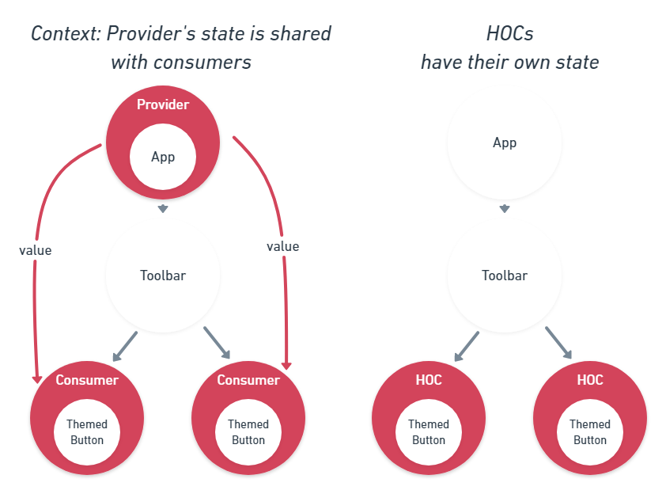
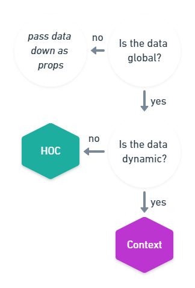

React 16.3 finally made the [Context API](https://reactjs.org/docs/context.html) stable. Since then, many developers started using it to solve the "prop-drilling" problem, the issue where you need to access a `prop` in a component that lives deep down the component tree and you need to forward that `prop` through many levels and components that don't even make use of the prop.
The official documentation states the intent of the Context API as follows:

> In a typical React application, data is passed top-down (parent to child) via props, but this can be cumbersome for certain types of props (e.g. locale preference, UI theme) that are required by many components within an application. Context provides a way to share values like this between components without having to explicitly pass a prop through every level of the tree.

> Context is designed to share data that can be considered “global” for a tree of React components, such as the current authenticated user, theme, or preferred language.

Let's look at an example. We want to track the activity of the user. For that we want to call a certain `track` function every time the user clicks on an UI element.

## Tracker in plain React
```jsx
const track = event => console.log(`${event} occured`);

class App extends React.Component {
  render() {
    return <Toolbar track={track} />;
  }
}

function Toolbar(props) {
  return (
    <div>
      <TrackedButton track={props.track} />
    </div>
  );
}

function TrackedButton(props) {
  const onClick = () => {
    props.track("button click");
    // do something on click
  };
  return <Button onClick={onClick} />;
}
```

We need the `track` function in many different components of the app, and in React without any advanced patterns, we need to pass `track` through the whole component tree, even though `App` and `Toolbar` make no use of it.

## Tracker with Context
We can use the new React Context API to inject the `track` function in the needed components:

```jsx
const track = event => console.log(`${event} occured`);
const TrackerContext = React.createContext(track);

class App extends React.Component {
  render() {
    return (
      <TrackerContext.Provider value={track}>
        <Toolbar />
      </TrackerContext.Provider>
    );
  }
}

function Toolbar(props) {
  return (
    <div>
      {/* does not need to forward props anymore */}
      <TrackedButton />
    </div>
  );
}

function TrackedButton(props) {
  return (
    <TrackerContext.Consumer>
      {value => (
        <Button
          onClick={() => {
            // call track
            value("button click");
            // do something on click
          }}
        />
      )}
    </TrackerContext.Consumer>
  );
}
```

We create a `TrackerContext`, wrap the root component with `Provider` which makes the `track` function _consumable_ as `value` in the `TrackedButton` component.

However, this is nothing new and you could always do this with a HOC (Higher Order Component) in React. The code is even more readable with a HOC.

## Tracker as a HOC
We can create a HOC, a function taking a component and returning a new component rendering the original component with some enhancements. In our case we will just inject the `track` function as a `prop` in the inner component.

```jsx
const track = event => console.log(`${event} occured`);
const withTracker = track => Component => (props) => <Component track={track} {...props}/>;

class App extends React.Component {
  render() {
    return (
      /* no need to wrap root Component */
      <Toolbar />
    );
  }
}

function Toolbar(props) {
  return (
    <div>
      {/* need to use the HOC here */}
      <TrackedButtonWrapped />
    </div>
  );
}

// TrackedButton is the same as in first solution
function TrackedButton(props) {
  const onClick = () => {
    props.track("button click");
    // do something on click
  };
  return <Button onClick={onClick} />;
}
// Need to create a higher-order component out of TrackedButton
const TrackedButtonWrapped = withTracker(track)(TrackedButton)
```

The nice thing about this is that the code is a lot cleaner than with using `Context`:
1. `App` needs no wrapper anymore.
1. `TrackedButton` is exactly the same component as in the plain React solution. It's not its responsability anymore to retrieve the `track` function.
This is because we shifted the `prop` retrieveal into the **`TrackedButtonWrapped` HOC** which we render in `Toolbar` instead.

> So is React.createContext useless?

Let's go back to the example given in the [React documentation](https://reactjs.org/docs/context.html). There we're using `Context` to theme the app.

## Theming with Context
The code is similar to the _Tracking with Context_ example. `ThemeContext.Provider` provides the `theme` and a function to _toggle the theme_ which sets `state` in the root component. These variables are only consumed where needed - in the `ThemedButton` to style the button and toggle the theme on button click.

```jsx
const ThemeContext = React.createContext();

class App extends React.Component {
  state = {
    theme: 'light'
  }

  toggleTheme = () => {
    this.setState(({ theme }) => ({
      theme: theme === 'light' ? 'dark' : 'light',
    }));
  }

  render() {
    const value = {
      theme: this.state.theme,
      toggleTheme: this.toggleTheme,
    }
    return (
      <ThemeContext.Provider value={value}>
        <Toolbar />
      </ThemeContext.Provider>
    );
  }
}

function Toolbar(props) {
  return (
    <div>
      <ThemedButton />
    </div>
  );
}

function ThemedButton(props) {
  return (
    <ThemeContext.Consumer>
      {({ theme, toggleTheme }) => <Button theme={theme} onClick={toggleTheme}/>}
    </ThemeContext.Consumer>
  );
}
```

## Theming as a HOC: First try
Let's try to apply the same HOC pattern that we did with `Tracking` to `Theming`.

> Spoiler: It won't work. 

```jsx
const withTheme = InnerComponent => class extends React.Component {
  state = {
    theme: 'light'
  }

  toggleTheme = () => {
    this.setState(({ theme }) => ({
      theme: theme === 'light' ? 'dark' : 'light',
    }));
  }

  render() {
    return (
      <InnerComponent theme={this.state.theme} toggleTheme={this.toggleTheme} />
    )
  }
}

class App extends React.Component {
  render() {
    return (
      // again no Provider needed
        <Toolbar />
    );
  }
}

function Toolbar(props) {
  return (
    <div>
      {/* use the HOC here */}
      <ThemedButtonWrapped />
      {/* let's add another Button here */}
      <ThemedButtonWrapped />
    </div>
  );
}

function ThemedButton(props) {
  return <Button onClick={props.toggleTheme} theme={props.theme} />;
}
// Need to create a higher-order component out of ThemedButton
const ThemedButtonWrapped = withTheme(ThemedButton)
```

**What's wrong here?**
If we add another `ThemedButton`, you'll notice that it doesn't work here. Every time the HOC is created, the component instance starts with a fresh `state`, and so the buttons' themes are independent of each other. You can play around with it [here](https://codesandbox.io/s/r5o2zjop5m).

<embed src="https://codesandbox.io/embed/r5o2zjop5m">

**Why did it work in the tracking example?**
In the tracking example the data (`track` function) is _static_ and never changed, so each Button instance using the same function is not a problem and the expected behavior here.

This is the big advantage of the `Context API` over the `HOC pattern` and why it is so powerful: **Using `Context` the data is _shared_ among all `Consumers`**.



# Summary
Here's what the React documentation says about the use-cases of `Context`:
> Context is designed to share data that can be considered “global” for a tree of React components

I would go one step further and say that the `Context API` is for global **dynamic** data that is **used by multiple component instances**.
In the case of **static** data, you might not need `Context`. It can always be replaced with a simpler to use HOC that injects the `props`.

Here's a general guideline how to decide whether to use React's `Context` API:




## Addendum: Recreating Context from a HOC
```jsx
const sharedState = {
  theme: 'light',
}
const listeners = []
const listen = (callback) => {
  listeners.push(callback);
  // return unsubscribe function
  return () => listeners.filter(cb => cb !== callback)
}
const toggleTheme = () => {
  sharedState.theme = sharedState.theme === "light" ? "dark" : "light"
  // update all listeners
  listeners.forEach(cb => cb());
};
const withTheme = InnerComponent =>
  class extends React.Component {
    constructor(props) {
      super(props);
      this.state = sharedState
      // create a new function per _instance_
      // important to make unsubscribing work
      this.updateState = this.updateState.bind(this);
      this.unsubscribe = listen(this.updateState);
    }

    componentWillUnmount() {
      this.unsubscribe();
    }

    updateState() {
      this.setState({
        ...sharedState
      })
    }

    render() {
      return (
        <InnerComponent
          ref={this.ref}
          theme={this.state.theme}
          toggleTheme={toggleTheme}
        />
      );
    }
  };

class App extends React.Component {
  render() {
    return (
      // again no Provider needed
      <Toolbar />
    );
  }
}

function Toolbar(props) {
  return (
    <div>
      {/* use the HOC here */}
      <ThemedButtonWrapped />
      {/* let's add another Button here */}
      <ThemedButtonWrapped />
    </div>
  );
}

function ThemedButton(props) {
  return <Button onClick={props.toggleTheme} theme={props.theme} />;
}
// Need to create a higher-order component out of ThemedButton
const ThemedButtonWrapped = withTheme(ThemedButton);
```